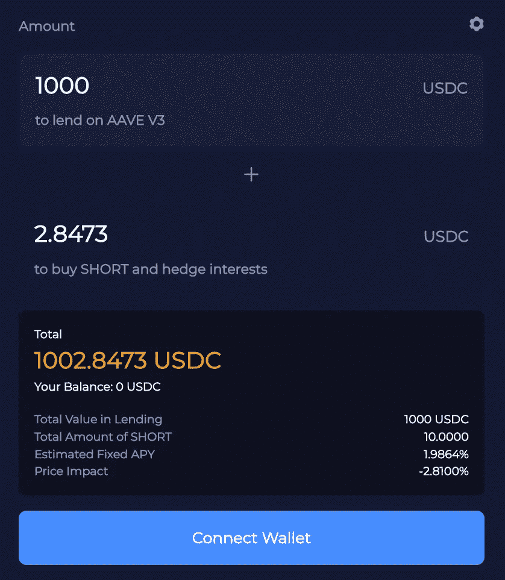

# 像我 5 岁一样解释:衍生品

> 原文：<https://medium.com/coinmonks/explain-like-im-5-derivatives-5b5d95d325a1?source=collection_archive---------22----------------------->

衍生品听起来可能很复杂，但它只是双方之间的协议

# TLDR:

*   衍生品基本上是两方之间的合同。
*   最常见的衍生品类型有远期、期货、期权和掉期。
*   衍生品被用来对冲头寸，增加杠杆，或对资产进行投机。

在我们这个瞬息万变的世界里，衍生品其实在我们的生活中扮演着重要的角色。我们以各种方式使用它们，从简单到复杂。

在这篇博文中，让我们一起来探索衍生品在日常生活中如何影响我们的生活！

# 什么是衍生品？

**衍生产品只是一种依赖于或衍生自另一种资产的资产。**

例如，你和你的朋友在一个艺术画廊，你们都发现了一个价值 1000 美元的雕塑。但是……你和你的朋友有分歧:

*   你的朋友认为这是一个荒谬的价格估值，并认为它将在 3 个月后价值减半。
*   另一方面，你在艺术品中看到了一些壮观的东西，并如此乐观地认为它的价值将在 3 个月内翻倍。

然后，你和你的朋友决定赌 100 美元，赌 3 个月后这幅画的价格是原价的一半还是两倍。3 个月来，价格飙升至最初估价的近 3 倍！

> 交易新手？试试[密码交易机器人](/coinmonks/crypto-trading-bot-c2ffce8acb2a)或者[复制交易](/coinmonks/top-10-crypto-copy-trading-platforms-for-beginners-d0c37c7d698c)

你(而不是你的朋友)刚刚从中获利的钱是基于一个衍生品，因为你们两个都没有购买过这个雕塑。更确切地说，它来源于雕塑的价格，取决于它的价值是上升还是下降。这就是导数的概念。

# 衍生品有哪些不同的类型？

市场上有许多类型的衍生品，但最常见的是远期、期货、期权和掉期。

它们都是独特的，但想法是相似的——它们都是双方之间的合同，同意在未来的特定价格和时间交易资产。

现在，让我们说，你没有同意支付对方 100 美元，而是决定接近雕塑的艺术家，协商在 3 个月后以 1050 美元的价格购买艺术品(因为你现在没有足够的现金)。

**远期/期货:**你和艺术家在合同上写下:你将在 3 个月后以 1050 美元的价格购买这座雕塑，不考虑它当时的估值。如果 3 个月后，雕塑价格升值到 1500 美元，那就意味着你赚了 450 美元。如果贬值到 900 美元，那么你就损失了 150 美元。这是一份远期合同——无论结果如何，你都有义务履行合同

远期和期货是一样的，唯一的区别是远期是私有的，而后者通常在公共交易所出售。

**期权:**期权与远期/期货具有相同的概念，然而，你没有义务履行你的合同，而是有不履行合同的“选择权”，以溢价为代价。所以，假设你确定这个雕塑在 3 个月后会值 1500 美元，但是你却退缩了。你想确定，万一你错了，你可以选择不买雕塑，所以你付给艺术家 50 美元来选择退出。

**掉期交易:**另一方面，掉期交易是用一种证券资产交换另一种证券资产。这就像问艺术家你能否用你妈妈的画换他的雕塑。

# 哪里可以使用衍生产品？

衍生品通常用于投机或希望在没有实际拥有的情况下获得某些金融资产的风险敞口，就像你在加密交易交易所看到的那样。

Binance Futures Trading — a form of derivative trading

在现实世界中，你可能使用过导数的概念，甚至不知道它是导数的一种形式。

一个很好的例子是，如果你认为未来几天汽油价格会上涨，就提前购买大量的汽油券。大多数航空公司以供应合同的形式这样做，以防止石油的极端波动，这是他们最大的运营支出之一。

# **衍生品有风险吗？**

衍生品不一定要复杂或有风险。其实很多时候，它其实是保护你免受风险的。至少， [iGain](https://bit.ly/3ubh7Tt) 是这么做的。

iGain 平台利用衍生令牌来对冲用户利率的波动，从而使其固定。

例如，如果你以 1.99%的 APY 利率在 iGain 上贷出 1，000 USDC，该协议将自动计算出你需要购买的空头代币的数量，以保护你免受波动性的影响。

这些短期代币充当衍生品，当利率比你锁定的利率低时，它就会获利。

这意味着，每当 USDC 利率下降少于 1.99%，你的空头代币将获得利润，并将补贴利率变化的差异，所以你可以确保你仍然可以获得全额 1.99%的 APY。

这只是衍生品如何被用来对冲市场波动的一个例子。

# 结论

衍生品在当今全球互联的经济中发挥着至关重要的作用。考虑到这一点，学习它的概念并知道如何利用它们是至关重要的，尤其是在风险管理方面。

[iGain 网站](https://bit.ly/3MBpnE3) | [推特](https://twitter.com/iGainFinance) | [不和](https://discord.com/invite/cU4D2a8) | [电报](https://t.me/hakkafinance) | [维基](https://hakkafinance.gitbook.io/igain/igain-universe/interest-rate-synth/introduction) | [乔布斯](https://pelith.notion.site/pelith/Hakka-Finance-Pelith-is-hiring-27bfdd1991bc46019f69f5c7926b69fb)