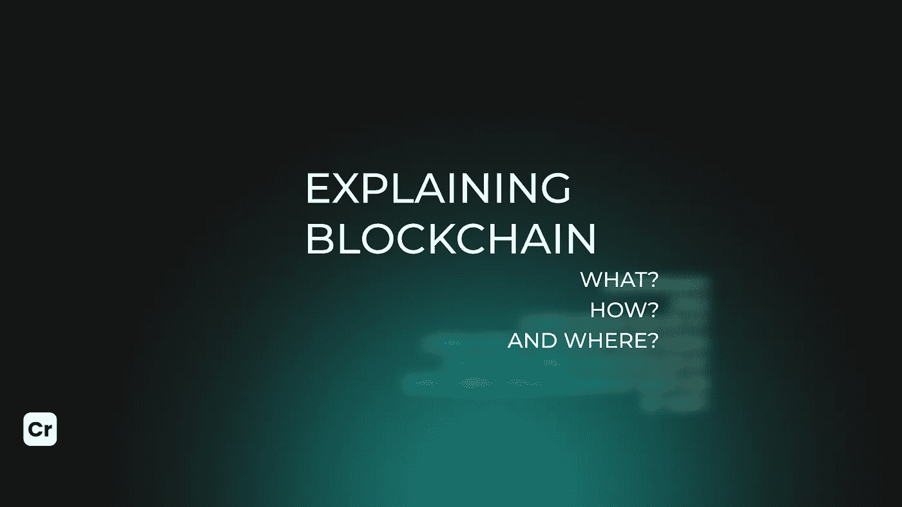

# 解释区块链:什么，如何，在哪里？

> 原文：<https://medium.com/coinmonks/explaining-blockchain-what-how-and-where-654cd6935e1b?source=collection_archive---------25----------------------->

## 什么是区块链？

区块链技术可能是 21 世纪最受炒作的创新之一。这一点都不奇怪:区块链是一个记录信息的系统，它很难或不可能改变、入侵或欺骗这个系统。这可以通过使用去中心化和加密散列来实现。区块链是一个革命性的数据库，加密货币只是其中一个可能的用途，它已经被用于许多经济领域。

谷歌文档经常被引用为区块链技术的一个简单例子。当我们一起工作来创建一个文档时，文档被分发而不是复制或传输。这允许每个人同时访问文档，也就是说，没有人被锁在外面等待另一方的更改。同时对文档的所有修改都被实时记录，使更改完全透明。这里有一个分散的分销链。

## **区块链是如何工作的？**

此外，与 google doc 相比，区块链是用户在 doc 中所做更改的历史。但说真的，区块链是一个交易的数字账本。它被复制并分布在区块链的整个计算机系统网络中。每当区块链(包含在链的块中)上发生新的交易时，该交易的记录被添加到每个参与者的分类账中。

## **区块链开发商是干什么的？**

区块链开发者负责执行几项任务。让我们来看看它们。

—创建和构建基础架构，并应用最新的安全措施来保护数字交易数据免受网络攻击和其他不当行为的侵害；

—维护和扩展当前的客户端和服务器端应用程序；

—通过集成最新的工具和技术，优化和保护基于区块链的应用程序；

—记录整个区块链开发过程。记录新的和现有的解决方案。

值得注意的是，虽然区块链是为跟踪加密货币而开发的，但区块链技术有可能用于许多不同的行业和领域，例如将该技术集成到商业中，包括医学、艺术和金融。因此，这为区块链工程师创造了无数的机会。

## 展示一个例子

索拉纳区块链 [Crypton Studio](https://crypton.studio) 开发人员开发的应用程序 Secretum 用于与投资者和社区交流。它包括信使和交易。

由于 Secretum 中的区块链，虚构的匿名被创造出来:用户不知道你的身份，但他们知道你的钱包里有多少钱以及你的交易历史。通过元掩码地址，用户可以找到彼此，以及通信和交换各种令牌。

## 结论

正如你所看到的，使用区块链不仅在金融领域是成功的，在其他领域也是如此。因此，这为区块链开发商创造了大量机会。

我希望你已经感兴趣了，所以加入我们吧！

> 加入 Coinmonks [电报频道](https://t.me/coincodecap)和 [Youtube 频道](https://www.youtube.com/c/coinmonks/videos)了解加密交易和投资

# 另外，阅读

*   [最佳期货交易信号](https://coincodecap.com/futures-trading-signals) | [流动性交易所评论](https://coincodecap.com/liquid-exchange-review)
*   [火币加密交易信号](https://coincodecap.com/huobi-crypto-trading-signals) | [Swapzone 审查](/coinmonks/swapzone-review-crypto-exchange-data-aggregator-e0ad78e55ed7)
*   最佳[密码交易机器人](https://coincodecap.com/best-crypto-trading-bots) | [购买索拉纳](https://coincodecap.com/buy-solana) | [矩阵导出评论](https://coincodecap.com/matrixport-review)
*   [Coldcard 评论](https://coincodecap.com/coldcard-review) | [BOXtradEX 评论](https://coincodecap.com/boxtradex-review)|[uni swap 指南](https://coincodecap.com/uniswap)
*   [比特币基地评论](/coinmonks/coinbase-review-6ef4e0f56064) | [德里比特评论](/coinmonks/deribit-review-options-fees-apis-and-testnet-2ca16c4bbdb2) | [FTX 评论](/coinmonks/ftx-crypto-exchange-review-53664ac1198f)
*   [n 零审核](/coinmonks/ngrave-zero-review-c465cf8307fc) | [Phemex 审核](/coinmonks/phemex-review-4cfba0b49e28) | [PrimeXBT 审核](/coinmonks/primexbt-review-88e0815be858)
*   最佳[区块链分析](https://bitquery.io/blog/best-blockchain-analysis-tools-and-software)工具| [赚比特币](/coinmonks/earn-bitcoin-6e8bd3c592d9)
*   [Cloudbet 赌场评论](https://coincodecap.com/cloudbet-casino-review) | [点火赌场评论](https://coincodecap.com/ignition-casino-review)
*   [加密套利](/coinmonks/crypto-arbitrage-guide-how-to-make-money-as-a-beginner-62bfe5c868f6)指南| [如何做空比特币](/coinmonks/how-to-short-bitcoin-568a2d0b4ae5)