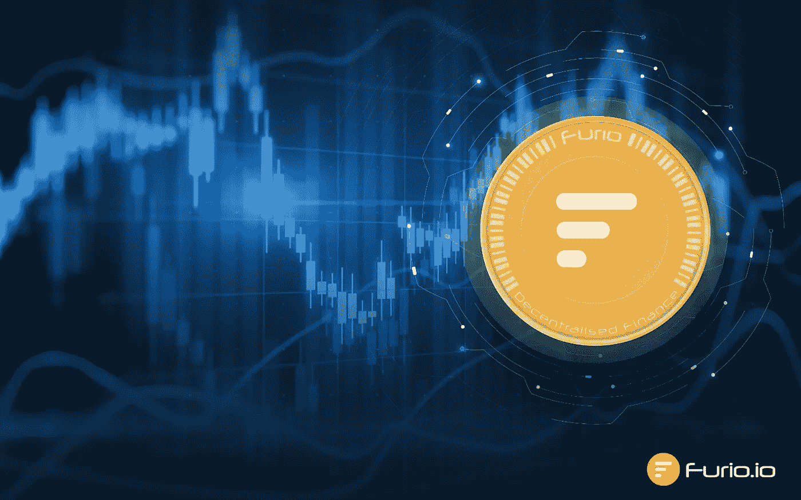
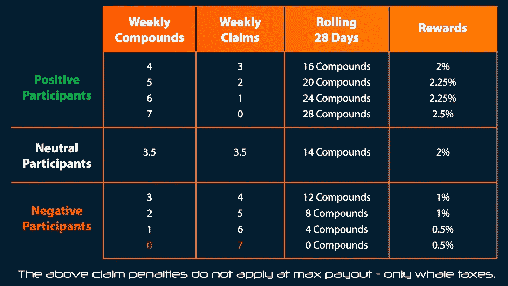

# 解释浮利欧奖励系统

> 原文：<https://medium.com/coinmonks/explaining-the-furio-rewards-system-and-auto-compounding-a9be16abb14d?source=collection_archive---------3----------------------->

大家好

社区对我们的奖励计划非常兴奋，这也是我们所希望的。这是独一无二的，有益于好的参与者来帮助生态系统，惩罚坏的参与者。

为了帮助每个人理解它，我们写了这篇文章，并包括了大量的例子。你会注意到我们已经包括了一个全新的选项。

上表中的基本原则非常简单，旨在奖励好的参与者，抑制坏的参与者。我们计算了连续 28 天的所有数据。为什么？

*   因为我们想给每个人一个机会，以防他们一开始就错了，然后可以改变他们的策略
*   28 天给了人们足够的时间，如果他们的情况发生变化，他们需要一些索赔，它不会立即拖累他们
*   如果你忘记了，去度假，身体不舒服，连接不好，没有汽油费，你不会受到惩罚。一个不活跃的一天算作一个积极的一天，因为你没有申请。
*   请记住，我们不是说不要索赔，只是以有利于你和 Furio 生态系统的方式索赔。

需要重点关注的是图表上的索赔复合比率，记住每个人在第一天都是 2%。一个中性参与者在 28 天内有 14 个索赔和 14 个化合物/非活性日。我们总是指望索赔。

每天是一个 24 小时的时间段，从 UTC 午夜 12 点开始，到 UTC 午夜 12 点结束。

如果你在一天内申请两次，这将被视为双重否定，并进一步拉低你的平均分数。记住它总是主张算数。

我们开始吧。在任何一天，你都可以做四件事情中的一件；

1.  什么也不做
2.  复合的
3.  要求
4.  自动复合(是的自动复合！！！)

现在让我们来看一些例子

参与者 1

我的目标是尽可能快地获得最高赔付，我该怎么做？

这很简单，你字面上复合或不活跃的 28 天。在第 29 天，根据您的最后 28 天，您将移动到 2.5%，并将一直保持到您提出索赔。

在您交易之前，如果您要更改奖励等级，DAPP 会向您发出警告。无论好坏。

如果我决定在第 30 天索赔，因为我的情况发生了变化，会发生什么？

在过去的 28 天里，您将有 27 个复利日和 1 个索赔日。你现在的比例是 27:1。你轻松地处于 2.25%的类别中。

第二天你又声称。在过去的 28 天里，你现在有 26 个化合物和 2 个索赔。你的比例是 26:2。你会停留在 2.25%的范畴。

你可以在另外三次索赔中保持在 2.25%的类别。也就是连续 6 天。

第二天，连续 7 天规则开始生效，你直接到 0.5%。这总是适用的，除非你是在最大支出。连续声明一周不是一个积极的社区成员的行为。

永远记住，如果你的奖励降到 2%以下，你就不能回来了。会有警告来帮助你，但这是没有商量余地的。不要麻烦联系我们或您的团队领导。它被编码到系统中。

您必须记住的是，连续 6 天的索赔将结转，并将与您一起平均坐 28 天。

参与者 2

我在 2%很开心，想隔天申领，可以吗？

这很好，28 天后你将成为一个中立玩家，保持在 2%。如果你在 28 天后试图改变你的策略，并声称有 2 天在运行中，DAPP 会警告你，这将把你带到 1%的较低水平。

如果您即将提出的索赔达到您无法在 28 天内恢复的水平，DAPP 也会向您发出警告。

永远记住，如果你的奖励降到 2%以下，你就不能再回来了。会有警告，这是没有商量余地的。不要麻烦联系我们或您的团队领导。它被编码到系统中。

重复上述内容，以充分理解这一信息。

参与者 3

我喜欢 2.25%的样子，想达到并留在那里，我该怎么做？

好的，让我们看看这张表。要成为 2.25%的参与者，你需要让你的比例至少达到 20:8。因此，在 28 天的时间里，你可以积累到 2.25%，你有效地要求每 7 天两次。你是一个 5:2 的参与者。永远记住“无所事事日”不会对你不利。

计划一个平稳的策略是对你最有利的，因为索赔必须经过连续的 28 天。

有道理，但是它是从一月一号开始吗？

不——你的第一天是你加入的那一天，它对你来说是独一无二的。如果您在 6 月 18 日加入，您的 28 天滚动期将在 7 月 16 日结束，在那一天您可以移动到 2.25%(或者 2.5%，如果您在这 28 天中没有申请过一次)。

重复一遍，DAPP 会警告你，如果你的水平即将改变，好的或坏的。

我们希望以上内容能让我们清楚事情是如何运作的。

现在大家大概都在问的问题——WTF 汽车复合？？？

是的，这是真的，Furio DAPP 将提供汽车化合物。它将会非常容易使用。

*   **你会被问到**你想自动复合多少天
*   **你可以选择从 2 天到 180 天的任何时间**
*   **启动自动复利只有一笔交易费**
*   **DAPP 为你做一切**
*   **DAPP 将计算出您的奖励等级，并在您有资格在 28 天的期限内升级后自动为您升级**
*   **如果您符合条件，自动奖励升级将在您选择的任何时间段生效**
*   你可以用它来适应你的策略——如果你要离开并且不想忘记，这是最完美的选择！

我们正在尽最大努力帮助新的参与者加入 DeFi 和 Furio。你来到 Furio 生态系统，将会有 fiat onboarding，建立钱包的指南，购买 Furio 的指南，帮助你找到一个好团队的快速方案，然后你就可以自动复合。它不会就此停止……但是让我们一步一步来。

所有这些如何应用于团队？

Furio team 系统中的所有东西都适用于所有钱包。团队领导可以根据上述任何一种策略来管理钱包。如果团队领导的钱包下降到 2.0%以下，他们将自动从 FAST 方案中删除(如果他们在此方案中的话)。我们强烈建议您彻底研究您选择的团队。

隶属于一个团队的个人钱包将根据推荐奖励系统推动奖励。然后，团队领导可以简单地将策略应用到团队钱包中。寻找一个优秀的团队领导和优秀的团队成员，用这种方法可以快速获得回报。

不要害怕问团队他们的策略是什么！！

请注意，本文中的任何内容都不构成财务建议或税务规划建议。这篇文章仅供参考。在做任何决定之前，你都应该进行自己的研究。