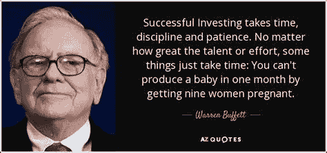

# 解释沃伦·巴菲特的投资方法，及其成功的原因

> 原文：<https://medium.com/coinmonks/explaining-warren-buffetts-investing-methodology-and-why-it-s-successful-4df43f7ccc0d?source=collection_archive---------0----------------------->

Source photo [warren buffett quotes — Bing images](https://www.bing.com/images/search?view=detailV2&ccid=zBLDsBjX&id=3A3556874AA2AF9E4B53651B1CBFCA2342FA8819&thid=OIF.8luxe7dRdOuAcPkarqduvQ&mediaurl=https%3a%2f%2fwww.azquotes.com%2fpicture-quotes%2fquote-successful-investing-takes-time-discipline-and-patience-no-matter-how-great-the-talent-warren-buffett-68-94-41.jpg&cdnurl=https%3a%2f%2fth.bing.com%2fth%2fid%2fR.cc12c3b018d7779d1d5da524caaad3c6%3frik%3d%26pid%3dImgRaw%26r%3d0&exph=400&expw=850&q=warren+buffett+quotes&simid=7091452777607&FORM=IRPRST&ck=F25BB17BB75174EB8070F91AAEA76EBD&selectedIndex=142&ajaxhist=0&ajaxserp=0)

任何对投资领域稍有了解的人都可能听说过沃伦·巴菲特的名字。也是因为这个原因。根据这一预测，到 2022 年 4 月，巴菲特的净资产预计将超过 1250 亿美元。结果，他现在是世界上第五富有的人。

## 他是怎么做到的？