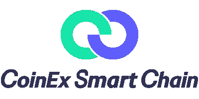

# 探索 CSC 及其提供的其他增值服务。

> 原文：<https://medium.com/coinmonks/explore-csc-and-other-value-added-services-it-offers-cf5be74ad441?source=collection_archive---------50----------------------->

CoinEx 智能链将不断提高区块链的吞吐量，使区块链客户端更易于使用，增强托管服务的安全性，并提供更多多功能的令牌跨链服务。

CSC 致力于为区块链建设基础设施，并遵循分散化和无许可街区生成的原则。在各种 DApps，特别是 DeFi 应用的快速发展中，以太坊的缺点变得前所未有的明显，例如低吞吐量、少量交易和高交易费用。总的来说就是“高成本低效率”。许多平台提出了确保高吞吐量和加速交易的建议，但或多或少地牺牲了去中心化。在这里，我们将讨论一些具有极高性能的高价值 DApps、它们的优势以及为什么您更愿意使用 CSC

CoinEx 链生态系统正在快速增长，因为我们一直致力于共同建立更加多样化和实用的应用程序。这里有几个你应该知道的 CSC 项目:

*   [**CoinEx**](https://www.coinex.com/?lang=en_US) **交易所** — **全球加密货币交易所，**创新数字资产聚集之地。为 200 多个国家和地区提供加密交易服务，为全球加密交易商提供多语言支持。

使用 CoinEx，您可以安全便捷地进行交易，您可以通过多种安全策略、100%准备金和支付担保来保护资产。CoinEx 有一个高质量的加密资产列表，提供全面的硬币信息，有助于提前一步探索投资机会。有了 CoinEx，您可以一目了然地满足现货、保证金、期货、金融服务和 PNL 分析等各种交易和资产管理的需求。

在 CoinEx 交易所安全方便地存款和取款。CoinEX exchange**兼容多种设备，**允许您随时随地交易加密货币。

*   [**ViaWalle**](https://viawallet.com/?lang=en_US)t—**致未来金融**，期待与您共创未来金融世界，ViaWallet 是一款多链钱包。ViaWallet 允许用户对私钥进行自我控制来管理资产，并提供多重保护措施来确保资产安全。安全存储 100 万以上的加密货币，ViaWallet 足以管理您的所有资产。ViaWallet 拥有丰富的密码，超过 46 个 mainnet 资产，如 CET，BTC & ETH，并支持 1M+令牌。借助多钱包资产，一站式管理多个加密钱包。

ViaWallet 支持 CoinEx 智能链上的 DApp 访问和资产存储 [(CSC)](https://www.coinex.org/?lang=en_US) 。在 CSC 和以太坊等主要公共连锁店探索、访问和享受时髦的 DApps。

**还可以通过 ViaWallet** 轻松赚取闲置资产的利息来赚钱，跟踪加密价格和其他信息以辅助交易，并通过一键下注来赚取利润。通过 4 个简单的步骤赢取赌注奖励:

01-下载并创建钱包

02-存款密码

03-打桩

04-赚取回报

你也可以点击[这里](/@kryptmystr/monetizing-csc-af1bb18a0bfd)查看 CSC 上更多的赚钱机会。

通过 3 个简单的步骤开始您的区块链之旅

01- [下载](https://viawallet.com/download) ViaWallet

02-创建钱包

03-存款密码。

ViaWallet 速度很快，没有未决订单，可以立即执行。

*   [**IF Pool**](https://ifpool.io/)**—IF Pool 是用于 CSC 节点锁定和令牌锁定挖掘的 DeFi 协议。IFPool 使您的赌注比直接赌注到 CoinEx 智能链节点更容易。在有限条件下花费更少的时间。**

****Liquid CET Staking，**Staking with Liquid，通过将 CET 押在池中，如果你得到 iCET，你可以使用 iCET 做更多的事情，如交换或押在借贷平台上。APY 充当**加密货币储蓄账户**，类似于年利率(APR)账户。你可以存入你的 CET，并在特定的时间内获得固定的回报率。**

**如果 pool 还有其他好处，如**更高的 APY，**(年百分比收益率)是您一年内可以从加密货币余额中获得的利息总额。APY 的主要特点是每月计算复利。这意味着你可以从最初的投资额和每月积累的利息中获得回报。基本上就是赚利息的利息。在 crypto 中，投资者通常获得 apy，在他们的账户中保留硬币，持有代币，或者通过向像 IFPool 这样的流动性池提供流动性。APY(年收益率)是评估任何投资回报的非常有用的工具。**

**如果池使用智能策略切换到更高的 APY 节点，这将使您获得比直接锁定节点更高的 APY。**

**APY 是通过使用投资额和投资保持活跃的时间段来计算的——以年度为基础。时间框架是一个基本要素，因为 APY 和简单回报之间的差异是复合的。下面是计算 APY 的公式:**

**APY= (1 + r / n)n — 1**

**这里， *r* 表示实际利率， *n* 表示评估复利的周期数。**

**正如我们所说的，这种计算可以用于任何投资:同样，对于加密资产的投资，可以计算 APY。**

**“哎！不要害怕，不需要担心学习公式或做所有的数学(谁会喜欢数学？)“如果你参加了 IFPool，IFPool 有一个内置的 APY 计算器为你做所有的数学计算，所以不要担心，IFPool 会帮你计算你的 CET 奖励。考虑到复利，APY 是衡量投资回报的好工具。**

**IFPool 可以直接连接到你的以太坊账号。**

*   **[**one swap**](https://www.oneswap.net/cet)**—one swap**是一个基于智能合约的完全去中心化的交易协议，支持自动做市(AMM)和订单簿模式以及免许可令牌列表。通过内置的 OneSwap 钱包，一站式提供各种服务，将用户互动提升到一个新的水平。OneSwap 应用自动做市算法，为市场提供连续报价。用户加入资金池，换取交易费的比例分成。**

**自动做市(AMM)可以根据公式计算买卖价格，从而为市场提供连续的报价。本质上，AMM 是自动代理，可以通过智能合约实现，无需人工干预。OneSwap 在 AMM 应用“恒定产品做市商公式”算法，该算法的特点是无论订单规模有多大或流动性池有多小，都向市场提供稳定的流动性。**

**通过免权限令牌列表，OneSwap 支持符合 CRC20 标准的令牌之间的交易。创建市场不需要上市费或许可。除了方便的转换服务，传统的订单簿也可以在 OneSwap 上使用，使交易更加灵活。**

**OneSwap 基于 CoinEx 智能链( [CSC](https://www.coinex.org/?lang=en_US) )打造，用户体验极佳。OneSwap 基于用户的交易习惯，开发出功能丰富、易于使用的操作界面。OneSwap 尽一切努力成为一个去中心化、值得信赖的平台。它的智能合约代码中没有内置管理控制或关闭功能，所有修改和优化都将由社区治理的投票结果决定。**

*   **[**欧米茄俱乐部**](https://omegaclub.finance/index.php?action=csc)**—同样建立在** [**CSC**](https://www.coinex.org/?lang=en_US) **欧米茄俱乐部**是一款玩赚 NFT 的游戏。我们是足球游戏，玩家可以享受竞争和奖励欧米茄代币。我们有一个多级系统，为玩家提供挑战，爬上最高级别，以获得更多赢得奖励的机会。游戏还有一个技能卡系统，创造了多种竞争。也有让最好的玩家赢得大奖的比赛。**

**持有 5 张以上 NFT 的用户可以组建自己的球队参加足球比赛，获胜者将获得欧米茄代币奖励。欧米茄俱乐部是一款风格类似斯诺克的足球游戏。目标是将球尽可能地移入对手的球门。每场游戏结束后，您将获得欧米茄代币奖励，并根据表现收集经验值以玩更高的级别。一枚欧米茄代币价值 0.00336 美元，欧米茄代币是根据 BEP-20 标准生成的，用作欧米茄游戏系统的基础货币。预售后代币的总供应量将达到一亿欧米茄。**

**-欧米茄奖励:**

****基础奖励。**基础奖励是赢、平、进球后获得的奖励。奖励会或多或少取决于你玩的水平。**

****赞助商额外奖励**。来自赞助商的额外奖励是基于你与赞助商的合同你将获得的奖励。这基本上是一种奖励，当你比赛时你肯定会得到，当你赢得比赛时会得到额外的奖励。**

**赞助商是一份你每 15-20 场比赛就必须签订的合同。当你签订合同时，你用欧米茄代币支付费用。你必须支付欧米茄代币作为与赞助商签约的费用。在那之后，赞助商将为你参加的每场比赛支付报酬，你也将获得你赢得的比赛的额外奖励。**

**在下面的链接中有一个关于如何玩和赢得欧米茄的详细视频；**

****结论。****

**这只是 CSC 前景的冰山一角。在 CoinEx Smart Chain 上已经存在更有利可图的项目，你可以在 CSC [这里](https://www.coinex.org/dapp)探索更多 DApps。**

> **加入 Coinmonks [电报频道](https://t.me/coincodecap)和 [Youtube 频道](https://www.youtube.com/c/coinmonks/videos)了解加密交易和投资**

# **另外，阅读**

*   **[最佳期货交易信号](https://coincodecap.com/futures-trading-signals) | [流动性交易所评论](https://coincodecap.com/liquid-exchange-review)**
*   **[火币加密交易信号](https://coincodecap.com/huobi-crypto-trading-signals) | [Swapzone 审查](/coinmonks/swapzone-review-crypto-exchange-data-aggregator-e0ad78e55ed7)**
*   **最佳[密码交易机器人](https://coincodecap.com/best-crypto-trading-bots) | [购买索拉纳](https://coincodecap.com/buy-solana) | [矩阵导出评论](https://coincodecap.com/matrixport-review)**
*   **[Coldcard 评论](https://coincodecap.com/coldcard-review) | [BOXtradEX 评论](https://coincodecap.com/boxtradex-review)|[uni swap 指南](https://coincodecap.com/uniswap)**
*   **[比特币基地评论](/coinmonks/coinbase-review-6ef4e0f56064) | [德里比特评论](/coinmonks/deribit-review-options-fees-apis-and-testnet-2ca16c4bbdb2) | [FTX 评论](/coinmonks/ftx-crypto-exchange-review-53664ac1198f)**