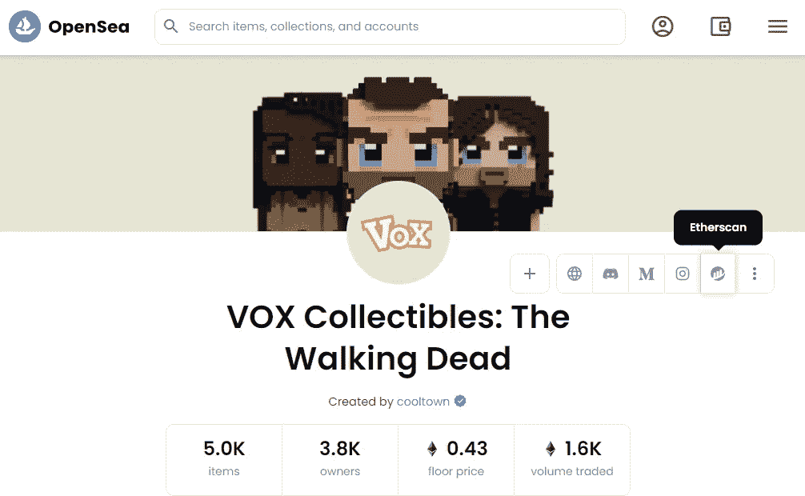
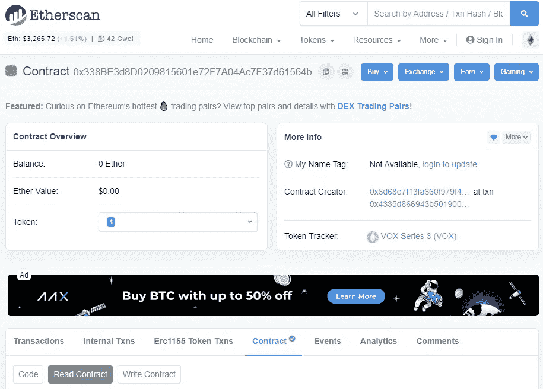
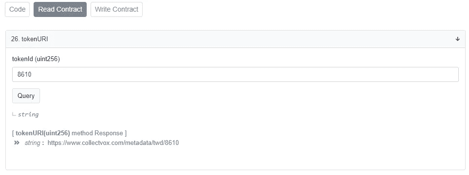
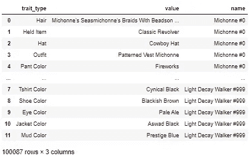
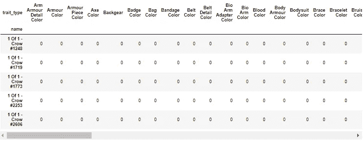
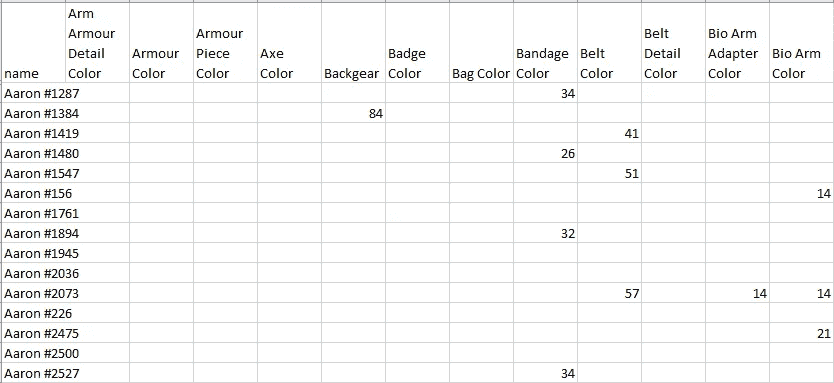

# 通过 Python 探索 NFT 的稀有性

> 原文：<https://medium.com/coinmonks/explore-nft-rarity-by-python-58b8502ceb9a?source=collection_archive---------7----------------------->

一个 NFT 的稀有性是由组成它的特征和特性在给定的收藏中出现的频率决定的

在我们的示例中，我们在 VOX 行尸走肉集合中检索 NFTs 列表。

点击所选藏品 [Opensea.io](https://opensea.io/collection/collectvoxthewalkingdead) 中的以太扫描链接，即可找到藏品的合约地址。您将被重定向到 etherscan.io 上的[智能合约页面。](https://etherscan.io/token/0x338be3d8d0209815601e72f7a04ac7f37d61564b)



NFTs collection page on Opensea.io



Smart Contract detail on etherscan.io



Read Contract Section in etherscan.io

从合同页，你必须去阅读合同部分，并找到令牌 URI 找出每个令牌的 URI。对于这种情况，我们可以知道，每个令牌的 URI 将是 https://www.collectvox.com/metadata/twd/的，后面跟随着令牌号，当我们打开 URI 时，我们将找到 ERC-721 标准中的元数据文件。

```
{
  "name": "Michonne #0",
  "description": "VOX are unique collectibles, with provably randomized traits. Own, trade, play and earn with your unique NFT character.",
  "external_url": "[https://www.collectvox.com/series/twd/0](https://www.collectvox.com/series/twd/0)",
  "image": "ipfs://QmPCuiXr5fAb5Lfh6DBEw56sKrozz3nbgrNtdKPzx3brri/image.png",
  "model": "ipfs://QmPCuiXr5fAb5Lfh6DBEw56sKrozz3nbgrNtdKPzx3brri/model.fbx",
  "hash": "acdf90addff5ee65dd153a394d764411385295416cae4a40f31bdbfe7a2d17919960445b37776551bcdbd3cbd82eb1b07ff990fa9577d93797241e6a6609ad78",
  "attributes": [
    {
      "trait_type": "Hair",
      "value": "Michonne's Seasmichonne's Braids With Beadson Eight Dreads"
    },
    .........
    {
      "trait_type": "Belt Color",
      "value": "Orka Black",
      "colors": [
        {
          "name": "color",
          "value": "#272220"
        },
        {
          "name": "color",
          "value": "#888888"
        }
      ]
    }
  ]
}
```

每只 NFT 的稀有程度将由每只 NFT 本身的特征决定。如果它具有独特或罕见的特征，稀有性可能很高。

现在，我们已经拥有了所有需要的信息，那么我们可以开始研究我们的 Python 代码来探索我们的 NFT 的稀有性。

在这个例子中，我用 Anaconda 编写了一个 Python 笔记本，但是请随意使用您熟悉的其他工具。

```
# importing lib , please install pandas if you have not installed yet.
import os, glob, json, requests
import pandas as pd#[https://www.collectvox.com/metadata/twd/8610](https://www.collectvox.com/metadata/twd/8610)
url = '[https://www.collectvox.com/metadata/twd/'](https://www.collectvox.com/metadata/twd/')
# base on [https://blog.gala.games/introducing-amcs-the-walking-dead-vox-49df7fd7e836](https://blog.gala.games/introducing-amcs-the-walking-dead-vox-49df7fd7e836), it indicate that VOX has 8,888 items in total
# then we create a loop to gathering the metadata file for all NFTs in this collection.
for i in range(0,8888) : 
    r = requests.get(url + str(i), allow_redirects=True)
    open('./vox/vox' + str(i) + ".txt", 'wb').write(r.content)
```

我们已经获得了用于数据探索的离线数据。为了使数据操作过程的代码简单，我们将使用 pandas lib，它是数据工程师/数据科学任务的标准库。

我们将遍历文件夹中的所有文件，将它们读取到 pandas 数据框中，并将所有数据框连接成一个数据框。

在读取文件的过程中，从上面的元数据文件中，我们会看到它是 JSON 格式的，所以我们可以使用 json.loads 以字典类型加载它，我们发现 traits 以列表的形式存储在“attributes”中，然后我们必须在进一步处理之前先将其规范化。

```
# Define relative path to folder containing the text files
files_folder = "./vox/"
data_list = []# Create a dataframe list from loaded file
for file_name in glob.glob(os.path.join(files_folder ,"*.txt")) :
    with open(file_name,'r', encoding="utf8") as f:
            data = json.loads(f.read())
            df_nested_list = pd.json_normalize(data, record_path =['attributes'],meta=['name', 'image'])
            data_list.append(df_nested_list)
concat_df = pd.concat(data_list)# Drop unused column
new_df = concat_df.drop(['colors','image'],axis=1)
display(new_df)
```



Sample data from downloading to Pandas data frame with normalize attributes data

但是如果数据是规范化的格式，就很难使用，那么我们必须使用数据透视表将属性转换成列。

```
# Find the unique trait list in this collection
trait_list = new_df.trait_type.unique()
nft_list = new_df.pivot_table(values='value', index=['name'],columns= 'trait_type', aggfunc=lambda x: ' '.join(x))
```



Result from Pivot Table

我们将有一个表格来显示 NFT 和列中每个可能的特征之间的关系，以及每个单元格中的特征名称。然而，我们仍然不知道它有多罕见，然后我们必须总结每个特征的重复数量，然后将该数量映射回我们的数据框架。

```
# count the number of duplicate traits
trait_count_series = new_df.groupby(['trait_type','value']).size()# mapping the number of duplicate with trait name in in dataframe
for index in trait_count_series.index :
    nft_list.loc[nft_list[index[0]] == index[1],  index[0]] = trait_count_series.loc[index]
nft_list = nft_list.fillna(0)
```

最后，将我们的结果导出为 CSV 文件，便于离线跟踪或发送到我们的 NFT 朋友社区。

```
nft_list.to_csv('vox_stat_count.csv')
```

万岁，我们现在有 CSV 文件来跟踪我们的 NFT 稀有度，单元格中的每个数字将显示 NFT 上有多少重复性状，数字越少，NFT 上就越稀有。

希望你喜欢用 NFT 市场的信息进行交易。



你可以从[https://github.com/anekpattanakij/nft-rarity-finding-python](https://github.com/anekpattanakij/nft-rarity-finding-python)下载这篇文章的笔记本

> 加入 Coinmonks [电报频道](https://t.me/coincodecap)和 [Youtube 频道](https://www.youtube.com/c/coinmonks/videos)了解加密交易和投资

# 另外，阅读

*   [5 款最佳加密交易终端](https://coincodecap.com/crypto-trading-terminals) | [最佳 DeFi 应用](https://coincodecap.com/best-defi-apps)
*   [比特币基地 vs 瓦济克斯](https://coincodecap.com/coinbase-vs-wazirx) | [比特鲁点评](https://coincodecap.com/bitrue-review) | [波洛涅克斯 vs 比特鲁](https://coincodecap.com/poloniex-vs-bittrex)
*   [德国最佳加密交易所](https://coincodecap.com/crypto-exchanges-in-germany) | [Arbitrum:第二层解决方案](https://coincodecap.com/arbitrum)
*   [币安交易机器人](/coinmonks/binance-trading-bots-d0d57bb62c4c) | [OKEx 评论](/coinmonks/okex-review-6b369304110f) | [阿塔尼评论](https://coincodecap.com/atani-review)
*   [最佳加密交易信号电报](/coinmonks/best-crypto-signals-telegram-5785cdbc4b2b) | [MoonXBT 评论](/coinmonks/moonxbt-review-6e4ab26d037)
*   如何在 Bitbns 上购买柴犬(SHIB)币？ | [买弗洛基](https://coincodecap.com/buy-floki-inu-token)