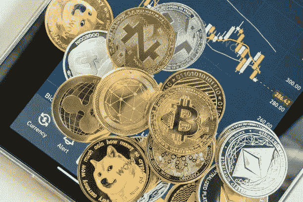
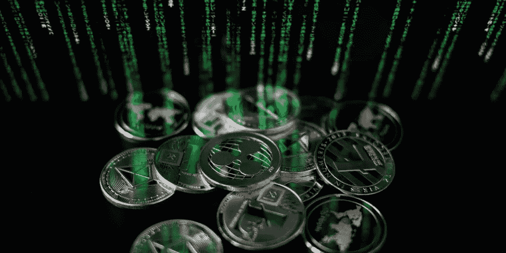

# 探索数字货币

> 原文：<https://medium.com/coinmonks/explore-the-digital-currency-fce3d9273f44?source=collection_archive---------58----------------------->

# 数字货币

*故事原载于*【https://koop360.com/blog/explore-the-digital-currency/】

> **根据国际清算银行的调查，全球 10 家央行中至少有 9 家正在尝试开发央行数字货币。与此同时，该调查还揭示了一个事实，即有更多央行正在测试和开发零售央行数字货币。它恰好是数字货币中的一种，被设计成使得它可以通过消费者参考银行机构通常使用的批发中央银行数字货币来在数字货币的用法之间产生差异。**

**

*根据国际清算银行的报告，有 81 家中央银行参加了调查。事情发生在 2021 年的秋天。这项调查在某种程度上扩大了银行参与央行数字货币工作的程度。以及与中央银行数字货币相关的所有保险相关的团队动机和意图。目前，国际清算银行(bank for international settlements)由近 63 家央行所有，这些央行代表了全球约 95%的国内生产总值。*

*然而，你可以估计超过一半的服务型央行正在开发央行数字货币。众所周知，这些银行会进行具体的实验，根据实验结果来判断。与此同时，大约 20%的银行正在开发和测试央行数字货币的零售版本。这是从事批发数字货币的央行数量的两倍。*

*谈到世界场景，可以看到央行正在敏锐地探索数字货币，因为经济倾向于加强数字支付和银行基础设施。从采取任何可能改善的金融包容性到加快所有跨境转移，它看到央行的数字货币理论上兑现了它们的承诺。但是，随着中国率先开发和测试数字人民币，世界上一些政府将中央银行数字货币的概念视为货币主权的一种游戏。*

*中央银行的期望不同，成为广泛接受和使用的支付手段。这取决于不同类型的稳定硬币。央行碰巧认为，这些由单一货币打包的稳定硬币碰巧成功地成为一种支付方法，而不是与任何商品或加密货币挂钩的稳定硬币。大约 70%的中央银行正在研究稳定硬币产生的潜在影响。这无疑带来了金融和货币稳定。因此，大约四分之一的银行开始习惯使用加密货币。*

***结论***

**

*2021 年 9 月，国际清算银行表示，世界各国央行应该开始研究数字货币。人们看到，以 87 个国家为代表的超过 90%的全球经济开始致力于央行的数字货币。*

> *交易新手？试试[密码交易机器人](/coinmonks/crypto-trading-bot-c2ffce8acb2a)或[复制交易](/coinmonks/top-10-crypto-copy-trading-platforms-for-beginners-d0c37c7d698c)*