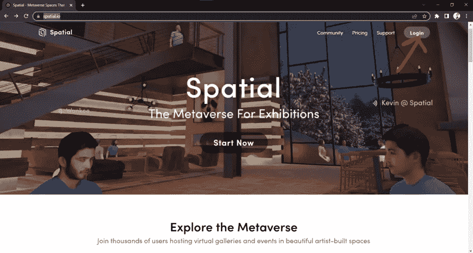
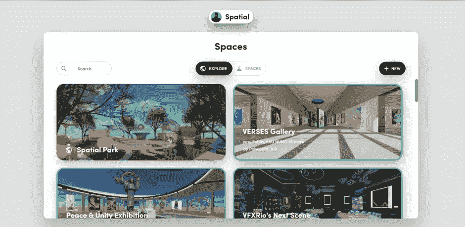
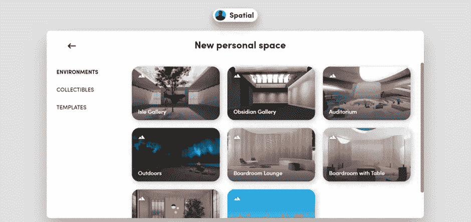
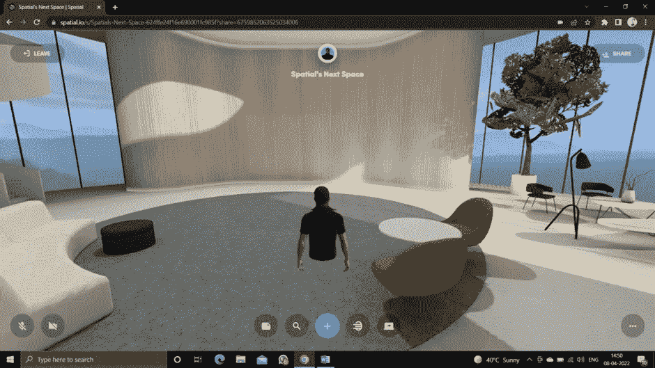
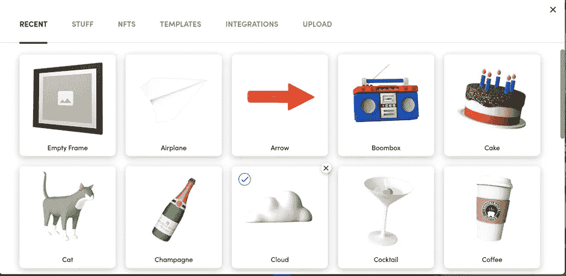
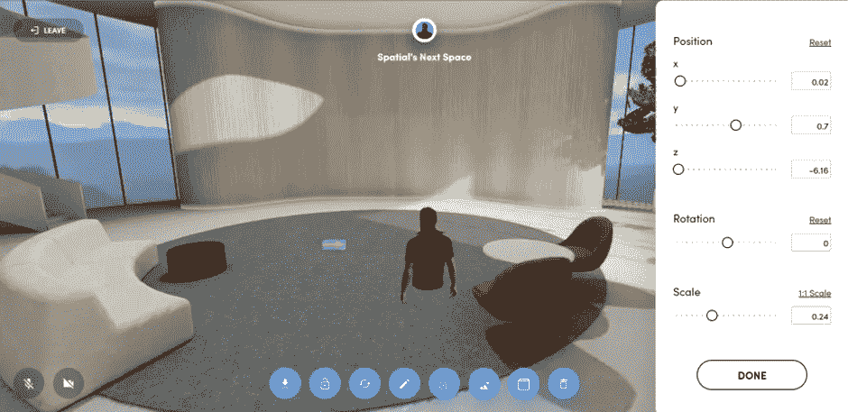
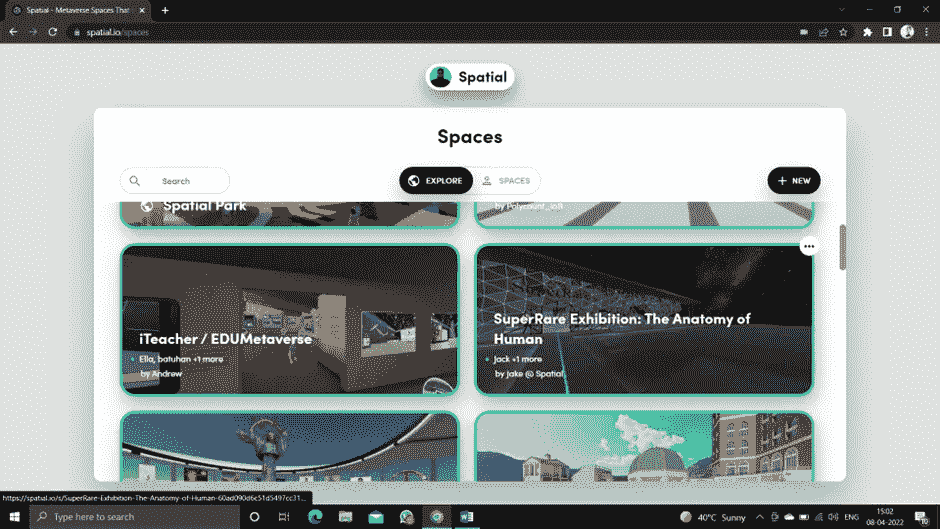

# 使用 Spatial.io 探索元宇宙

> 原文：<https://medium.com/coinmonks/exploring-metaverse-using-spatial-io-818b3416d2e6?source=collection_archive---------3----------------------->

想象一下，如果你能够通过创建各种不同的数字“化身”来参加任何虚拟活动，那会是什么感觉？

元宇宙是这个机会的关键。简而言之，元宇宙可以被定义为虚拟世界的三维网络，它专注于使用增强现实(AR)和虚拟现实(VR)的社交联系。

在这个博客中，我们将探索空间，这将有助于我们创建自己的“化身”和自己的个人虚拟空间。

Spatial.io 致力于帮助创作者和品牌在元宇宙建立自己的空间，共同分享文化。Spatial 使他们的用户能够利用他们美丽的空间来分享引人注目的内容，建立一个紧密结合的社区，并推动他们的创意作品和产品的有意义的销售。Spatial 还使我们的用户能够创建美丽而实用的 3D 空间，他们可以将其打造为 NFT，并出售/出租给其他希望获得令人兴奋的体验的人。

让我们看看如何利用空间:

1.  访问以下网站 [Spatial.io](http://spatial.io)

 [## 空间——元宇宙的空间让我们走到了一起

### 体验虚拟 NFT 艺术展、聚会和现场活动，以及栩栩如生的化身。自定义美丽的 3D…

spatial.io](https://spatial.io/) 

2.然后将出现以下窗口。根据您的选择登录。

3.在此之后，一个三维头像将通过上传你的个人资料图片到下面的窗口生成。

4.单击右侧的新选项，然后根据您的选择选择空间。

5.选择个人空间后。将出现以下窗口。

6.你也可以根据自己的选择定制个人空间。选择蓝色图标，将出现以下窗口。

7.只需拖放所需的图标，它会看起来像下面的窗口。

8.Spatial 还提供了使用 explore 选项卡查看其他用户创建的空间和头像的功能。

9.像集成微软 office、Metamask Wallet 和 google drive 这样的其他任务也可以在这里完成。

您可以通过共享邀请链接邀请您的朋友加入您的工作区。

# 干得好！！👍👍

# 欢迎来到你自己的虚拟世界！！

**如需进一步查询或任何与区块链和元宇宙发展有关的事情，编码可以在**[**Linkedin**](https://in.linkedin.com/in/anubhav-chaturvedi-a7465a72)**或 insta gram id =**[**acanubhav 94**](http://instagram.com/acanubhav94)**上 DM 我。**

**特别鸣谢我的团队成员:******[**安士卡**](https://www.linkedin.com/in/anshika-yadav-0a69381b7/)****

> *****加入 Coinmonks* [*电报频道*](https://t.me/coincodecap) *和* [*Youtube 频道*](https://www.youtube.com/c/coinmonks/videos) *了解加密交易和投资*****

# ****另外，阅读****

*   ****[3 商业评论](/coinmonks/3commas-review-an-excellent-crypto-trading-bot-2020-1313a58bec92) | [Pionex 评论](https://coincodecap.com/pionex-review-exchange-with-crypto-trading-bot) | [Coinrule 评论](/coinmonks/coinrule-review-2021-a-beginner-friendly-crypto-trading-bot-daf0504848ba)****
*   ****[莱杰 vs n rave](/coinmonks/ledger-vs-ngrave-zero-7e40f0c1d694)|[莱杰 nano s vs x](/coinmonks/ledger-nano-s-vs-x-battery-hardware-price-storage-59a6663fe3b0) | [币安评论](/coinmonks/binance-review-ee10d3bf3b6e)****
*   ****[Bybit Exchange 评论](/coinmonks/bybit-exchange-review-dbd570019b71) | [Bityard 评论](https://coincodecap.com/bityard-reivew) | [Jet-Bot 评论](https://coincodecap.com/jet-bot-review)****
*   ****[3 commas vs crypto hopper](/coinmonks/3commas-vs-pionex-vs-cryptohopper-best-crypto-bot-6a98d2baa203)|[赚取加密利息](/coinmonks/earn-crypto-interest-b10b810fdda3)****
*   ****最好的比特币[硬件钱包](/coinmonks/hardware-wallets-dfa1211730c6) | [BitBox02 回顾](/coinmonks/bitbox02-review-your-swiss-bitcoin-hardware-wallet-c36c88fff29)****