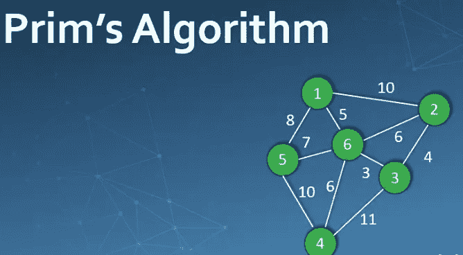
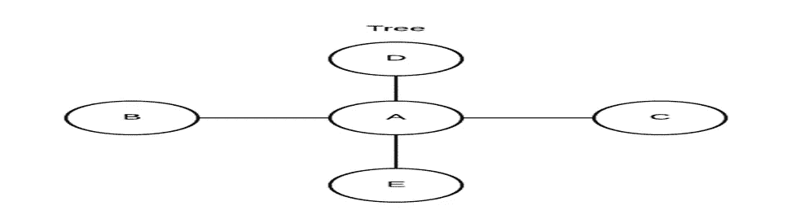
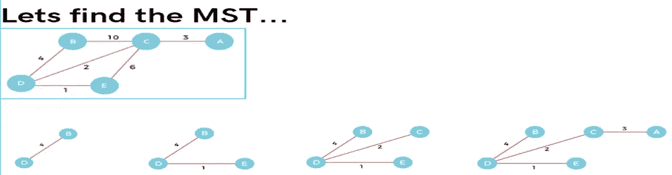
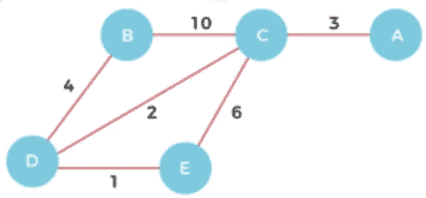
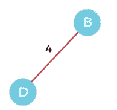
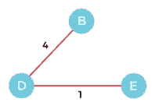
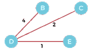

# 探索 Prim 算法

> 原文：<https://medium.com/coinmonks/exploring-prims-algorithm-3fc8170fbf11?source=collection_archive---------33----------------------->

大多数感兴趣的算法都是对数据进行操作的。有一些组织数据的安排在算法的设计和分析中起着关键的作用。简而言之，我们可以说数据结构就是组织数据的简单方式。

数据结构有两种类型，线性或非线性。链表和数组是线性数据结构的例子。树和图是一些类型的非线性数据结构。

算法是解决问题的方法。在这篇博客中，我们将探索 Prims 算法，该算法用于从图中寻找最小生成树。

在开始 Prims 算法之前，让我们先了解几个术语:

1.  图:图是一种数据结构，本质上是非线性的，由节点和边组成。这里的节点有时也称为顶点，边是连接图中任意两个节点的线或弧。

2.树:树也是一种非线性数据结构，其结构类似于图形。树的主要区别在于树的两个顶点之间只有一条路径。两个顶点之间不能有多条路线。

3.最小生成树:最小生成树是图中连接每个顶点并使边的总数最小的边的子集。赋予生成树的边的权重的总和就是生成树的权重。

现在我们进入讨论的主要话题，Prim 的算法。这是一种贪婪算法，用来寻找最小生成树。Prim 的算法识别包括图中每个顶点的边的子集，并允许边权重的总和最小化。我们从随机选取任何一个节点开始，然后通过连接其他节点继续前进，确保我们没有制作一个图，也就是说，从一个节点到另一个节点只有一条路。

算法:

步骤 1:随机选择一个起始节点。

第二步:重复第三步和第四步，直到出现边缘节点。

步骤 3:选择连接树节点和边缘节点的具有最小权重的边“e”

步骤 4:将选择的节点和边添加到最小生成树 T 中

[循环结束]

第五步:退出

现在，让我们看一个例子:

**第一步** —首先，我们必须从上图中随机选择一个节点。我们选 b 吧。

**第二步—** 现在我们必须选择并组合从顶点 B 开始的最短边，从顶点 B 开始有两条边:B 到 C，权重为 10，B 到 D，权重为 4。边 BD 具有所有边中最轻的权重。因此，将其添加到 MST 中。

**第三步** —在所有的边中，选择权重最小的一条。在这种情况下，边 DE 和 CD 是这种边的例子。将它们添加到 MST，并调查 C 旁边的区域，即 E 和 a。结果，选择边 DE 并将其添加到 MST。

**步骤 4** —现在，我们可以看到 CD 上的重量最小，选择边缘 CD，并将其添加到 MST。

**步骤 5** —现在，我们可以看到节点 A 是唯一剩下的节点，它只连接到 C，因此我们选择边缘 CA 并将其添加到 MST。

现在我们可以计算 MST 的成本，如下所示-

MST 的成本= 4 + 2 + 1 + 3 = 10 个单位。

我希望这篇博客能让你对 Prim 的算法有更好的理解。