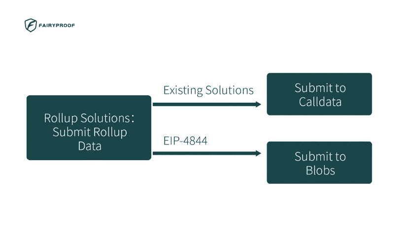
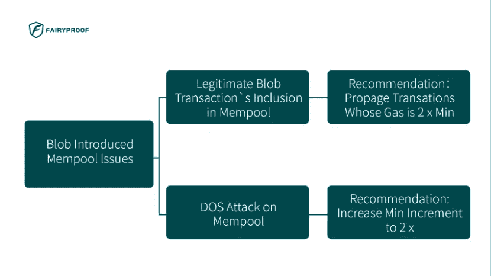
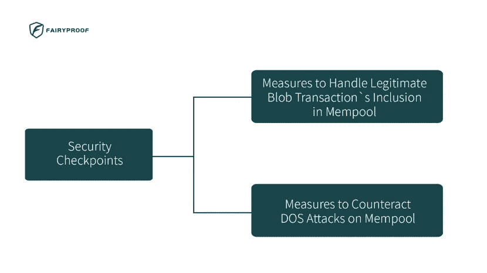

# 基于 EIP-4844 的分片 Blob 事务中安全检查点的探索

> 原文：<https://medium.com/coinmonks/exploring-security-checkpoints-in-shard-blob-transactions-based-on-eip-4844-by-fairyproof-8c3fc755fb14?source=collection_archive---------33----------------------->

在以太坊的联合创始人 Vitalik Buterin 的领导下，最近提出了一个 EIP，为“携带 blob 的交易”创建一种新的交易格式。它就是 EIP-4844[1]。

根据这个 EIP 的规范，尽管它是一个权宜之计，但它为 blob 事务引入的格式将与以太坊最终的分片规范中存在的格式相同[2]。最终，所有的汇总解决方案[3]将不得不使用分片数据(即 blobs ),而不是他们现在使用的 calldata，如果他们希望向以太坊提交汇总数据的话。

因此，这个 EIP 将很可能被以太坊的客户端采用和实现，现有的汇总解决方案最终将不得不做出更改以符合这个 EIP。

每当引入变更时，也可能引入问题或风险。

作为一家区块链安全公司，Fairyproof 的研究团队对这些变化可能带来的问题或风险非常感兴趣。我们研究了这个 EIP，探索了可能的安全检查点，并想分享一些关于这些检查点的想法。

该 EIP 在以太坊客户端和汇总解决方案的实现方面引入了重大变化。

在以太坊客户端，提出了新的 blob 事务，因此引入了 signedblobtransactionnetworkwrapper 等新的数据结构，引入了 validate _ blob _ transaction _ wrapper 等新的算法。

在汇总解决方案方面，乐观汇总解决方案[4]和 ZK 汇总解决方案[5]都需要将汇总数据放入 blob 事务中。

以太坊客户端和汇总解决方案中的变化可能不会引入明显的漏洞，但是新引入的 blob 事务可能会带来两种类型的内存池问题。

第一个是 blob 事务具有可变的内在气体成本。并且这将使内存池暴露于攻击，因为事务可能有资格被包括在一个块中，但是可能没有资格被包括在下一个块中。为了防止这种攻击，本 EIP 建议只广播“其 gas 至少是当前最小值的两倍”的交易，以大大增加合法交易被包括在块中的机会。

第二个问题是 blob 事务在 mempool 层有很大的数据量，这将使 mempool 暴露于 DoS 攻击。该 EIP 建议将“内存池替换的最小增量从 1.1x 增加到 2x”，以增加攻击者的成本，从而减少他/她的攻击企图。

值得注意的是，EIP 称这两项只是建议。这意味着开发人员可能不需要在他/她的实现中遵循它们。但是就安全性而言，开发人员需要尽一切办法在他/她的代码中处理这些问题。

这是区块链安全公司在审计实现该 EIP 的以太坊客户端时需要密切关注的。

此外，提出这两个建议是为了对抗对内存池的攻击。如果它们被实施，这意味着如果非恶意用户希望他/她的交易被迅速处理，他/她需要支付符合这些建议的燃气费。

这是用户应该知道的。

参考资料:

[1]https://eips.ethereum.org/EIPS/eip-4844，2022 年 2 月 25 日，EIP-4844:碎片 Blob 交易

[2]碎片锁链，【https://ethereum.org/en/upgrades/shard-chains/】T2

[3]一个不完整的汇总指南，【https://vitalik.ca/general/2021/01/05/rollup.html,】T42021 年 1 月 5 日

[4]乐观向上，

[https://docs . eth hub . io/ether eum-roadmap/layer-2-scaling/optimistic _ roll ups/，](https://metamask.io/,)

[5] ZK-Rollups，[https://docs . eth hub . io/ether eum-roadmap/layer-2-scaling/ZK-roll ups/](https://docs.ethhub.io/ethereum-roadmap/layer-2-scaling/zk-rollups/)

> 加入 Coinmonks [电报频道](https://t.me/coincodecap)和 [Youtube 频道](https://www.youtube.com/c/coinmonks/videos)了解加密交易和投资

# 另外，阅读

*   [加密货币储蓄账户](/coinmonks/cryptocurrency-savings-accounts-be3bc0feffbf) | [加密交易机器人](https://coincodecap.com/best-crypto-trading-bots)
*   [BigONE 交易所评论](/coinmonks/bigone-exchange-review-64705d85a1d4) | [CEX。IO 审查](https://coincodecap.com/cex-io-review) | [Swapzone 审查](/coinmonks/swapzone-review-crypto-exchange-data-aggregator-e0ad78e55ed7)
*   [最佳比特币保证金交易](/coinmonks/bitcoin-margin-trading-exchange-bcbfcbf7b8e3) | [比特币保证金交易](https://coincodecap.com/bityard-margin-trading)
*   [加密保证金交易交易所](/coinmonks/crypto-margin-trading-exchanges-428b1f7ad108) | [赚取比特币](/coinmonks/earn-bitcoin-6e8bd3c592d9)
*   [WazirX vs coin dcx vs bit bns](/coinmonks/wazirx-vs-coindcx-vs-bitbns-149f4f19a2f1)|[block fi vs coin loan vs Nexo](/coinmonks/blockfi-vs-coinloan-vs-nexo-cb624635230d)