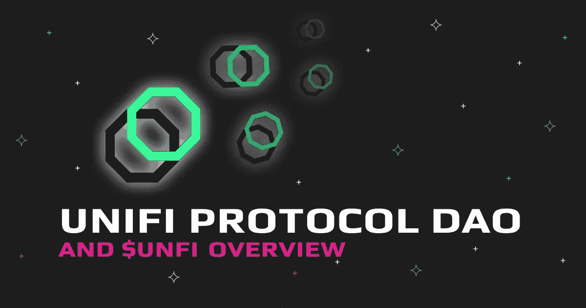

# 探索 Unifi 协议 DAO (UNFI)

> 原文：<https://medium.com/coinmonks/exploring-unifi-protocol-dao-unfi-bf039c1c82?source=collection_archive---------13----------------------->

Unifi Protocol DAO (UNFI)是一个非托管的区块链项目，旨在将互操作性构建到分布式金融(DeFi)的世界中。虽然乍一看，这听起来像另一个 DeFi 项目，但实际上，它的目标要多得多；通过连接独立的 DeFi 项目，UNFI 正在建立一个分散的金融系统。

该网络的本地 DeFi UP 令牌和 [UNFI 令牌](https://swapzone.io/currencies/unifi-protocol-dao)可以帮助我们获得这种潜在的改变游戏规则的 DeFi 基础设施。

在本帖中，我们将解释 Unifi 是做什么的，它是如何工作的，以及是谁开发了它。

# 快速安全的协议弥补了赤字经济

Unifi 协议最好被想象成一个智能合约的生态系统，它通过种子桥在以太坊(ETH)区块链上已经运行的 DeFi dApps 和在 Tron (TRX)等网络上运行的类似应用程序之间建立桥梁。

# 介绍 Unifi 协议

SEED Bridge 创建了一个多链网络，作为一个没有中央管理机构的非托管系统发挥作用。如果你对加密感兴趣，那么可以肯定地说，你会觉得这个项目符合很多必要的条件；它是分散的、互连的，让用户可以控制他们的令牌。

本土的 [UNFI 代币](https://swapzone.io/currencies/unifi-protocol-dao)通过流动性池、治理权和借贷激励参与。该协议不仅仅带来了互操作性；区块链的智能合约为开发人员安全高效地构建 dApps 提供了空间。

上行令牌是这个复杂的 DeFi 网络的心脏。UP 与 Unifi 跨链网络上的经济活动量成比例，并为参与 Unifi 协议所有领域的用户提供激励。

# 什么是 uTrade(以及它与 Unifi 的关系)？

uTrade 是 Unifi 系统中的主要功能之一，该自动做市商(AMM)作为一个分散的概念验证交易平台，可以在其中进行跨链互换。此外，流动性池用于保持 uTrade 平稳运行，流动性提供者因其支持而获得回报。

# 为什么 uTrade 比现有的交易平台更好？

许多跨链交易平台将支付给流动性提供者的报酬限制在预选交易对费用的一定比例。相比之下，Unifi 流动性提供者从整个协议产生的收入中抽取一定比例。

从资金池中撤出资金的流动性提供者可以通过持有代币继续获得回报。此外，虽然大多数 DeFi 交易平台的覆盖范围有限，但 uTrade 可以促进跨多个链的代币互换，同时保持非托管。

该交易平台的另一个令人兴奋的功能是你在其他任何地方都找不到的，那就是它的每日复利，通过提供对几个区块链的敞口，自动提高赌注回报。

# 有关 UP 令牌的更多信息

正如我们已经讨论过的，Unifi 是一个多链网络，因此，它需要使用的不仅仅是一个令牌；当网络从 Tron (TRX)或 Ontology (ONG)这样的网络收集收入时，回报被交叉计算到 UP 中。

因此，当税收增加时，UP 就产生了；这反过来提高了整个上行市场的价值，这一过程被称为功率上升率(PUR)。有趣的是，开发人员预测 UP 的价值最终会超过赎回的价值，从而导致 UP token 的价格上涨压力。

该项目的路线图还计划在未来利用 UP 令牌进行治理；这将把项目的开发移交给一个 Unifi 爱好者社区，并进一步保证内在的权力下放水平。

# uLend 是什么？

顾名思义，uLend 是通过 Unifi 区块链上的智能合同创建的贷款协议。一旦完成，uLend 将让 UP 持有者从网络的成功中获利。此外，uLend 上的贷款应用程序在提供 DeFi 贷款时可以利用各种令牌作为抵押品。

种子桥将在 uLend 中发挥关键作用，创造一个生态系统，可以用一种令牌发放贷款，但抵押品可以来自完全不同的区块链。例如，有人可能在 Polygon (MATIC)获得贷款，但在 Tron (TRX)提供担保。

人们也可以使用 uLend 进行加密交易，而不会失去他们的长期地位；例如，通过 Tron 持有代币的人可以使用这些代币作为抵押品，从 Ontology(ONG)价格上涨中获利。

# UNFI 需要多少份确认书？

每次在区块链上执行交易时，流程都必须由被称为节点的参与者确认，这些参与者必须就交换令牌达成共识。以 UNFI 为例，每笔交易在结算前都需要 14 次确认。

# 哪个区块链网络托管 UNFI？

虽然 UNFI 网络与几个区块链交互，但它像许多第二层 DeFi 项目一样托管在以太坊网络上。

# 最低和最高取款金额是多少？

您可以从加密货币中提取的金额取决于您用来进行转账的交易所。在 Swapzone 上提款是很棒的，因为我们会为你找到最好的交易，并给你一个你将从交换中获得多少的估计。

# Unifi 协议 DAO 网络是如何保护的？

Unifi 网络使用利益证明(PoS)机制进行保护；这意味着验证器节点需要标记令牌，以保证它们不会恶意操作。PoS 通常被认为比工作证明更具可扩展性和环保性，因为它消耗的能源更少。

# 流通中的币有多少枚？

根据 CoinGecko 的说法，UNFI 的最大供应量为 10，000，000，截止到写作时，有 5，716，363 本在流通中。大约 50%的 UNFI 供应量由流动性提供者和生态系统开发(LPED)持有，15%分配给了项目的开发者和创始人。UNFI 币在 2021 年 3 月达到 43 美元的历史高点，此后下跌超过 80%，至 8 美元。

# 是什么让 Unifi 协议 DAO 独一无二？

通过其跨链的雄心，Unifi 协议在不断增长的 DeFi 项目中脱颖而出。该网络的智能合约部署在几个以太坊虚拟机(EVM)兼容网络上，如 BNB 链(BNB)和雪崩(AVAX)。

由于最近的 uBridge 升级，当在 Unifi 智能合约上进行互换时，UNFI 控股公司会自动重新平衡，不像其他协议那样，包装的 BNB 或 AVAX 令牌会重新平衡。

# Unifi 协议 DAO 的创始人是谁？

这个项目是由一个名为 Sesameseed 的在线社区发起的；该社区的联合创始人兼首席执行官 Juliun Brabon 继续在该协议的发展中发挥核心作用。此外，Kerk Wei Yang 还监督协议的智能合约兼容性的开发。

# 如何使用 UNFI 代币？

如果您持有 [UNFI 代币](https://swapzone.io/currencies/unifi-protocol-dao)，您可以使用它们来下注，这将获得您的奖励，或者它们可以被委托给社区议会代表(CCR)的代表投票，以获得奖励并参与项目的开发。

> 加入 Coinmonks [电报频道](https://t.me/coincodecap)和 [Youtube 频道](https://www.youtube.com/c/coinmonks/videos)了解加密交易和投资

# 另外，阅读

*   [折叠 App 审核](https://coincodecap.com/fold-app-review) | [Kucoin 交易机器人](/coinmonks/kucoin-trading-bot-automate-your-trades-8cf0ca2138e0) | [Probit 审核](https://coincodecap.com/probit-review)
*   [如何匿名购买比特币](https://coincodecap.com/buy-bitcoin-anonymously) | [比特币现金钱包](https://coincodecap.com/bitcoin-cash-wallets)
*   [币安 vs FTX](https://coincodecap.com/binance-vs-ftx) | [最佳(SOL)索拉纳钱包](https://coincodecap.com/solana-wallets)
*   [比诺莫评论](https://coincodecap.com/binomo-review) | [斯多葛派 vs 3Commas vs TradeSanta](https://coincodecap.com/stoic-vs-3commas-vs-tradesanta)
*   【Capital.com】|[港加密借贷平台](https://coincodecap.com/crypto-lending-hong-kong)
*   [如何在 Uniswap 上交换加密？](https://coincodecap.com/swap-crypto-on-uniswap) | [A-Ads 评论](https://coincodecap.com/a-ads-review)
*   [WazirX vs CoinDCX vs bit bns](/coinmonks/wazirx-vs-coindcx-vs-bitbns-149f4f19a2f1)|[block fi vs coin loan vs Nexo](/coinmonks/blockfi-vs-coinloan-vs-nexo-cb624635230d)