# 指数衰减和大量代币供应

> 原文：<https://medium.com/coinmonks/exponential-decay-and-large-token-supplies-782683806ce9?source=collection_archive---------36----------------------->

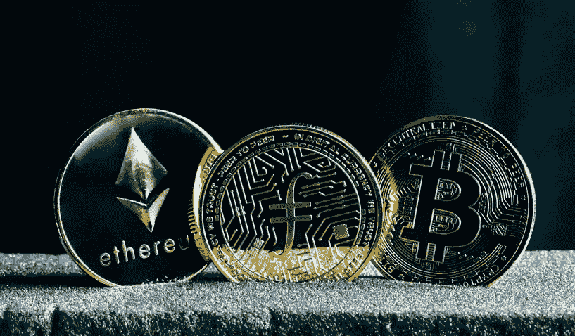

FEG、皮特保罗和 Safemars 等加密货币吸引着寻求极端价值的投资者。截至本文撰写时，Safemars 的交易价格为 0.00000002327；任何投资者都可以以 23.27 美元的价格拥有 10 亿枚 Safemars 代币。

这些投资者梦想着有一天这些代币中的一个会达到 1 美元，而不考虑需要大量减少的万亿代币供应，以创造足够的稀缺来大幅提高价格。

拥有大量供应的代币的智能合约通常是硬编码的，具有通常不足以实现稀缺性的通缩功能。

Coinmarketcap 表示，Safemars 的总供应量超过 393 万亿美元，每笔交易都征收 4%的税，这并没有导致代币供应的显著通缩。

4%的交易税视交易量而定。Coingecko 和 Coinmarketcap 显示了过去七天不同的交易量统计数据。

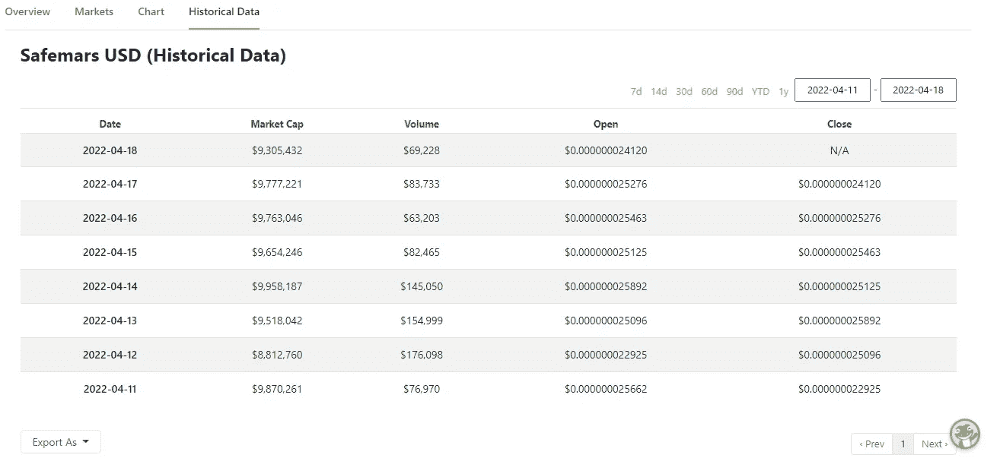

Coingecko

Coinmarketcap 显示交易量较高，从 83，707 美元到 217，490 美元不等。数据显示 Safemars 的交易量稳定，但交易税需要更高的交易量水平才能燃烧更多的代币。

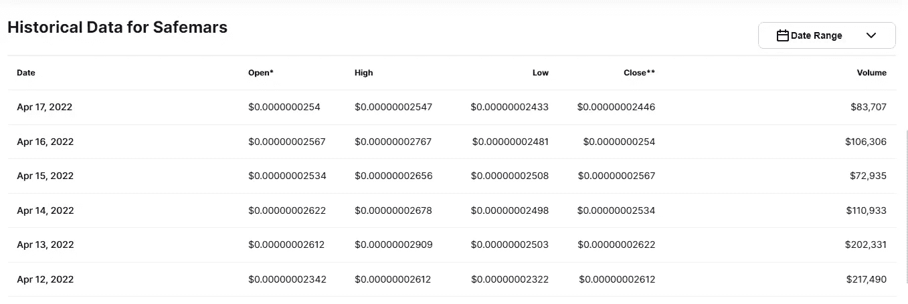

Coinmarketcap

对交易量为 100 万美元的交易征收 4%的交易税，将去除价值 40，000 美元的代币，但对交易量为 217，490 美元的交易仅去除 8，699.6 美元；收盘价为 0.00000002612 美元，粗略估计相当于 333，062，787，136.29 枚代币。

*8699.6÷0.00000002612 = 333062787136.29*

燃烧总量四舍五入为最大供应量的 0.0003%。最近的一篇 Twitter 帖子指出，一年后，目前有 383 万亿和 616，269 万亿令牌被烧毁。自从这篇文章发表以来，总数已经改变了，但是我们将使用这些数字来演示。

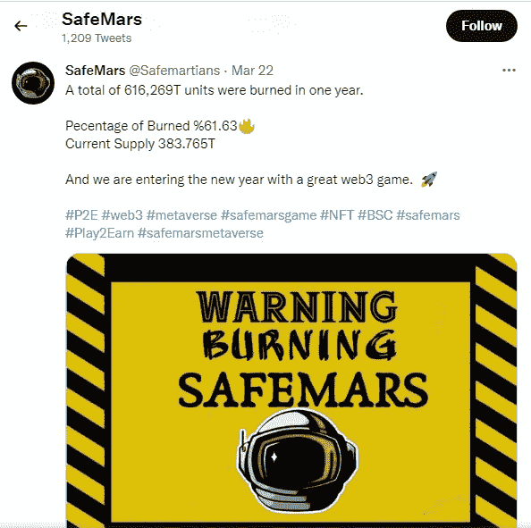

在成为一个备受青睐的项目(拥有超过 157，000 名 Twitter 粉丝、一个 NFT 市场和一个即将推出的元宇宙项目)一年后，它们的价格升值一直停滞不前。

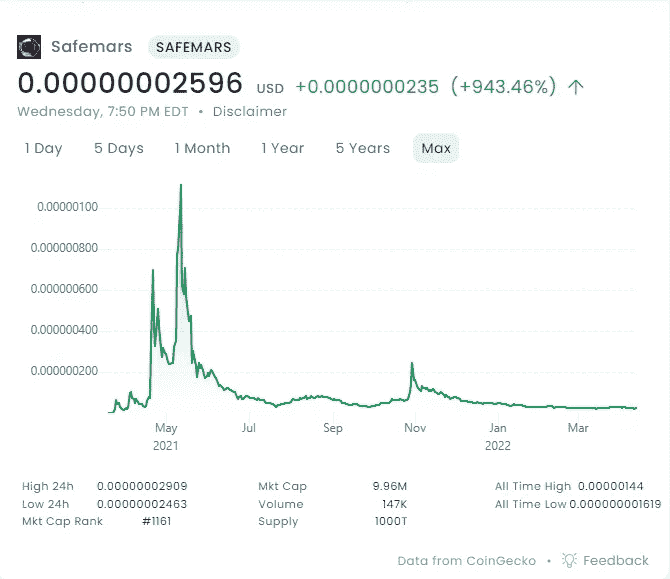

Safemars 拥有一个支持社区和超过 400，000 名令牌持有者。他们的 Twitter 账户在一年的不到恒星的价格升值后有很多参与。安全火星经受住了考验。

最后，它们已经通过 Certik 认证。经过研究，新投资者可能会认为这是一个不错的项目，可以通过早期介入来增加投机组合。若干年后，由于巨大的总供应量，价格可能不会升值。

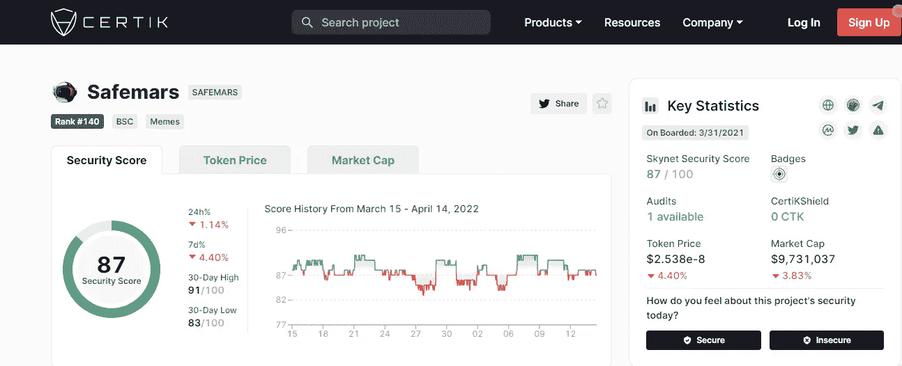

类似项目的存活率是不可能的，在有大量代币供应的情况下，极低买高卖的承诺能实现吗？投资者能否投资 20 美元左右，赚取 10000 美元或更多？

是的，通常是在市场上涨后的大幅抛售期间，这对于 HODL 的长期投资者来说是不可持续的。象征性的燃烧和回购是价格稳步上涨的两个主要条件，但在减少 Safemars 等项目的大量象征性供应方面无效。

千万亿级的总供应量或最大供应量要求象征性的供应大幅指数下降，以实现稳定的价格上涨。使用指数衰减公式将进一步深入了解这些代币供应的巨大规模。

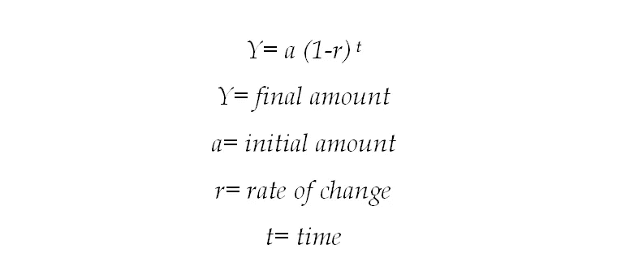

有了如此巨大的代币供应，例如，以 10%的指数衰减率，代币供应在 5 年后会是多少？

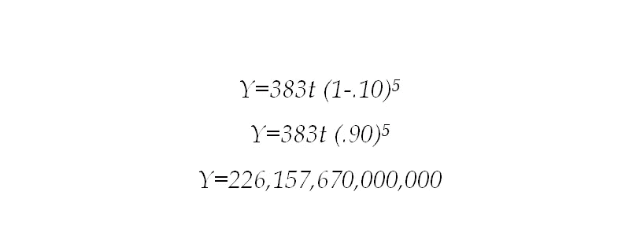

剩余总供给超过 226 万亿。根据这一粗略估计，投资者不太可能实现稳定的价格升值。

通过实施 95%的指数衰减率，在不考虑交易税的情况下，总供应量减少到 1.196 亿，结果要好得多。

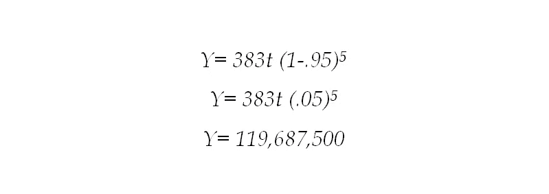

Titano、Safuu、Libero、Sphere Finance 和许多其他通胀 rebase 项目在燃烧代币以保持价格稳定的同时，使代币供应呈指数增长。

具有大量代币供应的项目可能不得不使用指数缩减来将代币供应有意义地减少到固定数量。

开发团队确定固定金额，是 2100 万，600 万，还是 30 万；效果就是稀缺性。

一个项目的最大供应量为 100 万亿，每年的衰减率为 97%，减少到 24 亿代币**可能**有助于实现长期 20 美元投资的 10，000 美元回报。

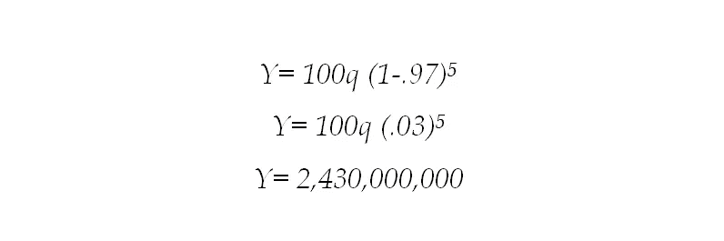

第一年减少 97%相当于剩余 3000 亿个代币，仍然是一个天文数字。投资者可能没有完全意识到 100 万亿这个数字有多大，这是 FEG 的总供应量。

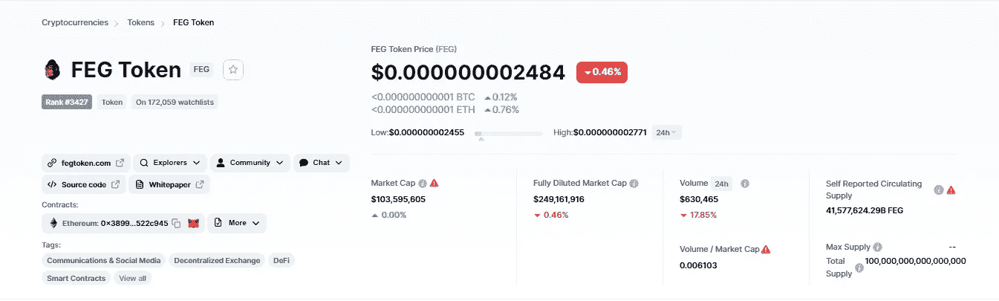

Coinmarketcap

简单的交易税是必要的，但还不够，尤其是在交易量低的日子，这意味着象征性的低消耗。令牌供应的指数级减少必须是硬编码的。无论交易量如何，代币都必须燃烧。

指数衰减函数是长期投资的一种工具，它不能完全抵消价格的急剧下跌。拉不拉地毯。市场是无情的。

抛售压力往往伴随着价格上涨。投资者在市场上涨时获利。就像曼达洛人*，*“这就是方法。”

价格可以在 24 小时内下降 90%以上，即使是 97%的年指数衰减率也不足以烧掉突然涌入市场的代币。

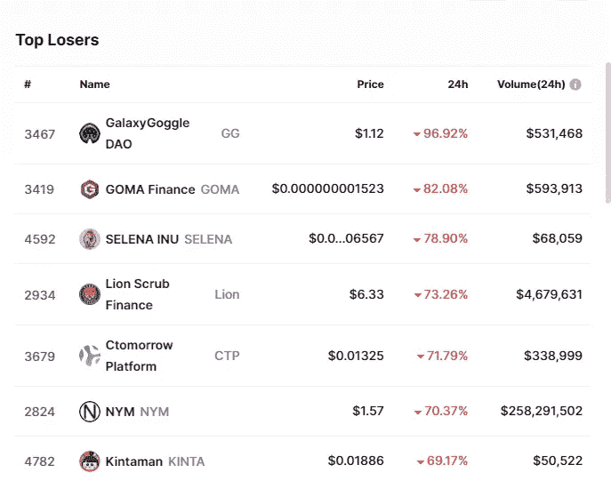

通过燃烧售出的等量令牌、自动回购和燃烧以及对死亡钱包征收买卖税来优化衰减函数，增强了协议抵御大规模抛售的能力。

具有大量代币供应和次便士代币价格的加密货币项目提供了套利机会，有可能让投资者赚到数百万美元。

巨大的象征性供应是开发商必须消除的一个障碍，以允许投资者进入一个流动财富和利润的土地。

> 加入 Coinmonks [电报频道](https://t.me/coincodecap)和 [Youtube 频道](https://www.youtube.com/c/coinmonks/videos)了解加密交易和投资

# 另外，阅读

*   [ProfitFarmers 回顾](https://coincodecap.com/profitfarmers-review) | [如何使用 Cornix 交易机器人](https://coincodecap.com/cornix-trading-bot)
*   [如何匿名购买比特币](https://coincodecap.com/buy-bitcoin-anonymously) | [比特币现金钱包](https://coincodecap.com/bitcoin-cash-wallets)
*   [瓦济里克斯 NFT 评论](https://coincodecap.com/wazirx-nft-review)|[Bitsgap vs Pionex](https://coincodecap.com/bitsgap-vs-pionex)|[Tangem 评论](https://coincodecap.com/tangem-wallet-review)
*   [如何使用 Solidity 在以太坊上创建 DApp？](https://coincodecap.com/create-a-dapp-on-ethereum-using-solidity)
*   [币安 vs FTX](https://coincodecap.com/binance-vs-ftx) | [最佳(索尔)索拉纳钱包](https://coincodecap.com/solana-wallets)