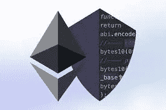

# 您的 Solidity Smart 合约中的外部呼叫安全性

> 原文：<https://medium.com/coinmonks/external-call-security-in-your-solidity-smart-contract-2d7c0be5e20?source=collection_archive---------7----------------------->

以太坊是世界上使用最多的区块链之一。它用于开发 Dapps，最重要的用例是 Defi。目前，Defi 处理超过 780 亿美元的资金，因此在开发智能合同时，安全性是最重要的考虑因素。



由于区块链开发的基本性质，开发智能合同的理念与普通的 Web2 开发非常不同。

处理一大笔钱需要更多的预防措施，所以人们应该随时做好失败的准备必须有一个出路，比如断路器，或者可以减少整体损害的最大使用限制。

无论是软件还是技术，不断升级是关键。由于 Web3 社区是如此之大和多样化，总会有人面临威胁并有解决方案，所以请保持警惕。总是建议进行回归测试，发布审计报告，并为潜在的 bug 设置 bug 奖金。开发 Dapps 时最重要的考虑之一是将所需的代码仅放在区块链上，并使其尽可能简单

在开发智能合约时，可以考虑外部调用期间的某些安全问题:

外部呼叫是您从智能合同向另一个智能合同发出的呼叫。(永远不要相信外部的智能合约！！).

将它们标记为不可信是表明它们正在访问外部合同的一种方式。

```
// Bad practise
function withdrawMoney(){
		Contract2.withdraw()
}
// Good practise
function UntrustedWithdrawMoney(){
		UntrustedContract2.withdraw()
}
```

避免外部调用发生后的任何状态变化，因为他们可能没有恶意代码，但他们能够调用一个。它会导致控制劫持和有史以来最重要的攻击之一——重入。该模式用于避免这种检查-效果-交互模式。因此，首先使用 require、revert、assert 进行检查，一旦检查通过，就必须完成对状态更改的影响，然后在与外部契约的交互之后

什么是可重入攻击？

基本思想是契约 A 调用契约 B，契约 B 可以在第一次调用执行之前调用契约 A

```
// Contract A has a withdraw function where users can withdraw ether if have
//balance in the ContractContract A{
	mapping (address => uint256) userBalance;
	function withdraw() public {
        uint bal = balances[msg.sender];
        require(bal > 0); (bool sent, ) = msg.sender.call{value: bal}("");
        require(sent, "Failed to send Ether"); balances[msg.sender] = 0;
    }
}// Contract B will have two functions first is attack function which will call
// the Contract A for withdrawal and a fallback function to withdraw money and a loop
// will be created to drain all the ether before updating of balanceContract B{
	fallback(){
	A.withdraw()
		}
	function attack(){
		A.withdraw()
		}
}
```

避免 transfer()和 send()这些方法用于阻止重入攻击，因为它们可以向调用者发送高达 2300 gas，但是由于 gas 成本不能恒定为 2300 gas(查看 [EIP 1884](https://eips.ethereum.org/EIPS/eip-1884) 伊斯坦堡 fork 以了解更多信息), call()是首选方法，但是易于重入。

在 address.call()之类的外部低级调用中处理错误它们不会抛出错误，但会为失败的事务返回一个布尔值，这些值需要进行处理

```
(bool success, ) = someAddress.call.value(_value)("");
require(success,"transaction failed!!");
```

总是让用户从合同中提取资金，而不是合同发送资金给用户，特别是付款，因为如果交易不成功，它将对特定用户失败，而不是所有用户。

避免对不受信任的代码进行委托调用。delegatecall 函数是调用另一个协定函数并更改该协定的状态的函数。如果目标地址是由用户提供的，开发者需要检查地址是否在白名单中。

外部呼叫可能是危险的 2016 年以太坊上名为 Dao Hack 的可重入攻击可能导致价值 7000 万美元的以太损失，并导致以太坊的分叉，即以太坊经典。所以在打任何外部电话之前都要非常小心

> 加入 Coinmonks [电报频道](https://t.me/coincodecap)和 [Youtube 频道](https://www.youtube.com/c/coinmonks/videos)了解加密交易和投资

# 另外，阅读

*   [SmithBot 评论](https://coincodecap.com/smithbot-review) | [4 款最佳免费开源交易机器人](https://coincodecap.com/free-open-source-trading-bots)
*   [比特币基地僵尸程序](/coinmonks/coinbase-bots-ac6359e897f3) | [AscendEX 审查](/coinmonks/ascendex-review-53e829cf75fa) | [OKEx 交易僵尸程序](/coinmonks/okex-trading-bots-234920f61e60)
*   [如何在印度购买比特币？](/coinmonks/buy-bitcoin-in-india-feb50ddfef94) | [瓦济克斯审查](/coinmonks/wazirx-review-5c811b074f5b)
*   [加密交易机器人](/coinmonks/crypto-trading-bot-c2ffce8acb2a) | [普罗比特评论](https://coincodecap.com/probit-review)
*   [隐翅虫替代品](/coinmonks/cryptohopper-alternatives-d67287b16d27) | [HitBTC 审查](/coinmonks/hitbtc-review-c5143c5d53c2)
*   [CBET 评论](https://coincodecap.com/cbet-casino-review) | [库科恩 vs 比特币基地](https://coincodecap.com/kucoin-vs-coinbase)
*   [折叠 App 回顾](https://coincodecap.com/fold-app-review) | [Kucoin 交易机器人](/coinmonks/kucoin-trading-bot-automate-your-trades-8cf0ca2138e0)
*   [如何匿名购买比特币](https://coincodecap.com/buy-bitcoin-anonymously) | [比特币现金钱包](https://coincodecap.com/bitcoin-cash-wallets)