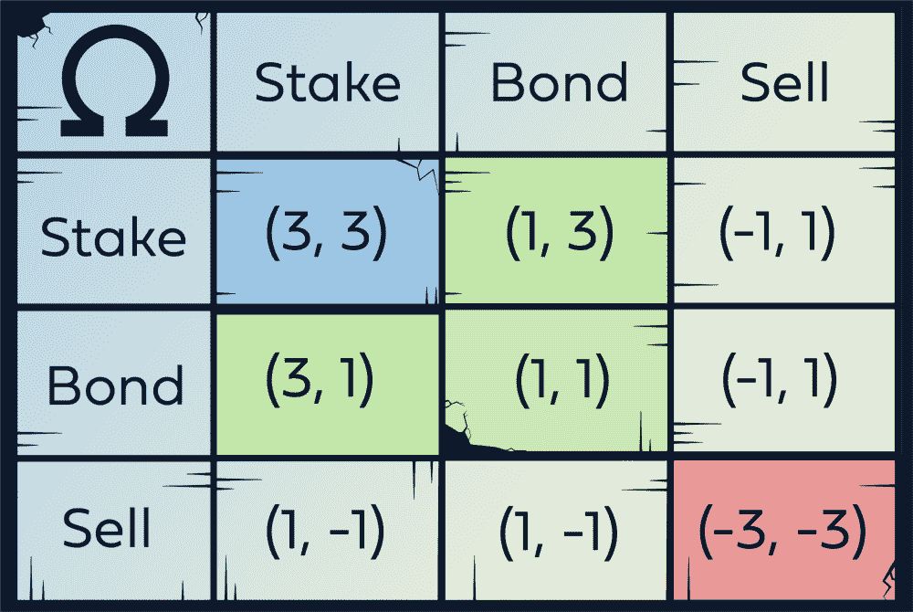

# 外在激励:对可持续发展社区是祸是福？

> 原文：<https://medium.com/coinmonks/extrinsic-incentives-bane-or-boon-to-sustainable-communities-1caaf77c86d9?source=collection_archive---------17----------------------->

## 开始很简单，维持却不简单。

Photo by [rafael albornoz](https://unsplash.com/@rafaelalbornoz?utm_source=unsplash&utm_medium=referral&utm_content=creditCopyText) on [Unsplash](https://unsplash.com/s/photos/sustainability?utm_source=unsplash&utm_medium=referral&utm_content=creditCopyText)

一个道的社区成员只**贡献**希望以后得到回报，这有错吗？在这篇文章中，我们试图评估激励的一致性以及它如何影响社区的可持续性。

这里的关键词是 **only** ，暗示了社区更大程度的脆弱。如果承诺奖励的**外在激励**被移除，贡献者将会少得多，这个社区实际上肯定会分崩离析。

在建立在区块链上的分散化社区中，外部激励通常通过象征经济学设计来实施，这种设计在如何将象征性奖励分配给社区上有所不同。这通常以追溯空投的形式出现，即根据用户之前在社区中的参与程度，将令牌“空投”到用户的钱包中。虽然这一系统在过去对奖励早期采用者很有效，但许多人已经开始利用这一机制，通过[创建多个钱包或进行虚假交易](https://www.coindesk.com/tech/2021/10/08/airdrop-ethics-vc-firm-draws-ire-following-25m-ribbon-finance-exploit/)，希望在未来的空投中增加他们的奖励。

诚然，我没有明确区分“社区成员”和“用户”。尤其是在 DAOs 的情况下，用户经常认为自己是社区的一部分，模糊了两者之间的界限。这种激励社区发展的金钱奖励现象并不仅限于加密领域。推荐方案或产品补贴经常被用作吸引更多用户的增长策略，尽管这种策略可能会产生巨大的成本，而且可能只能在短期内奏效。

如果没有真正的有机增长，一旦外部激励被移除，社区(或用户)的脆弱性就会变得明显。例如，一旦[流动性挖掘激励](https://www.coindesk.com/tech/2022/01/19/liquidity-mining-is-dead-what-comes-next/)枯竭，您经常会看到各种 DeFi 协议中平台的使用和锁定的总价值(TVL)急剧减少。

那么，我们如何设计激励机制来实现可持续发展的社区呢？这个问题我不会声称知道答案。然而，我确实知道它不是什么。在 Ohm(及其各种分支)的情况下，他们对这个问题的答案是[协议拥有的流动性](https://newsletter.banklesshq.com/p/wtf-is-olympus-dao)。

[(3,3), a game theory concept](/@CryptoMugen/climbing-the-summit-of-olympus-5ded557758ab)

这种激励模式的问题在于，用户和 OlympusDAO 的[贡献者](https://docs.olympusdao.finance/main/get-involved/contribute)从根本上来说仍然受到从他们的投资中获得金钱回报的外在激励。

最后，系统的设置最好能让贡献者有一种内在的贡献欲望，无论是通过他们在社区中结交的朋友，享受游戏本身，或者更好的是，通过为更伟大的事业做出贡献的欲望。然而，短期的货币或其他形式的外部激励对于建立关键的用户基础是必要的，该用户基础可以为社区以后从外部激励引导的贡献过渡到内部激励引导的贡献奠定基础。