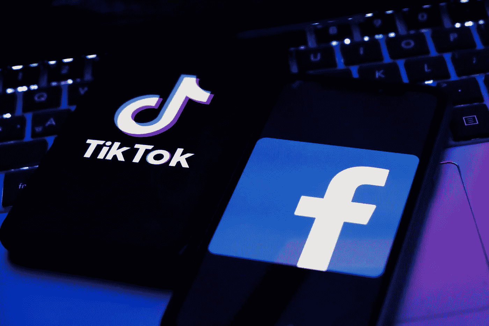

# 脸书和抖音为削弱对方而战

> 原文：<https://medium.com/coinmonks/facebook-and-tiktok-fight-to-weaken-each-other-44479862fa5?source=collection_archive---------62----------------------->

政治咨询公司 Turgiton Victory 的首席执行官回应了《华盛顿邮报》的一篇报道，该报道称梅塔(脸书)雇佣他来削弱抖音

《华盛顿邮报》报道称，它看到的电子邮件显示，一家名为 Targeted Victory 的政治咨询公司被要求在 Go 上开展一项名为抖音(对美国儿童的威胁)的活动

定向胜利的首席执行官扎克·莫法特(Zack Moffat)在推特上表示，《华盛顿邮报》的报道歪曲了他的公司的工作，报道的要点完全错误

BBC 联系了 Meta(脸书)对《华盛顿邮报》新闻的评论。Meta(脸书)的一位发言人表示:“我们认为，包括抖音在内的所有平台都应该根据其成功程度接受审查。”

[**阅读全文**](https://www.theeducationism.com/2022/04/facebook-and-tick-talk-fight-to-weaken.html)

> 加入 Coinmonks [电报频道](https://t.me/coincodecap)和 [Youtube 频道](https://www.youtube.com/c/coinmonks/videos)了解加密交易和投资

# 另外，阅读

*   [Bookmap 评论](https://coincodecap.com/bookmap-review-2021-best-trading-software) | [美国 5 大最佳加密交易所](https://coincodecap.com/crypto-exchange-usa)
*   最佳加密[硬件钱包](/coinmonks/hardware-wallets-dfa1211730c6) | [Bitbns 评论](/coinmonks/bitbns-review-38256a07e161)
*   [新加坡十大最佳加密交易所](https://coincodecap.com/crypto-exchange-in-singapore) | [购买 AXS](https://coincodecap.com/buy-axs-token)
*   [红狗赌场评论](https://coincodecap.com/red-dog-casino-review) | [Swyftx 评论](https://coincodecap.com/swyftx-review) | [CoinGate 评论](https://coincodecap.com/coingate-review)
*   [投资印度的最佳密码](https://coincodecap.com/best-crypto-to-invest-in-india-in-2021)|[WazirX P2P](https://coincodecap.com/wazirx-p2p)|[Hi Dollar Review](https://coincodecap.com/hi-dollar-review)