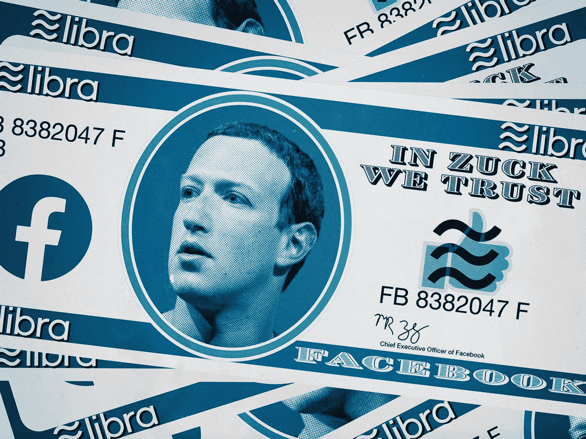

# 传言脸书将放弃数字硬币风险投资

> 原文：<https://medium.com/coinmonks/facebook-rumored-to-be-scrapping-digital-coin-venture-e35e2e2792d9?source=collection_archive---------7----------------------->

彭博的分析师报告称，脸书董事长马克·扎克伯格发起的 stablecoin 项目没有取得任何进展，因为联邦监管机构施加了巨大压力。支持该项目的组织，Diem Association，正在考虑出售该企业的资产，并将资本返还给投资者。