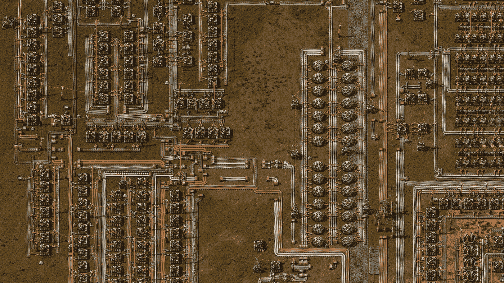

# 区块链工厂和快乐的本质

> 原文：<https://medium.com/coinmonks/factorio-blockchain-and-the-nature-of-fun-449e885fa314?source=collection_archive---------6----------------------->

Factorio © Wube Software

## 我被一个恶作剧骗了，并写了博客

万一你能在 2020 年或以后找到像样的游戏硬件，为数不多的不短缺的资源之一就是高质量的游戏发行。哈迪斯和微软飞行模拟器让我度过了大部分锁定期，尽管随后公开承诺[手里的狗屎并出售击掌](https://www.inverse.com/gaming/square-enix-nft-backlash)，甚至 Square Enix 也在《最终幻想 7》的翻拍中取得了巨大的胜利。

不过，疫情时代的游戏有个问题。很明显，你很喜欢这种游戏，但没有一款像[工厂](https://factorio.com/)一样让人无限享受。这是什么样的游戏？不确定。我猜是“物流”。在谷歌上快速搜索“像 Factorio 这样的游戏”,会出现一个你从未听说过的电脑游戏的庞大列表，我想其中一些游戏甚至相当不错。也许不是。没关系。我不知道有哪款游戏像 Factorio 一样，对其公认的利基类型有如此确凿、无可争议的掌控。

这不是一篇评论；Factorio 已经有大量的这种产品。但只是为了上下文:Factorio 是一个开放的、最不现实的制造模拟器，专注于“科学包”的生产，可以用来解开更高级的科学包的日益复杂的配方，等等。一个单一的科学包，即使是最复杂的游戏后期品种，也只需要不到一分钟的时间来制造。但是你需要成百上千个这样的人才能完全进步。一次建造一个，虽然在技术上是可能的，但速度非常慢。越来越复杂的配方需要一个无限扩大的、完全消耗的工厂，通常由非常简单的组件组成，令人愉快地连续几个小时进行微观管理。这是一个非常详细的自给自足的经济体，没有货币。不同于任何其他游戏的净化形式的供应链物流。我可以向你保证，玩 Factorio 会比阅读这篇博文有趣得多。

区块链技术是一个有毒的自我延续的骗局，不值得任何一个有思想的人关注，更不用说他们的钱了。这是一个事实，我没有兴趣辩论或讨论。如果你反对，请省下打回复的力气，把你的手伸进烤面包机里。你的键盘和烤面包机都是比加密交易更好的用电方式。

那么，你可以想象当我正面陷入 Factorio 创造者的愚人节邮件时，我有多害怕。说到 NFTs，每个游戏工作室要么是[育碧](https://www.rockpapershotgun.com/ubisoft-think-people-dont-get-the-thrilling-benefits-of-nft-items)要么是[鬼城游戏](https://twitter.com/Overcookedgame/status/1488486066898227205?s=20&t=-7JFib8CM1gCo1fDao6h2A)。中间没有太多(也不应该有)，这让我意识到我不确定 Wube Software 在明显愿意欺骗其客户的划分中属于哪一方。在 Factorio 的世界里，过度污染者被外星怪物吃掉。创造者真的愿意参与煤电欺诈吗？

不事实证明。但我敢肯定，rickroll 在 Wube 上并没有迷失背后的可怕事实:与绝大多数只值你哪怕一秒钟时间的游戏不同，Factorio 的机制非常适合区块链的废话。它肯定比 [DND](https://gizmodo.com/dungeons-dragons-nft-gripnr-blockchain-dnd-ttrpg-1848686984) 或[口袋妖怪](https://axieinfinity.com/)更适合区块链，因为它是一个简单的耗能模拟器。*要点*是以可笑的巨大且毫无意义的规模开采自然资源，吸干你能找到的每一片铁矿石，制造出更多的“科学包”，这样你就能在实验室里引爆它们。当地的野生动物偶尔会破坏你的东西或简单地吃掉你，当这种情况发生时，游戏很清楚地表明这是你自找的。

加密兼容性不仅仅是在隐喻层面上；在任何有意义的规模上制作这些科学包都需要大量的游戏内工作。不难想象，每一包都是一枚硬币，可以用来推进游戏进程，或者卖给耐心不足的玩家。建造更高效工厂的玩家将获得更高产量的可销售包装，游戏中的经济可以通过调整自然资源的繁殖频率来调整。正如《愚人节邮报》所言，工厂的蓝图也可以作为非功能性食品来铸造和交易。投资 40 万美元在一个虚拟工厂，它会在虚拟科学包中收回投资，这些可疑的产品甚至在他们自己的虚拟世界中都没有意义。也许在某个地方有一个汗流浃背的密码傻瓜读到这里，并感到鼓舞。

但是作为一个游戏概念，一个假想的区块链动力工厂有一个根本的缺陷:它烂透了。就像其他每一个半吊子的“游戏赚钱”游戏一样，它以一种非常不人道的方式误解了人类对刺激的需求。

我没有 Factorio 的 Steam 版本，所以我没有任何玩了多少小时的记录。根据我玩 Steam 游戏的频率，我估计我会玩 600 个小时左右。(而且没有，说了这么多，我还是没有[发射火箭](https://www.reddit.com/r/factorio/comments/b29usz/til_only_14_of_players_on_steam_launched_a_rocket/)。撇开环境和道德问题不谈，花那么多时间做我喜欢的事情还能得到报酬，即使是 T2 的最低工资或者更低一点，会不会很酷？不要！

说真的:货币交易发生的那一刻，它就不再是一场游戏了。往好里说，这是一个比新闻报道的股市更不稳定、更受操纵的股市，往坏里说，这是一份糟糕的低薪工作。两者都没有吸引力。在一个需要积极关注的环境中，被动收入是不可能的；当(脆弱的)机会出现时，对现实世界金钱的需求会从人脑中挤出其他需求，以至于这些需求完全得不到满足。因为那里不缺乏被剥夺的绝望的人，总会有过剩的玩家，他们只是为了钱而加入。这破坏了新手和临时工的竞争格局。当获胜与现实世界的货币支付密不可分时，每场比赛都是在大联盟中进行的。被职业选手踢脸一点都不好玩，如果不好玩，为什么还要玩呢？哦，是的，赚钱——就像这里的其他人一样。你不得不做的养家糊口的活动永远不会占据你大脑中与逃避现实的幻想世界相同的部分，比如与兔子或蜘蛛机器人战斗或其他什么。

Factorio 完全是基于数学的；从概念上讲，[计算](https://kirkmcdonald.github.io/calc.html)任何给定游戏内物品的“完美”装配线是相对简单的。对于一些玩家来说，优化才是最重要的。他们喜欢建造如此巨大、高效和完美校准的工厂，以至于计算机 CPU 的物理限制成为他们最大的障碍。就个人而言，这听起来很可怕。我倾向于优先考虑美观(我如何保持所有这些装配线大小相等？)或者角色扮演类的挑战(我能不砍倒任何一棵树就建立一个 100%的太阳能工厂吗？).有时候，我会将自己异想天开的片面蓝图与 YouTube 上完美得令人痛苦的蓝图进行比较，并为错误地制作了我的科学包而感到内疚。然后我记得那是愚蠢的。这是一个电子游戏。谁在乎。

但是如果薪水岌岌可危，我*应该*为用错误的方式制造所有那些假装的计算机芯片而感到内疚——这实际上相当于我的工作做得不好！

显然这都是基于我的亲身经历。公众强烈反对游戏公司把 NFT 的废话硬塞到其他像样的游戏中，这支持了我的观点。对我来说，似乎也对大多数人来说，一个为娱乐而非剥削而存在的游戏**在现实世界中肯定毫无意义。这有两个目的:**

*   做得太多了，我有点内疚。如果我连续 12 个小时都在玩 Factorio，那可能意味着我没有好好吃饭，我妻子会因为我不洗碗而生气。这是正确的结果。我不能说这是为了家庭的更大利益，无论是经济利益还是其他利益，因为显然不是。内疚最终抵消了乐趣，如果不好玩，我就不玩了。我没有外在的动机继续浪费时间。保持和谐和干净的菜肴。
*   我没有因为没做这件事而感到内疚。如果 Factorio 是我做的一件兼职赚钱的事情，那么任何花在 Factorio 或我的工作以外的事情上的时间实际上都是浪费。有时候我不想玩 Factorio。我不应该为此感到难过，因为这是一个电子游戏。

这些金字塔形状的垃圾堆 NFT 游戏并不好玩。他们*不能*这样做，原因很难解释清楚，但对于任何重视时间和健康的适应良好的人来说都是清楚的。他们甚至不是真正的*的意思是*有趣。Axie Infinity 是加密吸血鬼可以指向的最接近 NFT 游戏成功故事的东西。为了简洁起见，我将忽略[最近遭受的大规模可预见的违规](https://www.nbcnews.com/tech/tech-news/hackers-steal-600-million-maker-axie-infinity-rcna22031)，而只是将你引向它的[主页](https://axieinfinity.com/)，它突出地展示了“36 亿美元的交易”和 82 万美元的“axie ”,但没有一张实际游戏的截图，因为游戏太烂了。这很好。对于每个参与其中的人来说，都有一个心照不宣但显而易见的共识，那就是把时间浪费在一个糟糕的游戏上，是为了获得你和你的家人迫切需要的赚钱机会而付出的小小代价。

相比之下， [Factorio 的主页](https://factorio.com/)，那里充斥着真实、诱人的游戏、迷人的复古图形等视频和截图。Factorio 是一种体验，它的价值远远超过了 30 美元的游戏费用，也远远低于一些笨蛋为 Axie Infinity 卡通动物支付的 82 万美元。我想创作者会同意，我很感激他们也同意区块链游戏是在浪费每个人的时间。

澄清一下，我说的是玩家卖物品给其他玩家。游戏中的微交易是现代游戏的另一个祸害，但不是我今天写的这个祸害。

据我所知，不，我不能，因为在早期的游戏中没有木制电线杆是无法配电的。如果这是错误的，*请在下面*纠正我。

> 加入 Coinmonks [电报频道](https://t.me/coincodecap)和 [Youtube 频道](https://www.youtube.com/c/coinmonks/videos)了解加密交易和投资

# 另外，阅读

*   [8 大加密附属计划](https://coincodecap.com/crypto-affiliate-programs) | [eToro vs 比特币基地](https://coincodecap.com/etoro-vs-coinbase)
*   [最佳以太坊钱包](https://coincodecap.com/best-ethereum-wallets) | [电报上的加密货币机器人](https://coincodecap.com/telegram-crypto-bots)
*   [交易杠杆代币的最佳交易所](https://coincodecap.com/leveraged-token-exchanges) | [购买弗洛基](https://coincodecap.com/buy-floki-inu-token)
*   [3 commas vs Pionex vs Cryptohopper](https://coincodecap.com/3commas-vs-pionex-vs-cryptohopper)|[Bingbon Review](https://coincodecap.com/bingbon-review)
*   [加密复制交易平台](/coinmonks/top-10-crypto-copy-trading-platforms-for-beginners-d0c37c7d698c) | [如何在 WazirX 上购买比特币](/coinmonks/buy-bitcoin-on-wazirx-2d12b7989af1)