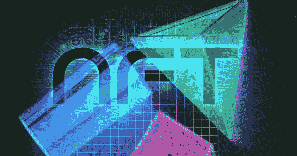

# 著名艺术家从 0.33 ETH 开始发布匿名作品作为 NFT 实验

> 原文：<https://medium.com/coinmonks/famous-artists-release-anonymous-artwork-as-an-nft-experiment-starting-at-0-33-eth-b443f962954e?source=collection_archive---------48----------------------->

艺术家们决定使用 NFTs 作为一种方式:

> “挑战他们对认可的永恒追求，完全放弃姓名、性别、地位和其他社会资产——创造一个匿名的 58 件数字艺术作品的收藏，每件作品都附有 NFT 所有权和真实性证书。”

该项目由 NFT·马斯特斯负责，他自称是“艺术、文化、金融、技术、法律和项目管理领域的一群专家”。然而，他们的 Twitter 账户目前只有 2 名粉丝，所以当所有炒作、恶名、背景和名气都被移除时，看看著名艺术家创作的艺术是否保留其价值将是一件有趣的事情。

# 艺术家是谁？

有趣的是，NFTMASTERS Twitter 账户关注的少数艺术家之一是 Beeple，他的作品去年卖出了令人震惊的 6900 万美元。未经训练的眼睛可以断定金字塔网站上的列出的一些艺术品可能反映了毕普的风格，但鉴于实验的前提，没有办法确切知道。此外，鉴于艺术家应该是匿名的，这很可能是一个错误的标志。

NFT 都包含可解锁的内容，这些内容将链接到用于创建艺术品的原始文件。每位艺术家从“人类元需求金字塔”中选取一个主题，包括本能、堡垒、心灵、地位、意义、美丽和荣耀。该作品将视频、计算机图形和数字作品混合在每个中心主题中。

金字塔给每个艺术家分配了一个假名。然而，看看他们的推特粉丝，似乎至少有一位艺术家并不认同这个项目的匿名性。商业艺术家谢尔盖·戈罗登斯基(Sergey Gorodenskii)曾在俄罗斯举办过展览，并与国际品牌合作过，他在自己的推特名称中添加了自己的笔名，并将一些艺术品发布到了自己的 **Instagram 页面**。然而，其余的艺术家似乎是匿名的。

# 社会实验

参与这个项目的艺术家的恶名程度不得而知。然而，如果他们在 NFTMASTERS 声称的著名博物馆展出，这将是一个令人兴奋的观看项目。

根据他们的网站，NFTMASTERS 参与了圣彼得堡艾尔米塔什博物馆艺术品的符号化。因此，他们有关系引进著名艺术家是可行的。多年来，许多人声称现代艺术市场是建立在名誉和名人的虚幻和虚幻之上，而不是艺术本身具有任何实际价值。随着非功能性测试越来越受欢迎，类似的问题也出现了。

金字塔计划试图同时解决这两个问题。如果一些世界上最好的艺术家创作的 NFT 的名字被删除，并且以数字形式出售，它们会有任何价值吗？

> 加入 Coinmonks [电报频道](https://t.me/coincodecap)和 [Youtube 频道](https://www.youtube.com/c/coinmonks/videos)了解加密交易和投资

# 另外，阅读

*   [如何在 Bitbns 上购买柴犬(SHIB)币？](https://coincodecap.com/buy-shiba-bitbns) | [买弗洛基](https://coincodecap.com/buy-floki-inu-token)
*   [CoinFLEX 评论](https://coincodecap.com/coinflex-review) | [AEX 交易所评论](https://coincodecap.com/aex-exchange-review) | [UPbit 评论](https://coincodecap.com/upbit-review)
*   [十大最佳加密货币博客](https://coincodecap.com/best-cryptocurrency-blogs) | [YouHodler 评论](https://coincodecap.com/youhodler-review)
*   [AscendEx 保证金交易](https://coincodecap.com/ascendex-margin-trading) | [Bitfinex 赌注](https://coincodecap.com/bitfinex-staking)
*   [最好的卡达诺钱包](https://coincodecap.com/best-cardano-wallets) | [Bingbon 副本交易](https://coincodecap.com/bingbon-copy-trading)