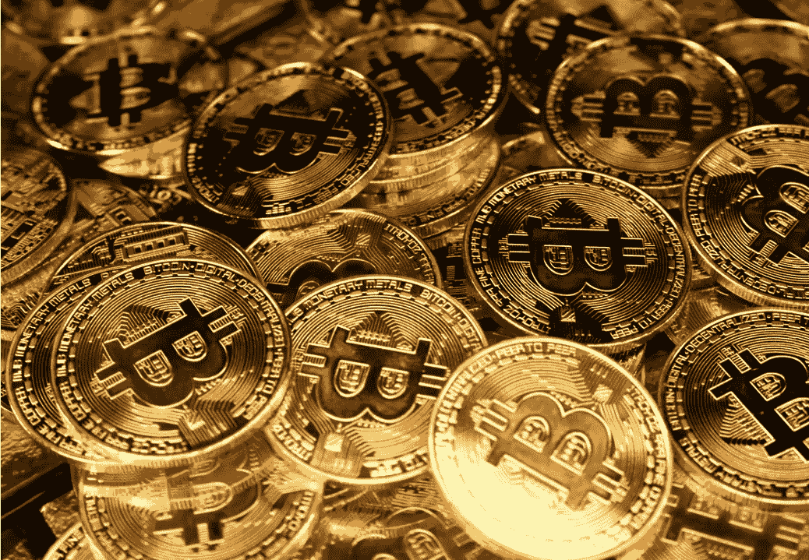

# 著名投资者凯文·奥利里认为比特币的监管和未来增长是不可避免的

> 原文：<https://medium.com/coinmonks/famous-investor-kevin-oleary-believes-bitcoin-regulation-and-future-growth-is-inevitable-ecf2277439af?source=collection_archive---------20----------------------->

Image via [Unsplash.com-Kanchanara](https://images.unsplash.com/photo-1609726494499-27d3e942456c?ixlib=rb-1.2.1&ixid=MnwxMjA3fDB8MHxwaG90by1wYWdlfHx8fGVufDB8fHx8&auto=format&fit=crop&w=1170&q=80)

## 尽管仍有许多未知和争议，这位《鲨鱼池》的明星相信正面清晰和更广泛的采用将会到来

随着加密货币[比特币(BTC)](https://www.coinbase.com/price/bitcoin) 最近在新闻中持续波动，因为它…