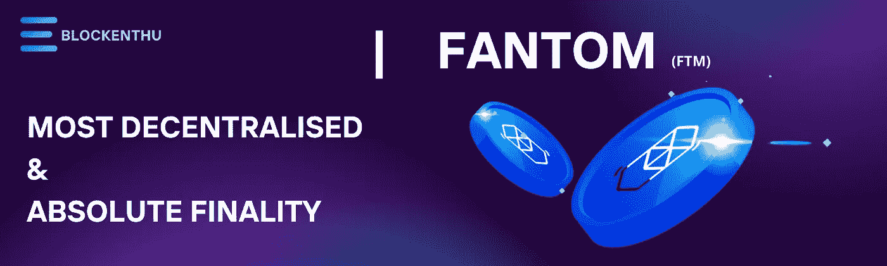
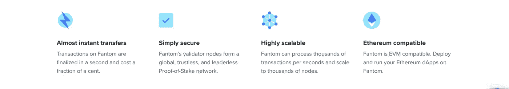
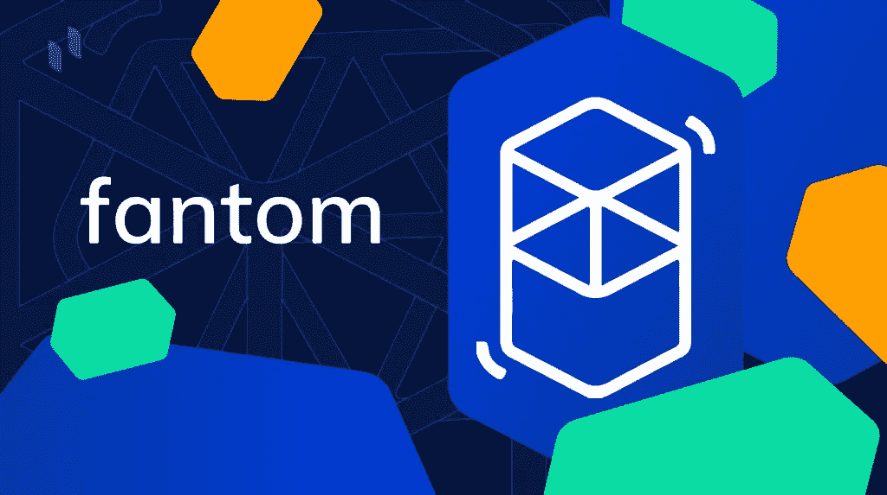
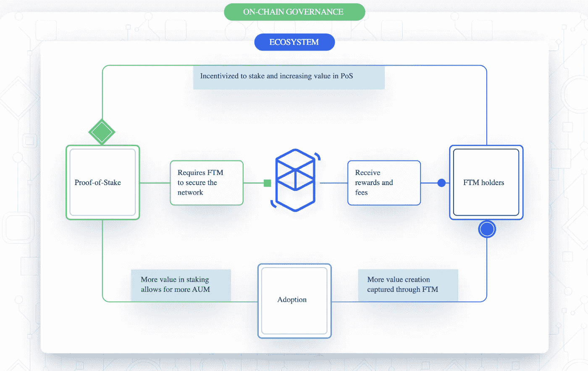

# 幽灵

> 原文：<https://medium.com/coinmonks/fantom-359bda1189df?source=collection_archive---------58----------------------->

# 什么是 Fantom (FTM)

# 它是如何工作的？表征组学，特征

*基于 DAG 的智能合约区块链*

如果你在非常繁忙的一天使用以太坊协议，**费用几乎肯定会超过交易的金额，如果你转移的加密值少于你口袋里的零钱。**今天的演讲， **Fantom** ，可以帮上忙。

> ***Fantom 简介***

**Fantom** 是支持 DeFi、DApps 和企业应用的第 1 层解决方案。它是非常可扩展和快速的。Fantom 的本地实用令牌 **FTM** ，负责整个 Fantom 区块链生态系统。你可以使用你的 Fantom FTM 来铸造**FUSD**(Fantom 的稳定硬币)并使用 DeFi 工具。你可以用 fUSD 交易合成资产，或者借出去赚利息，借合成代币。这是几个寻求提供以太坊替代品的区块链网络之一。Fantom 打算提供更大的灵活性并降低费用。

Fantom 的设置通过其**巨蝮属**(异步拜占庭容错(aBFT)证据(PoS)安排工具)成为可能，该工具跟踪整个组织的功能能力。aBFT 网络布局应该在提高性能的同时提高网络安全性。

# 巨蝮属共识在 Fantom 是如何运作的？

Fantom 开发了巨蝮属共识 BFT(异步拜占庭容错)技术**来克服经典协议和 Nakamoto 共识协议中的漏洞。**

就其 aBFT 的概念而言，**巨蝮属**能够以可变的速率处理交易，并容忍多达三分之一的有问题的用户参与恶意行为，而不会对网络构成威胁。

与需要耗时验证的工作证明(PoW)不同，aBFT 技术倾向于超越其他 BFTs 共识，旨在减少事务时间，同时保持可伸缩性。因此，巨蝮属人口普查局能够创建一个省时的最终交易；每笔交易都可以在不到一秒的时间内正确确认。

**有向无环图(DAG)** 由 Fantom 中的每个巨蝮属节点用来确定和确认系统中事件块的顺序。一旦事件单独结束，确认的块将作为 Fantom 基础层的一部分聚合为最终链。交易现已完成，正在等待处理。

不同于通常在块之间发送信息的其他类型的共识，巨蝮属共识专门在节点之间发送信息。因此，当涉及到不到一秒钟的交易速度和安全性时，这个协议是明显的赢家。

因此，巨蝮属共识协议主要依靠利害关系证明(PoS)来确保所有验证者节点对网络具有同等的影响力，并且可以随时加入或离开。

> ***谁建造了 Fantom？***

**韩国计算机科学家安秉毅博士创立了 Fantom 基金会。Michael Kong 是该平台的现任首席执行官。**

Fantom 团队拥有丰富的经验，尤其是在全栈区块链开发方面，并着手设计一个优先考虑可扩展性、去中心化和安全性的智能合约平台。

# Fantom 网络的特征

> ***维护网络***

为了保护其分散的网络和交易，Fantom 采用了一种利益证明机制，将 FTM 作为一枚赌注硬币。超过 **500，000 个 FTM 令牌**用于运行验证器节点，这些节点负责锁定令牌和验证交易。事实上，标记 FTM 令牌为 Fantom 用户创造了经济激励，让他们为网络安全做出贡献，同时也增加了利润。

> ***连锁治理***

Fantom 是一个去中心化的平台，没有中央权力机构来指导网络，并在整个生态系统中为用户提供完整的权利。因此，FTM 令牌的另一个重要优势是链上监管功能，它允许持有人对平台进步进行提案和投票。

> ***什么是范通戏？***

Opera 为开发分散式应用程序提供了一个安全快速的环境。它是完全开放和开源的。它已经为现实世界的应用做好了准备，没有拥塞或长确认期的危险，因为它由 Fantom 的 aBFT 共识算法提供支持，该算法利用了它的速度和快速终结性。

Fantom Opera mainnet 兼容**以太坊虚拟机(EVM** )并通过 Solidity 拥有完整的智能合约功能。

开发人员构建 Opera 来克服前几代区块链的限制，同时保持与以太坊的互操作性，以实现平稳的 dApp 转换。

> ***谁在 Fantom 上翻新？***

Fantom Finance 实现了合成铸造、流动赌注、分散贷款和交易。

SpookySwap 是一家分散的做市商。考虑 Fantom 上的 Uniswap。它的标志上有一个有趣的标记“BOO”

**多链**是一种在许多链上运行的路由器协议。

**艾斯特金融**是一种去中心化的借贷协议。

**Devil Finance** 是一个分散化的收益率优化工具，让用户从他们的加密货币资产中赚取复利。魔鬼金融拥有最先进的市场收益率策略和操作。

# 3.7 亿 FTM 激励计划

答根据一份新闻稿，该项目是在 Fantom 基金会注意到“**在过去几个月里在流动性挖掘方面发生了许多有趣的事情**之后产生的。Fantom 提到，他们各自链背后的其他基金会已经开始奖励部署在各自链之上的协议的用户。Fantom 也打算奖励用户，但以自己独特的方式。Fantom 基金会创建了这个项目，以“更好地协调用户、建筑商和网络之间的激励。"随着**3.7 亿 FTM 奖励计划**的推出，FTM 令牌的价格上涨了 100%以上，现在为 0.8463 美元。自 2021 年 7 月 20 日 FTM token 触及 0.15 美元低点以来，价格暴涨，达到 0.9571 美元的历史高点，涨幅达 500%。

# 令牌组学

**FTM** 是**40 大加密货币之一**目前，截至 2022 年 4 月 5 日，Fantom (FTM)的交易价格为**1.5 美元(166 印度卢比)**。而随着市场规模超过**39 亿美元**。目前有 25.5 亿 FTM 的代币在流通。剩余的 FTM 代币将用于向 FTM 持有者提供赌注奖励。收益由治理决策决定；然而，截至目前，FTM 令牌可能需要两年时间才能实现完全流通，并将所有激励分配给利益相关的 FTM 持有者。

FTM 代币可在所有主要交易所购买。然而，FTM 的发明者不鼓励这种活动，因为考虑到保管问题以及从官方 FTM 网络之外的来源获得 FTM 的 FTM 持有者缺乏赌注回报。

# 把所有的放在一起

与以太坊和币安智能链等其他流行平台相比，Fantom 有许多优势。Fantom 确保了巨大的可扩展性，而没有损害其分散的特性或安全性，因为它基于 DAG 的 Lachemis aBFT 共识机制。如果 Fantom 继续目前的道路，它有潜力成为 DeFi 行业的一个大玩家。

# 加入我们的社区

# WHATSAPP

 [## BLOCKENTHU

### WhatsApp 群邀请

chat.whatsapp.com](https://chat.whatsapp.com/FTKme4XzkOU73ZDv99Oatj) 

# 电报

 [## ⚡·布洛克登胡·⚡

### 可以马上查看并加入@blockenthu。

t.me](https://t.me/blockenthu) 

# INSTAGRAM

[https://www.instagram.com/blockenthu/](https://www.instagram.com/blockenthu/)

# 商务化人际关系网

 [## Blockenthu | LinkedIn

### LinkedIn 上有 564 名粉丝。“面向大众的 Web 3.0 福利”加密和区块链| BlockEnthu 是社区…

www.linkedin.com](https://www.linkedin.com/company/blockenthu/) 

使用印度最安全的加密交换#COINDCX。

 [## CoinDCX -加密交易所|购买、出售和交易比特币和顶级替代币

### CoinDCX 是印度最大、最安全的加密货币交易所，在这里你可以买卖比特币和其他…

coindcx.com](https://coindcx.com/) 

#区块链# BLOCKENTHU # CRYPTO # coincxpath breaker # coincx # FANTOM

> 加入 Coinmonks [电报频道](https://t.me/coincodecap)和 [Youtube 频道](https://www.youtube.com/c/coinmonks/videos)了解加密交易和投资

# 另外，阅读

*   [3 商业评论](/coinmonks/3commas-review-an-excellent-crypto-trading-bot-2020-1313a58bec92) | [Pionex 评论](https://coincodecap.com/pionex-review-exchange-with-crypto-trading-bot) | [Coinrule 评论](/coinmonks/coinrule-review-2021-a-beginner-friendly-crypto-trading-bot-daf0504848ba)
*   [莱杰 vs n rave](/coinmonks/ledger-vs-ngrave-zero-7e40f0c1d694)|[莱杰 nano s vs x](/coinmonks/ledger-nano-s-vs-x-battery-hardware-price-storage-59a6663fe3b0) | [币安评论](/coinmonks/binance-review-ee10d3bf3b6e)
*   [Bybit Exchange 审查](/coinmonks/bybit-exchange-review-dbd570019b71) | [Bityard 审查](https://coincodecap.com/bityard-reivew) | [Jet-Bot 审查](https://coincodecap.com/jet-bot-review)
*   [3 commas vs crypto hopper](/coinmonks/3commas-vs-pionex-vs-cryptohopper-best-crypto-bot-6a98d2baa203)|[赚取加密利息](/coinmonks/earn-crypto-interest-b10b810fdda3)
*   最好的比特币[硬件钱包](/coinmonks/hardware-wallets-dfa1211730c6) | [BitBox02 回顾](/coinmonks/bitbox02-review-your-swiss-bitcoin-hardware-wallet-c36c88fff29)
*   [BlockFi vs 摄氏度](/coinmonks/blockfi-vs-celsius-vs-hodlnaut-8a1cc8c26630) | [Hodlnaut 审核](/coinmonks/hodlnaut-review-best-way-to-hodl-is-to-earn-interest-on-your-bitcoin-6658a8c19edf) | [KuCoin 审核](https://coincodecap.com/kucoin-review)