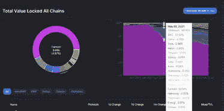
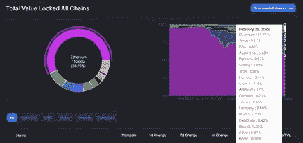

# 幽灵

> 原文：<https://medium.com/coinmonks/fantom-494aa10d8204?source=collection_archive---------33----------------------->

Fantom Foundation

**什么是 Fantom？**

Fantom 是第 1 层解决方案，有时也称为以太坊黑仔。
Fantom 使用 DAG(有向无环图)而不是区块链。
区块链链接到每个先前的块，而在 DAG 中，每个节点有多个链接。这允许同时验证更多的事务，因为节点不必在处理新事务之前等待事务完成。

Fantom 旨在解决区块链的问题:可扩展性和费用问题。可扩展性。区块链必须让每个参与者确认一个块，因此性能是有限的。需要的事务越多，网络就变得越慢。费用。区块链支付的主要费用是大宗矿工的确认费和大宗奖励本身。

**看涨案例** 
Fantom 允许所有用户近乎即时的交易和低得令人难以置信的交易成本。这对现代商业来说至关重要。我认为阻止广泛采用的主要原因是速度。例如，如果我选择从一个银行账户向同一个国家的另一个银行账户汇款，交易很可能是即时的。如果我想向网上商家付款，钱会立刻从我的账户中被取走。对于投机资产价值的交易者来说，批量确认的等待时间是可以接受的，但对于现实世界的应用来说，这是完全不可接受的。想象一下在餐馆付款，然后等半个小时确认付款已经收到的荒谬。使用 ETH 网络的费用昂贵且缓慢，因此我们已经看到 DApps 转移到其他网络。Fantom 的成功得益于其快速的确认时间和低廉的交易费用。

**TVL(总值锁定)**

Defi Llama May 2nd 2021 Market Share 0.04%

Fantom 绝对是在吞噬 ETH 的市场份额。TVL(锁定的总价值)继续增长，fantom 生态系统继续扩大。这对 Defi 来说是一件好事，目前大多数高 APR 德根农场都在 Fantom 网络上。随着越来越多的资本锁定 Fantom，它将受益于价值的升值。大多数新的 Defi 协议都是在 Fantom 上启动的，首都紧随其后。永远观察资金流向，因为那是成长和增值的地方。

Defi Llama February 25th Market Share 4.97%

**为什么所有项目都在 Fantom 上开发，而不是在其他第 1 层网络上？**

进入 Fantom 奖励计划。Fantom 鼓励和奖励 Defi 协议的开发者，这是 Fantom 武器库中另一个辉煌的力量。

**为什么要奖励开发者？**

该网络奖励那些建造项目、设法保持流动性的开发商；而不是奖励用户。当网络奖励用户时，用户到达、耕种、转储令牌，然后离开。当一个网络奖励开发人员时，这些开发人员就会建立可持续的项目。Fantom 网络上有一些最好的 Defi 项目:Spookyswap、SpiritSwap 和 Tombfinance。这些项目已经存在很长时间了，对生态系统的影响是惊人的。通过激励开发商建设可持续项目，生态系统得以有机增长，并为进一步升值奠定了坚实的基础。Fantom 是一个伟大的长期游戏，也是我最喜欢的硬币之一。不仅因为网络的最低费用和速度，还因为网络上的所有协议。Fantom 目前的定价为 1.64 美元，ATH(创历史新高)为 3.46 美元，预示着辉煌的一年。

> *加入 Coinmonks* [*电报频道*](https://t.me/coincodecap) *和* [*Youtube 频道*](https://www.youtube.com/c/coinmonks/videos) *了解加密交易和投资*

# 另外，阅读

*   [3 商业评论](/coinmonks/3commas-review-an-excellent-crypto-trading-bot-2020-1313a58bec92) | [Pionex 评论](https://coincodecap.com/pionex-review-exchange-with-crypto-trading-bot) | [Coinrule 评论](/coinmonks/coinrule-review-2021-a-beginner-friendly-crypto-trading-bot-daf0504848ba)
*   [莱杰 vs n rave](/coinmonks/ledger-vs-ngrave-zero-7e40f0c1d694)|[莱杰 nano s vs x](/coinmonks/ledger-nano-s-vs-x-battery-hardware-price-storage-59a6663fe3b0) | [币安评论](/coinmonks/binance-review-ee10d3bf3b6e)
*   [Bybit Exchange 审查](/coinmonks/bybit-exchange-review-dbd570019b71) | [Bityard 审查](https://coincodecap.com/bityard-reivew) | [Jet-Bot 审查](https://coincodecap.com/jet-bot-review)
*   [3 commas vs crypto hopper](/coinmonks/3commas-vs-pionex-vs-cryptohopper-best-crypto-bot-6a98d2baa203)|[赚取加密利息](/coinmonks/earn-crypto-interest-b10b810fdda3)
*   最好的比特币[硬件钱包](/coinmonks/hardware-wallets-dfa1211730c6) | [BitBox02 回顾](/coinmonks/bitbox02-review-your-swiss-bitcoin-hardware-wallet-c36c88fff29)
*   [BlockFi vs Celsius](/coinmonks/blockfi-vs-celsius-vs-hodlnaut-8a1cc8c26630)|[Hodlnaut 点评](/coinmonks/hodlnaut-review-best-way-to-hodl-is-to-earn-interest-on-your-bitcoin-6658a8c19edf) | [KuCoin 点评](https://coincodecap.com/kucoin-review)
*   [Bitsgap 审查](/coinmonks/bitsgap-review-a-crypto-trading-bot-that-makes-easy-money-a5d88a336df2) | [Quadency 审查](/coinmonks/quadency-review-a-crypto-trading-automation-platform-3068eaa374e1) | [Bitbns 审查](/coinmonks/bitbns-review-38256a07e161)
*   [密码本交易平台](/coinmonks/top-10-crypto-copy-trading-platforms-for-beginners-d0c37c7d698c) | [Coinmama 审核](/coinmonks/coinmama-review-ace5641bde6e)
*   [印度的加密交易所](/coinmonks/bitcoin-exchange-in-india-7f1fe79715c9) | [比特币储蓄账户](/coinmonks/bitcoin-savings-account-e65b13f92451)