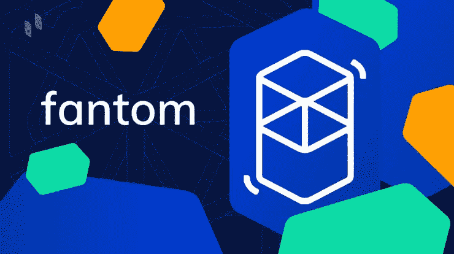
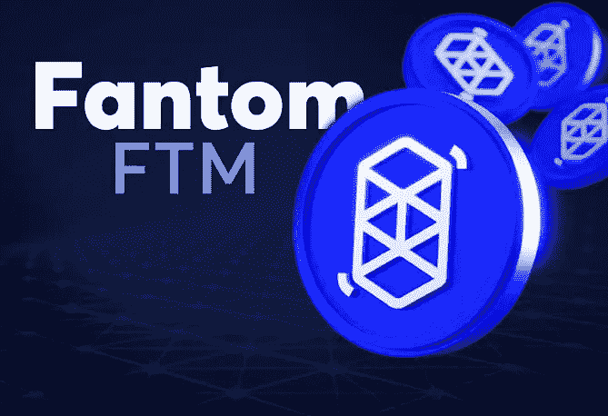
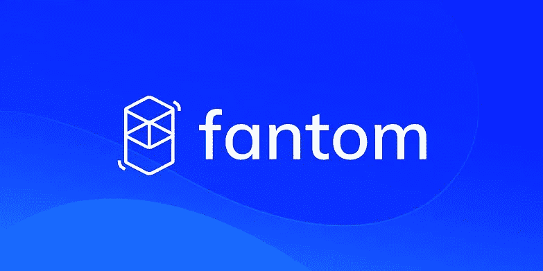

# Fantom (FTM)硬币——你不知道的 Fantom 硬币

> 原文：<https://medium.com/coinmonks/fantom-ftm-coin-what-you-dont-know-about-fantom-coin-5fab171d3ed3?source=collection_archive---------22----------------------->

Fantom 硬币最近获得了很大的吸引力，许多人更有兴趣将他们一生的积蓄投资于 Fantom。

虽然一些投资者不知道 fantom 是什么，但他们的目的或项目的目标，同时许多人不知道在哪里购买 fantom

然而，这篇文章包含了关于 fantom 项目的信息，在哪里购买以及硬币的价格

# 什么是 Fantom(FTM)币？

Fantom 打算解决与智能合约协议相关的问题，确切地说是交易速度，开发者说他们已经将交易速度减少到两秒钟以下。

监督 Fantom 产品捐赠的 Fantom 组织最初成立于 2018 年，Fantom 的 mainnet OPERA 于 2019 年 12 月推出。

Fantom 是用于 DApps 和数字资产的开源分散智能合约协议，作为以太坊的替代方案而构建，Fantom 的目标是克服上一代区块链的限制，平衡三个组件:可扩展性、安全性和分散性。

该项目提供了一套工具来简化整合现有 DApps 的过程，以及详细的赌注奖励系统和内置的 Defi 仪器。

Fantom 是一个第 1 层区块链，它使用临时构建的共识机制和独立共识层巨蝮属来促进基于智能合约的 Defi 和相关服务。巨蝮属还为其他层提供安全性，包括 Opera，Fantom 的 EVM 兼容智能合同链。该项目的长期使命是“在全世界所有交易主体之间实现兼容性”

# 范托姆(FTM)硬币价格

截至本文撰写之时，Fantom(FTM)硬币价格为 1.41 美元，24 小时高点为 1.45 美元，24 小时低点为 1.38 美元，市值为 35 亿美元，24 小时交易量为 4.52 亿美元。

与此同时，许多交易员仍在大量印刷 Fantom 的钞票，而投资者则一直在打包他们预计在 2022 年到期前至少会下降 5 到 10 倍的资金。

# Fantom(FTM) Crypto 是一项好的投资吗？

许多投资者目前都在乞求 FTM 是否是一项好的投资，原因是他们最清楚的，但随着这个术语的如此多的发展和大多数投资者的积极心态，Fantom 在适当的时候似乎是一项好的投资。

然而，fantom 被称为以太坊杀手，这是真的，因为它处理交易的速度很快，交易费用不到 1 美分。

# 哪里可以买到 Fantom(FTM)币？

Fantom(FTM) token 是自愿交易的，可以在币安、Kucoin、Gate.io、火币、FTX、Gemini、Bybit、Bitfinex、OKEx Korea e.t.c 等主要交易所找到

Fantom(FTM)包括各种协议，ERC-20、BEP2 和 Fantom 的 OPERA 令牌都在流通。

# 结论

与以太坊相比，Fantom 的交易速度非常快，费用也很低，这也是大多数投资者称其为以太坊杀手的原因之一，但实际上，Fantom 能取代以太坊吗？

与此同时，答案只有你自己知道，但是根据币安首席执行官 CZ 所说，以太坊是为有钱的游客设计的。

*加入我们的电报社区，获取加密新闻、加密宝石，支持&加密教程；*

电报链接:【https://t.me/+6ek5FpdVW89jNjE0 

> 加入 Coinmonks [电报频道](https://t.me/coincodecap)和 [Youtube 频道](https://www.youtube.com/c/coinmonks/videos)了解加密交易和投资

# 另外，阅读

*   [有哪些交易信号？](https://coincodecap.com/trading-signal) | [Bitstamp vs 比特币基地](https://coincodecap.com/bitstamp-coinbase) | [买索拉纳](https://coincodecap.com/buy-solana)
*   [ProfitFarmers 点评](https://coincodecap.com/profitfarmers-review) | [如何使用 Cornix Trading Bot](https://coincodecap.com/cornix-trading-bot)
*   [十大最佳加密货币博客](https://coincodecap.com/best-cryptocurrency-blogs) | [YouHodler 评论](https://coincodecap.com/youhodler-review)
*   [my constant Review](https://coincodecap.com/myconstant-review)|[8 款最佳摇摆交易机器人](https://coincodecap.com/best-swing-trading-bots)
*   [MXC 交易所评论](/coinmonks/mxc-exchange-review-3af0ec1cba8c) | [Pionex vs 币安](https://coincodecap.com/pionex-vs-binance) | [Pionex 套利机器人](https://coincodecap.com/pionex-arbitrage-bot)