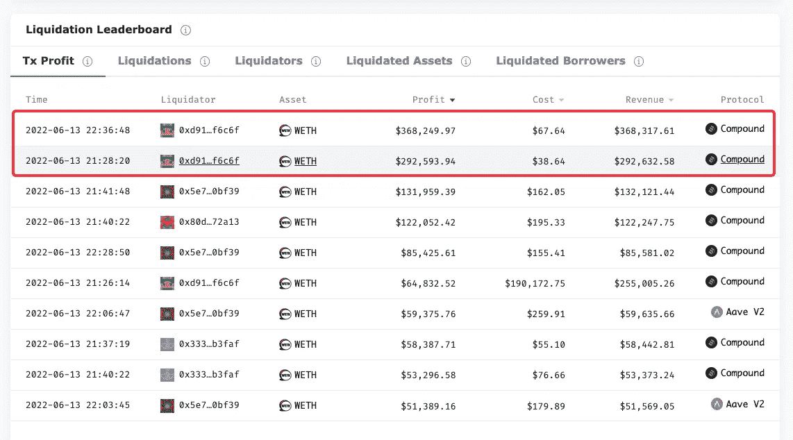

# 清算之夜告别 1 万亿美元市场

> 原文：<https://medium.com/coinmonks/farewell-to-the-1-trillion-market-during-the-night-of-liquidation-6733ca195b9a?source=collection_archive---------6----------------------->

Photo by [Alice Pasqual](https://unsplash.com/es/@stri_khedonia) on [Unsplash](https://unsplash.com/)

关键要点:

*   市场的崩溃是由 stETH depeg 和 Celsius 的用户资产冻结的连锁反应造成的。
*   随着 2000 亿美元的蒸发，人们需要更好的工具来识别隐藏在 DeFi 中的系统性风险。
*   由一致和连贯的数据模型框架支持的调查和互动数据平台对于公众审查市场中的潜在危险至关重要。

一年多来，crypto 的全球市值首次跌破 1 万亿美元，损失了 2000 亿美元。

昨晚，在 AAVE 和大院，大约一千名借款人的资产被清算。由于最近的市场波动，总额达到了约 1 亿美元。

在过去的七天里，ETH 下跌了超过 37%。与此同时，在之前的 24 小时内，stETH 对 ETH 的比率已经跌至最低点 [0.9268 ETH](https://coinmarketcap.com/currencies/steth/steth/eth/) 。

正如下面从 Coinmarketcap.com 获得的图表所示，在过去的几天里，下降趋势非常严重。

撞车引起了连锁反应，一语双关。

Celsius Network 拥有超过 170 万客户，去年价值 35 亿美元，截至 5 月 17 日管理着[118 亿美元，现在](https://twitter.com/Kr00ney/status/1536182145982599168)[冻结了所有取款和转账](https://twitter.com/CelsiusNetwork/status/1536169010877739009)。这有多严重？以下是[区块](https://www.theblockcrypto.com/)研究副总裁[拉里·瑟马克](https://twitter.com/lawmaster)的观点。

根据 Larry Cermak 的说法，在撰写本文时，Celsius 拥有的[前 15 个钱包地址](https://zapper.fi/bundle/0x8aceab8167c80cb8b3de7fa6228b889bb1130ee8%2C0x1cedc0f3af8f9841b0a1f5c1a4ddc6e1a1629074%2C0x87a67e7dc32fdc79853d780c6f516312b4a503b5%2C0xeee27662c2b8eba3cd936a23f039f3189633e4c8%2C0xc131701ea649afc0bfcc085dc13304dc0153dc2e%2C0x84e1f49a6b65882c7365b6a775999cfcb481f22f%2C0xcf7a68127285c7c6c8546ce51b89d7e820f6d294%2C0x4f6742badb049791cd9a37ea913f2bac38d01279%2C0xdbaa0bcec419c47a75efbb93c745aebae3fe9c7b%2C0x3b6543ebe26824bd8156a103063f56ce50f88080%2C0xef22c14f46858d5ac61326497b056974167f2ee1%2C0x3be6d80fdce385358f5762998882efc282df7b9a%2C0x845cbcb8230197f733b59cfe1795f282786f212c%2C0x0fc8415a9b8f535e9f48ba245b1b18a37fb03a90%2C0x8665d75ff2db29355428b590856505459bb675e3?label=Celsius+Wallets+Combined&id=0x7d3a40822eb2701f5d08e3a24b0bfefbd173e1ae&addresses=0x8aceab8167c80cb8b3de7fa6228b889bb1130ee8%2C0x1cedc0f3af8f9841b0a1f5c1a4ddc6e1a1629074%2C0x87a67e7dc32fdc79853d780c6f516312b4a503b5%2C0xeee27662c2b8eba3cd936a23f039f3189633e4c8%2C0xc131701ea649afc0bfcc085dc13304dc0153dc2e%2C0x84e1f49a6b65882c7365b6a775999cfcb481f22f%2C0xcf7a68127285c7c6c8546ce51b89d7e820f6d294%2C0x4f6742badb049791cd9a37ea913f2bac38d01279%2C0xdbaa0bcec419c47a75efbb93c745aebae3fe9c7b%2C0x3b6543ebe26824bd8156a103063f56ce50f88080%2C0xef22c14f46858d5ac61326497b056974167f2ee1%2C0x3be6d80fdce385358f5762998882efc282df7b9a%2C0x845cbcb8230197f733b59cfe1795f282786f212c%2C0x0fc8415a9b8f535e9f48ba245b1b18a37fb03a90%2C0x8665d75ff2db29355428b590856505459bb675e3)仍然拥有超过 15.5 亿美元的不同资产，其中 74%的 Maker 上的所有美元 wBTC 都在 Celsius 的 Maker vault 中，[根据@TheDeFiDan](https://twitter.com/TheDeFiDan/status/1536347682377068546) 的说法。Celsius 增加了更多 BTC 作为抵押品，以避免被清算，总计 5.444 亿美元，从而将 wBTC 的清算价格降至 16852 美元。

[根据 aQua](https://twitter.com/AceDevAndQA/status/1536368100031209473) 的说法，在充值之前，一旦 BTC 价格达到 22.4 万美元的 200WMA(加权移动平均线)，就会触发 Celsius 和许多其他借款协议的清算机制，这将进一步加剧市场崩溃，连锁反应的结果是级联进入另一轮，或最糟糕的情况，一轮又一轮的清算。

现在，Celsius 有了一些喘息的空间，整个加密世界也是如此，但对于成千上万的借款人来说，他们超过 1 . 13 亿美元的资产在过去 24 小时内被清算。尤其是昨晚，美国东部时间 20:46:34，BTC 价格为 22325.2 美元，低于其 200WMA。

# 如何解决波动性问题？

最具讽刺意味的是，这种呈现在我们面前的系统性风险正是促使人们建立 DeFi 来避免的。然而我们又来了。作为 DeFi 世界中最大的 CeFi 之一，Celsius 一直处于沉思风暴的中心，这引发了一些哲学层面的问题:

*   (某些)人类的逐利和避险本质，是否自然滋生了像 Celsius 这样的集权机构，最终挫败了分权的乌托邦？
*   或者这只是一个大减速带，提醒我们在仍然朝着正确方向行驶的同时要小心？

我们布德勒夫妇是乐观的人。否则，我们不会取得现在的成就。因此，我认为，你和我一样，对未来有着坚定的信念，认为当前的困境是一个我们能够并且将要解决的问题。

问题的一部分是数据碎片。资产跨协议自由流动，而不是数据在不同维度的不同协议之间流动。因此，每日交易者没有合适的工具和方法来整合所有的信息。此外，目前大多数数据的呈现方式没有为用户进行探索性分析提供交互。因此，现有的大多数数据工具不足以让投资者做出明智的决策。

为了方便用户做出明智的选择，我们在 4 月发布了清算模块，显示清算交易的综合数据和详细资产流动情况。幕后是我们的一致和连贯的数据分析框架，结合了结构、行为和网络分析。

让我们浏览一下昨天的清算数据，以揭示清算之夜发生了什么，希望是最后一次，而不是可预见的未来的第一次。

# 夜间视察

22:00 左右，我们注意到我们的[清算模块](https://eigenphi.io/ethereum/liquidation)出现异常。到那时，1 天的数据汇总显示金额为 1 亿美元。当我们在 22:10 发出第一条推特通知我们的推特观众时，金额增长到了 1 . 25 亿美元。两分钟内 2500 万美元。

该数字在接下来的一个小时内不断攀升，最终在 23:00 后逐渐平息。美国东部时间 23:10，稳定在 1.65 亿美元左右。

# 最大的清算是什么？

以下是昨晚最大的 10 笔清算，从 300 万美元到 520 万美元不等。所有清算的资产都是 wet，10 笔中有 9 笔发生在 Compound。

# 不同协议清算了多少资产？

昨晚的大部分交易发生在 AAVE v2 上:超过 8700 万美元。将近 6840 万美元是复利。100 万美元是在 AAVE v1 上完成的。

# 资产呢？

以下是排名靠前的几个:1.2 亿美元的 WETH、4000 万美元的 WBTC、超过 300 万美元的 stETH 和超过 135 万美元的 LINK。

# 谁是今晚的最高清算人？

这是最大的赢家，它清算了近 6900 万美元，从 257 名借款人的 320 笔交易中获利约 85 万美元。它的足迹覆盖了 AAVE v2 和 Compound，并分布在 11 个资产中。

您还可以在页面上检查其交易分布，这里显示了多少清算分布在哪个利润范围内。

它的成本呢？天然气价格图表可以提供一些思路。

# 清算哪个最赚钱？

根据下面的利润排行榜，这是由冠军狗完成的，他在 67 美元的成本下赚了 368K 美元的利润。第二个也属于它。

# 想知道最成功的一个是如何完成的吗？

点击该行，您可以查看明细，包括图表中的债务资产及其金额和资产流量。我们可以看出，清算人用价值超过 490 万美元的 USDT 偿还了债务，并获得了超过 24.4 万 cETH 的回报。

上面的利润排行榜还显示了前 10 名清算人，您可以逐一查看，以及清算金额最高的清算借款人。

所有这些数据涵盖了清算市场的整体情况、不同协议的性能、清算人的详细信息以及清算资产的转移。此外，不同层次的数据被整合，以利用用户在多事之夜以互动方式进行探索性分析。

# 如何帮助这 10 亿用户？

崩溃不是第一次，也绝对不会是最后一次。即使有所有的反对，比特币的用户群仍然是[预计到 2030 年将有 10 亿用户。](https://www.prnewswire.com/news-releases/blockware-intelligence-publishes-new-report-bitcoin-user-adoption-301564823.html)

我们如何帮助这 10 亿人？首先，该行业需要为社区提供强大的工具，使他们不仅能够识别系统风险，还能发现潜在的可持续投资。如果做不到这一点，用户就会淹没在各种类型、数量和维度的数据中，并在发誓放弃加密之前永远被困在黑暗的 DeFi 森林中。

跟随我们通过这些来挖掘更多隐藏的 DeFi 的智慧:

*   [EigenPhi 官方推特](https://twitter.com/eigenphi)
*   [EigenPhi MEV 提醒推特](https://twitter.com/eigenphi_alert)
*   [子堆栈](https://eigenphi.substack.com/)
*   [中等](/@eigenphi)
*   [Mirror.xyz](https://mirror.xyz/0xc19565163aFdEe3783FC970E4Bd0275B11848d34)
*   [电报](https://t.me/WisdomOfDeFi)
*   [不和](https://discord.com/invite/JXD8cyzR2a)
*   [时事讽刺剧](https://www.getrevue.co/profile/EigenPhi)

> 加入 Coinmonks [电报频道](https://t.me/coincodecap)和 [Youtube 频道](https://www.youtube.com/c/coinmonks/videos)了解加密交易和投资

# 另外，阅读

*   [八大加密附属计划](https://coincodecap.com/crypto-affiliate-programs) | [eToro vs 比特币基地](https://coincodecap.com/etoro-vs-coinbase)
*   [最佳以太坊钱包](https://coincodecap.com/best-ethereum-wallets) | [电报上的加密货币机器人](https://coincodecap.com/telegram-crypto-bots)
*   [交易杠杆代币的最佳交易所](https://coincodecap.com/leveraged-token-exchanges) | [购买弗洛基](https://coincodecap.com/buy-floki-inu-token)
*   [3Commas 对 Pionex 对 Cryptohopper](https://coincodecap.com/3commas-vs-pionex-vs-cryptohopper) | [Bingbon 评论](https://coincodecap.com/bingbon-review)
*   [加密复制交易平台](/coinmonks/top-10-crypto-copy-trading-platforms-for-beginners-d0c37c7d698c) | [如何在 WazirX 上购买比特币](/coinmonks/buy-bitcoin-on-wazirx-2d12b7989af1)