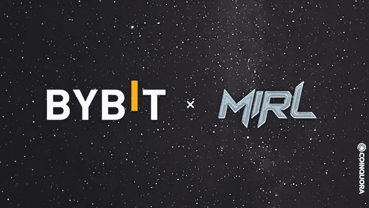

# FashionFi

> 原文：<https://medium.com/coinmonks/fashionfi-d160be96b540?source=collection_archive---------48----------------------->

## first 新加坡的第一时尚

Image from: [https://blog.metallurgy.gold/bybit-joins-the-metaverse-with-mirl-partnership-to-boost-fashionfi/](https://blog.metallurgy.gold/bybit-joins-the-metaverse-with-mirl-partnership-to-boost-fashionfi/)

高级时尚品牌 FOMO 将于 2021 年进军 NFT 市场。2021 年底，耐克和阿迪达斯将率先进入元宇宙——耐克收购 RTFKT，阿迪达斯收购 Sandbox land。时尚风吹遍亚洲只是时间问题；五天前，2022 年 3 月 10 日，MIRL 在新加坡发射升空。

快速浏览一下 MIRL 的所有公关文章，就不难理解为什么这可能是一个有吸引力的项目——MIRL 提议将我们的数字资产转化为现实世界的物品，其中 NFTs & tokens 可用于兑换物理服装。此外，它建议通过减少浪费和结束设计师剥削来支持可持续的时尚。

真正吸引我的是，MIRL NFT 的持有者在 ETH 持有 Bybit 30 天就能获得 6.88%的 APY——现在，这是一个投资者关心的交易。

更深入地看这个项目，我不得不说 MIRL 团队试图在太少的时间里做太多的事情，并且没有清晰的路线图。在 MIRL 24 页的白皮书中，没有任何关于 MIRL 如何创造可持续的时尚和赋予设计师权力的内容——然而，有很大一部分是关于 NFT 和密码市场在过去几年的表现。这让我相信，MIRL 的创始人对时尚产业有着非常基本的了解，而且更热衷于利用秘密炒作。

我自己上过可持续发展的时尚课程，我几乎可以肯定地说，时尚刀无法帮助解决可持续发展问题。这在很大程度上是因为时尚的整个供应链——从棉花采摘者一直到消费者和回收者——需要改变。快速廉价的时尚已经深深地扎根于我们的思想和日常生活中，用一把小刀在一夜之间改变它简直是移山倒海。

我与 MIRL 的另一个问题是，创始人不用他们的真名，我找不到任何关于他们背景和经历的信息。这让我更加怀疑——提示:拉地毯。

如果我在这个阶段购买 MIRL 的 NFTs，那将是为了 ETH，而不是别的；这不会持续很长时间，因为创始人没有更深入地思考问题，也无法解决它声称想要解决的问题。

声明:不提供投资建议，我也不提供任何投资建议。我也不持有 MIRL，也无意持有。

> 加入 Coinmonks [电报频道](https://t.me/coincodecap)和 [Youtube 频道](https://www.youtube.com/c/coinmonks/videos)了解加密交易和投资

# 另外，阅读

*   [币安期货交易](https://coincodecap.com/binance-futures-trading)|[3 commas vs Mudrex vs eToro](https://coincodecap.com/mudrex-3commas-etoro)
*   [如何购买 Monero](https://coincodecap.com/buy-monero) | [IDEX 评论](https://coincodecap.com/idex-review) | [BitKan 交易机器人](https://coincodecap.com/bitkan-trading-bot)
*   [CoinDCX 评论](/coinmonks/coindcx-review-8444db3621a2) | [加密保证金交易交易所](https://coincodecap.com/crypto-margin-trading-exchanges)
*   [红狗赌场评论](https://coincodecap.com/red-dog-casino-review) | [Swyftx 评论](https://coincodecap.com/swyftx-review) | [CoinGate 评论](https://coincodecap.com/coingate-review)
*   [Bookmap 点评](https://coincodecap.com/bookmap-review-2021-best-trading-software) | [美国 5 大最佳加密交易所](https://coincodecap.com/crypto-exchange-usa)
*   [如何在 FTX 交易所交易期货](https://coincodecap.com/ftx-futures-trading) | [OKEx vs 币安](https://coincodecap.com/okex-vs-binance)