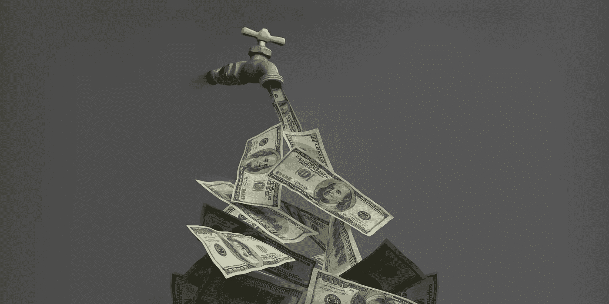

# 水龙头不要用力

> 原文：<https://medium.com/coinmonks/faucet-dont-force-it-d8988b94ebdf?source=collection_archive---------12----------------------->

# 在不到一年的时间里，每月将 1000 美元变成超过 20000 美元的被动收入

FREE💧DRIP Getting Started Manual + Mini-BOOK ‘Faucet Don’t Force It’
> [bit.ly/drip-passive-income](https://bit.ly/drip-passive-income) (no email signup required)

我是如何找到最终实现我一直难以实现的财务自由的光明前景的呢？我会说的。

我正在享受我的第五十个地球年。大部分是。撇开精神或技术永生的幻想不谈，我已经完全过了这个中点，也就是我目前的世俗化身。

他们说从这里开始大部分都是下坡路。我说，我希望这不是滑向金融遗忘的黑暗。

作为一名企业家，或者说转型企业家，我更喜欢称我自己和我的内向、多面手或博学的中年群体(危机？)艺术家、创意者、设计师、工程师和治疗师客户，我也经历过财务上的大起大落。我知道我不是唯一一个坐过山车的人。

我的养老基金以及我的梦想——能够驾驶太阳能电动保时捷 911 Targa 穿越法国乡村，与我的男友在里维埃拉享受船上的饮料，或者乘坐头等舱飞往布宜诺斯艾利斯参加为期一周的阿根廷探戈研习班——都因为太多的财务失误而受挫。

FREE💧DRIP Getting Started Manual + Mini-BOOK ‘Faucet Don’t Force It’
> [bit.ly/drip-passive-income](https://bit.ly/drip-passive-income) (no email signup required)

我财务状况良好，相对富裕，甚至按某些标准来看也很富有。但是我肯定没有钱去你的。这基本上意味着，如果我不想再像一个隐士那样生活，以这样或那样的方式省吃俭用，无论你如何打扮，我仍然会被某人钩住，不得不卖掉我宝贵的“通缩”时间。在这种情况下，通货紧缩意味着我剩下的时间越少，我的时间就越有价值。

虽然在很多方面，我已经过着一种游牧式的创造性的“我喜欢的方式”的生活方式，但我总是不得不密切关注我的个人资金和商业财务，以免我过度支出或更糟的过度承诺，最终追逐我的财务目标以确保收支平衡。

因此，我的警觉的眼睛，我的网状激活系统的一部分，总是在寻找机会。创业公司、首次公开募股、股票、加密货币，以及最近的 DeFi(去中心化金融)项目和产品。

正是后者的风景引人入胜，是的，令人兴奋。

不知何故(我认为是一篇关于 Medium 的文章激起了我的兴趣)，我找到了我的方式来使用 DRIP，这是一种 DeFi 产品，它承诺将你购买并存入其水龙头的任何和所有 DRIP tokens 乘以令人微笑的 365%。

听起来好得令人难以置信，不是吗？

该回报按您每日存款额的 1%支付。

你可以提取这笔回报，并将其换成另一种加密货币或法定货币，或者你可以将其重新存入水龙头，以复合你的回报。稍后将详细介绍。

让我们来看一个例子，这个例子将排除标准的币安智能链(滴滴网络[运行的网络)汽油费和滴滴税(我将很快解释)，并假设滴滴的价格随着时间的推移保持不变，而不是增加或减少价值。](http://drip.community/faucet?buddy=0x44A64ca69Cd15Cb480cBa20B65E6F8A1Ef77592b)

存款价值= 10，000 美元

最高支付额=存款价值 x 3.65(365%)= 36，500 美元

每日回报支付@ 1%(你的存款)= 1% x $ 10K = 100 美元

在这种情况下，365 天内您每天都可以获得$100，也就是说，当您达到$36，500 的最高支付额时，您的回报就会耗尽。你可以每天最多提取 1%，或者累积一周、一个月或一年，然后一次提取全部 36，500 美元(扣除税款后解释)。

不错吧，嗯？

嗯，不是很好，但也不远了。当你将购买的水滴存入水龙头时，将被征收 10%的税，而当你从累积的 1%支出中提取可用的水滴用于[水滴花园](https://theanimal.farm/referrals/0x44A64ca69Cd15Cb480cBa20B65E6F8A1Ef77592b) @ [动物农场](https://theanimal.farm/referrals/0x44A64ca69Cd15Cb480cBa20B65E6F8A1Ef77592b)时，也将被征收 10%的税。您的全部存款不能提取。滴滴被设计成一个中长期项目，可以在几个月内获得惊人的回报。

实际上，您已经使用您的存款购买了不可退款的 365%回报，该回报按您每天存款金额的 1%向您提供。根据开发商的说法，这确保了滴滴金库维持有足够的资金来提供 1%的每日回报。[滴滴网络](http://drip.community/faucet?buddy=0x44A64ca69Cd15Cb480cBa20B65E6F8A1Ef77592b)自 2021 年 4 月 22 日起成功持续运行。在加密和定义中这是很长的时间。

您可以从您的可用收入中提取您已申请的 1%的应计支出(相对于水合支出),以额外缴纳 10%的税。实际上，这意味着提取你的被动收入，并通过出售将其转化为法定收入，你将支付 19%的税。在**免费入门手册+迷你书>**[**bit.ly/drip-passive-income**](https://bit.ly/drip-passive-income)中寻找工作示例。

这就是这台看似赚钱的机器如何维持自己和你提前退休的收入。我将在我策划的 [DRIPreneurs](https://t.me/dripreneurs) Telegram 频道和本书的后面部分发布一个指向 Google Sheets 电子表格模型的链接，以说明如果你已经启动并运行，随着时间的推移，根据你的初始存款或当前存款，这种情况会如何，这样你就可以感受一下它是如何工作的。

现在，这就是它变得超级有趣和令人兴奋的地方。如果 365%的回报不够好，如果你选择复合，即把你可用的 1%日回报(或一部分)重新存入水龙头，你的回报会成倍增长。我们都知道或者应该知道爱因斯坦说的复利。

在点滴的说法中，这被称为补水。

这是真正的奇迹发生的地方。这就是你和我如何将每月 100 美元、1000 美元或 1000 美元的 10K+变成 10 到 20 倍的经常性被动收入，然后在 12 到 18 个月内变成一些或总数，这取决于滴滴代币的价格升值以及你决定在从滴滴网络中提取之前将收入复合多少。

水合物或化合物超过一年，然后提取一部分你的日常回报只是许多方法之一，以维持你想要的被动收入水平，只要你想。

总会有一个对你来说独一无二的平衡被打破。最好的学习方法当然是开始学习，然后积累知识和技能，使用滴滴顺风车为您送货上门。

这确实是一个简单的系统，有一些简单明了的规则。

当然，我在这里使用简单的整数来快速说明一种机制，通过这种机制，你可以投入一些你可以承受损失的闲置资金，为你努力工作，让你更接近你一直梦想的财务自由水平，并努力工作大部分时间(如果不是全部时间)来实现。

我在这里整理这个指南的目的是向你介绍 DRIP，这样你就知道它，可以自己做研究，并向你展示如何开始和测试它，看看它是否适合你。

我已经附上了帮助我开始学习的综合初学者指南和一份资源列表，这样你就可以在涉水之前完全掌握速度。

请记住，对于任何投资，您确实需要做自己的研究，并对您愿意承担的风险(和可能的损失)感到放心，同时牢记加密货币和 DeFi 协议仍然相对较新，风险较大，且不受监管。您并且只有您对您的加密货币和相关钱包的安全性负责。

所有这些都表明，有一个庞大且不断增长的滴流社区向我表明，这种开创性的被动收入 DeFi 产品不仅有腿，而且有令人难以置信的支持、营销和项目推广水平。这从来都不是坏事。

FREE💧DRIP Getting Started Manual + Mini-BOOK ‘Faucet Don’t Force It’
> [bit.ly/drip-passive-income](https://bit.ly/drip-passive-income) (no email signup required)

通读本**免费入门手册+迷你书>**[**【bit.ly/drip-passive-income】**](https://bit.ly/drip-passive-income)。你会发现，要尝试使用滴滴，你需要一个[伙伴](http://drip.community/faucet?buddy=0x44A64ca69Cd15Cb480cBa20B65E6F8A1Ef77592b)。这是滴流社区奖励滴流上线和下线的一种方式，以传播消息、建立团队并支持新老滴流达到并超越其财务目标。

有一个拥有数万名成员的官方电报小组，我发现它非常有用，如果不是一开始就有点势不可挡的话。我花时间监控这个和其他频道，所以你不必。我在我的 Telegram Channel '[DRIP reneurs](https://t.me/dripreneurs)'中整理和策划有用的信息和工具，以便您可以最大限度地利用滴滴网络。

I created a FREE💧DRIP Goal Planning + Hydration Schedule + Price Decrease Risk Assessment MODEL > bit.ly/DRIPpreneurs_TOOLS (no email signup required)

我希望你能信任我，引导和支持你充分利用你的财务自由和幸福之旅。

随着我的团队不断壮大，我会奖励你一些点滴，帮助你更快地实现财务自由目标，因为你是我团队的一员，为[点滴网络](http://drip.community/faucet?buddy=0x44A64ca69Cd15Cb480cBa20B65E6F8A1Ef77592b)的成功做出了贡献。

**$1K > $20K+每月< 1 年** 💧与 [Richard Conner](https://transformerpreneur.squarespace.com/richard-conner) 一起加入 [DRIPreneurs](https://t.me/dripreneurs) 获得策划指导和 1–2–1 支持，通过 [DRIP Network](http://drip.community/faucet?buddy=0x44A64ca69Cd15Cb480cBa20B65E6F8A1Ef77592b) 在不到一年的时间内将 1K 美元变成每月超过 20K 美元的被动收入。

💧始乱终弃的电报频道【t.me/dripreneurs】>

💧你的组长+电报上的滴滴导
>[t.me/richardconner](http://t.me/richardconner)

💧目标规划+补水进度+降价风险模型
>[bit.ly/DRIPpreneurs_TOOLS](http://bit.ly/DRIPpreneurs_TOOLS)

💧免费入门手册+迷你书
>[bit.ly/drip-passive-income](https://bit.ly/drip-passive-income)

💧**Flowcastic**(47 美元)*当你和 drip reneurs
>[【bit.ly/flowcastic-money-kit】](http://bit.ly/flowcastic-money-kit)

💧好友 ID 地址
>[0x 44 a 64 ca 69 CD 15 CB 480 CBA 20 b 65 e 6 f 8 a1 ef 77592 b](http://drip.community/faucet?buddy=0x44A64ca69Cd15Cb480cBa20B65E6F8A1Ef77592b)

💧与[理查德·康纳](https://www.transformerpreneur.com/richard-conner)
>[bit.ly/DRIP_Setup](https://bit.ly/DRIP_Setup)进行 1–2–1 次点滴准备活动，享受九折优惠

💧获取设置
> [滴滴网络](http://drip.community/faucet?buddy=0x44A64ca69Cd15Cb480cBa20B65E6F8A1Ef77592b)每月**1 千美元>2 万美元以上< 1 年**

*当您开始使用[滴滴网络](http://drip.community/faucet?buddy=0x44A64ca69Cd15Cb480cBa20B65E6F8A1Ef77592b)时，DM 您的电子邮件和公共钱包地址，以便使用**flow castic**Money Kit。

你的组长>[transformerpreneur.com/richard-conner](http://transformerpreneur.com/richard-conner)

*这篇文章、这本书以及相关的网页、群组、网站和聊天记录都不能作为财务建议。自己做研究。只投资你能承受的损失。*

*原载于 2022 年 2 月 23 日 https://www.transformerpreneur.com**[*。*](https://www.transformerpreneur.com/transformerpreneured/faucet-dont-force-it)*

> 加入 Coinmonks [电报频道](https://t.me/coincodecap)和 [Youtube 频道](https://www.youtube.com/c/coinmonks/videos)了解加密交易和投资

# 另外，阅读

*   [Bookmap 评论](https://coincodecap.com/bookmap-review-2021-best-trading-software) | [美国 5 大最佳加密交易所](https://coincodecap.com/crypto-exchange-usa)
*   最佳加密[硬件钱包](/coinmonks/hardware-wallets-dfa1211730c6) | [Bitbns 评论](/coinmonks/bitbns-review-38256a07e161)
*   [新加坡十大最佳加密交易所](https://coincodecap.com/crypto-exchange-in-singapore) | [收购 AXS](https://coincodecap.com/buy-axs-token)
*   [红狗赌场评论](https://coincodecap.com/red-dog-casino-review) | [Swyftx 评论](https://coincodecap.com/swyftx-review) | [CoinGate 评论](https://coincodecap.com/coingate-review)
*   [投资印度的最佳加密软件](https://coincodecap.com/best-crypto-to-invest-in-india-in-2021)|[WazirX P2P](https://coincodecap.com/wazirx-p2p)|[Hi Dollar Review](https://coincodecap.com/hi-dollar-review)