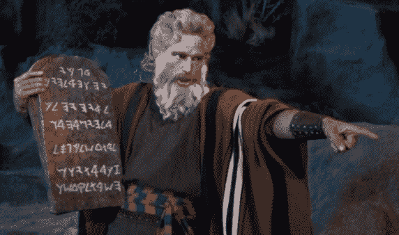

# 生活中需要遵循的水龙头提示

> 原文：<https://medium.com/coinmonks/faucet-tips-to-live-by-b0a50eefd9ac?source=collection_archive---------43----------------------->

```
This post originally was published on [TapCrypto.co](https://tapcrypto.co/), visit for more content like this and reviews on all major crypto faucets. Follow us on Twitter [@Tapcrypto1](https://twitter.com/tapcrypto1)
```

# 给加密水龙头用户的提示和技巧。

# 建议，将节省您的时间，让您在网上用加密货币水龙头赚钱。

在 TapCrypto，我们不仅提供关于大多数主要水龙头的报道和评论，我们也使用它们！没有付费评论，都是我们做的。作为多年来狂热的水龙头用户，我们认为应该分享一些我们学到的有用的东西。希望水龙头使用者可以避免我们所经历的一些痛苦。不多说了，下面是每个水龙头使用者应该遵循的建议。



The Crypto Faucet Commandments

# 研究网站

*   帮你自己一个忙，在注册之前看看这个网站。这将节省你的时间浪费在潜在的骗局。
*   在你首选的搜索引擎中搜索“[tap crypto](https://tapcrypto.co/)‘水龙头名称’”，如果我们已经涉及到它，你应该来评论一下。或者，既然你在这里，停留一段时间，点击周围！
*   搜索“‘水龙头名称’骗局”，如果 [TapCrypto](https://tapcrypto.co/) 没有评论，你可能会找到评论。
*   让自己熟悉不合理的高支出和提款限额等泄密信号。
*   评论可能会误导人，我们以前写过关于[骗局](https://tapcrypto.co/scam-faucets-and-sites/)的文章，所以你可以在论坛上搜索其他的评价，比如 [BeerMoneyForum](https://www.beermoneyforum.com/?inv=62032)

# 账户管理

*   创建一个专门为水龙头网站使用的电子邮件帐户，这有助于以防任何网站以任何方式恶意行为(许多骗子在加密空间)。那么他们所拥有的只是一个断开的电子邮件地址，与你真正的个人通信是分开的。
*   永远不要提供您的姓名、电话号码或个人身份信息。
*   在所有网站上使用不同的密码。

> 加入 Coinmonks [电报频道](https://t.me/coincodecap)和 [Youtube 频道](https://www.youtube.com/c/coinmonks/videos)了解加密交易和投资

# 一致性是关键

*   很多人尝试一个网站一天左右，然后试图找到一个“新”的网站，相信它会更好地支付，但通常情况并非如此。
*   找几个你喜欢/喜欢的，坚持做下去，太多的话，开始感觉像是一件苦差事。
*   大多数网站都有连续几天的忠诚度奖励，与新用户相比，这些确实增加了你的收入。如果你声称有几天的时间去寻找一个新的网站，你只会不停地重置时钟。
*   如果你有一组每小时一次的要求，那就把它变成一个常规，每小时一起做，每半小时单独做一批，等等。
*   根据索赔计时器将浏览器选项卡分组。如果你不希望有一百万个打开的标签，我们建立了一个非常漂亮的网络应用程序，你可以标记收藏夹，让自己保持有序。不需要下载，检查一下 [TapCrypto 移动水龙头应用](https://wiggly-soap-9680.glideapp.io/)并在这里详细阅读[。](https://tapcrypto.co/2022/03/05/tapcrypto-mobile-app-and-site/)

# 不要赌博

*   正如我们在以前的一篇文章中讨论的[龙头企业如何运作](https://tapcrypto.co/2022/03/05/are-crypto-faucets-worth-it/)，游戏和赌博之所以可用，是因为赌场总是赢家！
*   博彩是运营商将用户资金放在网站上而不是放在用户钱包里的一种方式！

# 微型钱包仍然不是你真正的钱包！

*   从各种迹象来看，FaucetPay 在之前的事件中表现得像黑客一样值得信任，并诚信经营了几年。
*   微型钱包服务于一个非常需要的目的，但仍然是一个你必须信任的第三方。他们控制你的硬币，在你交易和取款时收取费用，是一个随时可能破产或诈骗的行业。
*   使用率很高的 microwallet ExpressCrypto.io 最近关闭了，这是一个骗局还是一个实际的 IT 问题，记录了他们的业务记录和数据，这永远无法得到证实，但用户的资金却不见了。所以永远不要持有太多的余额，只要有可能就取出来。其他像 [Coinpot](https://tapcrypto.co/2020/07/17/complete-coinpot-overview/) 甚至之前的 FaucetHub，也早就关闭了。

# 取款限额比可用硬币更重要

*   虽然如果你可以要求和提取你希望长期持有的硬币总是更容易，但如果支付可靠，不要让水龙头不支持你的密码这一事实阻碍你使用该网站。你可能会排除一些收入最高的网站。
*   一些付费最高的网站只支持几种加密货币。
*   您可以积累硬币余额，并将其兑换成您喜欢的硬币。
*   像 [FaucetPay](https://faucetpay.io/?r=1497) 这样的微型钱包提供相当多的主要硬币的现场交换和交易，并且随着时间的推移偶尔会添加新的支持硬币。

# 撤！

*   网站试图为用户提供不撤销密码的激励。这些有多种形式，如超过一定金额的余额“利息”或现场活动奖金，让你赚得更多。
*   不幸的是，网站总是破产。如果一个网站关闭了，你的钱也会随之消失。因为在网站上而不能使用的 10 美元不是你的钱。不是你的钥匙，也不是你的硬币，但我们也不反对那些依赖集中交易的人，比如比特币基地，如果他们没有足够的知识来管理自己的钱包。这很可能比将许多人的责任托付给一家资金雄厚的企业更具风险。
*   如果该网站最终是一个骗局，不会让你撤回你的密码，那么你将不会浪费更多的时间使用该网站。

如果你想自己尝试一些合法的加密货币水龙头，在 [TapCrypto](https://tapcrypto.co/) 我们已经策划了一系列经过验证的水龙头。

[比特币水龙头](https://tapcrypto.co/bitcoin-faucets/)、[以太坊水龙头](https://tapcrypto.co/ethereum-faucets/)、 [Dogecoin 水龙头](https://tapcrypto.co/dogecoin-faucets/)、 [Solana 水龙头](https://tapcrypto.co/solana-faucets/)、[莱特币水龙头](https://tapcrypto.co/litecoin-faucets/)、 [Zcash 水龙头](https://tapcrypto.co/zcash-faucets/)、[比特币现金水龙头](https://tapcrypto.co/bitcoin-cash-faucets/)、 [Dash 水龙头](https://tapcrypto.co/dash-faucets/)、[币安币水龙头](https://tapcrypto.co/binance-coin-faucets/)、 [Digibyte 水龙头](https://tapcrypto.co/digibyte-faucets/)、 [Tron 水龙头](https://tapcrypto.co/tron-faucets/)

查看我们新推出的[移动网络应用](https://wiggly-soap-9680.glideapp.io/)，快速、高效地申请和整理您选择使用的所有水龙头！点击了解更多[！](https://tapcrypto.co/2022/03/05/tapcrypto-mobile-app-and-site/)

我们在 [TapCrypto](https://tapcrypto.co/) 感谢您的收看，并在页面中走到这一步。通过订阅我们的[网站](https://tapcrypto.co/)，你可以找到我们使用的所有加密货币水龙头、[网站评论](https://tapcrypto.co/blog/)和支付凭证。关注我们 [@tapcrypto1](https://twitter.com/tapcrypto1) 。谢谢大家！