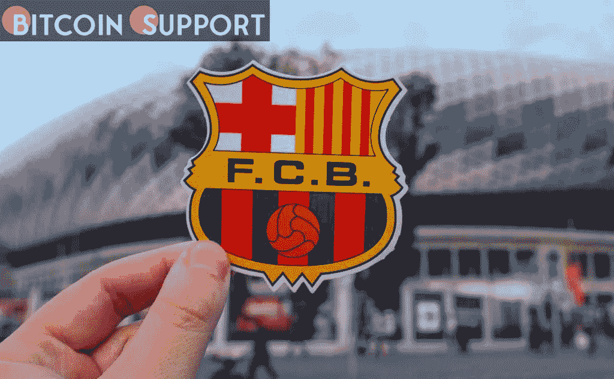

# 据报道，巴塞罗那足球俱乐部将推出自己的加密货币

> 原文：<https://medium.com/coinmonks/fc-barcelona-is-to-launch-its-own-cryptocurrency-according-to-reports-5481838c98e?source=collection_archive---------69----------------------->

**Visit our website:-** [**https://bitcoinsupports.com/**](https://bitcoinsupports.com/)

该俱乐部拒绝了与加密货币公司合作的提议，因为它希望创造自己的货币和元宇宙。据 ESPN 报道，巴塞罗纳俱乐部主席表示，该俱乐部希望开发自己的加密货币。

据 Joan Laporta 本周在巴塞罗纳世界移动通信大会上发言称，该俱乐部已经拒绝了与加密公司合作的提议，因为它想创建自己的加密货币和元宇宙。

“我们想制造自己的加密货币，我们必须自己做，”拉波尔塔说。“我们的独特之处在于，我们依靠体育业务产生的收入来实现收支平衡。”与大多数大型足球俱乐部不同，巴塞罗那是由其支持者拥有和经营的。该俱乐部的治理基于 16 万名会员，而非股东。根据福布斯，它是 2021 年世界上最有价值的足球俱乐部。“我们没有大公司或股东的支持。拉波尔塔说:“这迫使我们在体育领域的许多方面具有创造性、原创性、勇气和超前性。继去年 11 月首次披露计划后，拉波尔塔表示俱乐部将在不久的将来引入一系列不可替代的代币(NFT)。目前还不知道巴塞罗那的 crypto 将被用于什么用途，是作为一个类似于 Socios 提供的球迷代币，还是一种支付门票和其他东西的方式。

**访问我们的网站:-**[**https://bitcoinsupports.com/**](https://bitcoinsupports.com/)

**免责声明:以上为作者观点，不应视为投资建议。读者应该自己做研究。**

> 加入 Coinmonks [电报频道](https://t.me/coincodecap)和 [Youtube 频道](https://www.youtube.com/c/coinmonks/videos)了解加密交易和投资

# 另外，阅读

*   [CoinFLEX 评论](https://coincodecap.com/coinflex-review) | [AEX 交易所评论](https://coincodecap.com/aex-exchange-review) | [UPbit 评论](https://coincodecap.com/upbit-review)
*   [AscendEx 保证金交易](https://coincodecap.com/ascendex-margin-trading) | [Bitfinex 赌注](https://coincodecap.com/bitfinex-staking) | [bitFlyer 点评](https://coincodecap.com/bitflyer-review)
*   [麻雀交换评论](https://coincodecap.com/sparrow-exchange-review) | [纳什交换评论](https://coincodecap.com/nash-exchange-review)
*   [支持卡审核](https://coincodecap.com/uphold-card-review) | [信任钱包 vs 元掩码](https://coincodecap.com/trust-wallet-vs-metamask)
*   [Exness 回顾](https://coincodecap.com/exness-review)|[moon xbt Vs bit get Vs Bingbon](https://coincodecap.com/bingbon-vs-bitget-vs-moonxbt)
*   [如何开始通过加密贷款赚取被动收入](https://coincodecap.com/passive-income-crypto-lending)
*   [加密货币储蓄账户](/coinmonks/cryptocurrency-savings-accounts-be3bc0feffbf) | [加密交易机器人](https://coincodecap.com/best-crypto-trading-bots)
*   [BigONE 交易所评论](/coinmonks/bigone-exchange-review-64705d85a1d4) | [CEX。IO 审查](https://coincodecap.com/cex-io-review) | [交换区审查](/coinmonks/swapzone-review-crypto-exchange-data-aggregator-e0ad78e55ed7)
*   [最佳比特币保证金交易](/coinmonks/bitcoin-margin-trading-exchange-bcbfcbf7b8e3) | [比特币保证金交易](https://coincodecap.com/bityard-margin-trading)