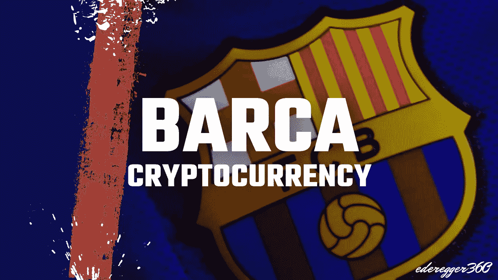

# 巴塞罗那足球俱乐部发布其加密货币

> 原文：<https://medium.com/coinmonks/fc-barcelona-releases-its-cryptocurrency-8955eb1d7f75?source=collection_archive---------32----------------------->

## 莱昂内尔·梅西已经成为历史。巴塞罗那的加密货币是未来！

Thumbnail made by [Günter Ederegger](https://medium.com/u/4f0c50d16421?source=post_page-----8955eb1d7f75--------------------------------)

一个新的机构投资者加入了加密市场。这一次，足球俱乐部巴塞罗那想要设计它的加密货币，以及其他一些东西。

据西班牙媒体报道，不到一周前，巴萨拒绝了币安和 T2 的赞助协议