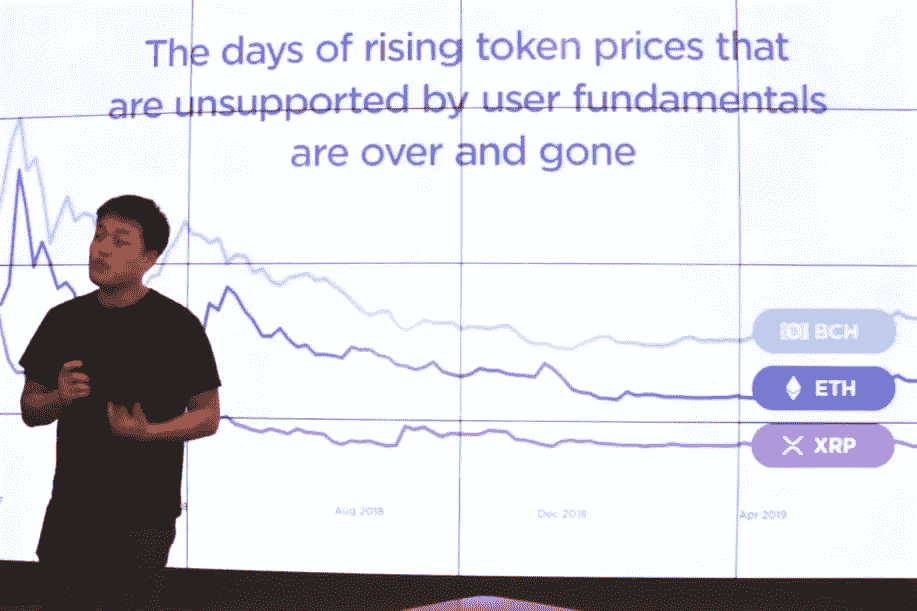
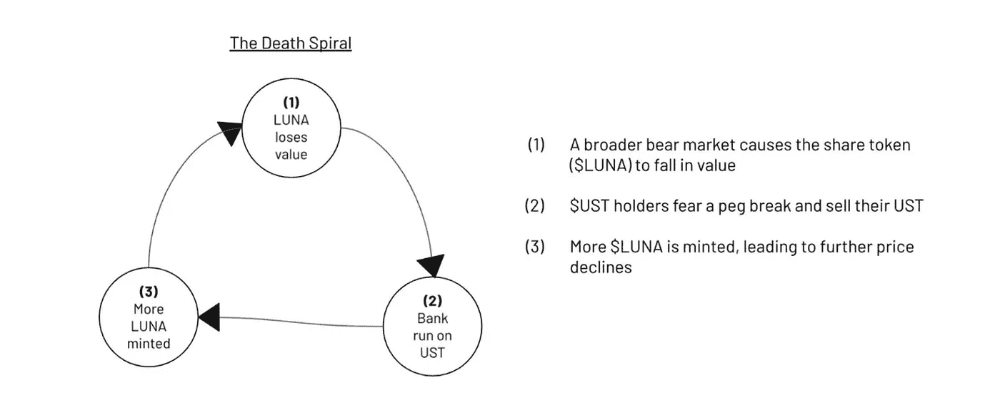

# 恐惧是唯一传播速度超过光速的东西。

> 原文：<https://medium.com/coinmonks/fear-is-the-only-thing-that-travels-faster-than-the-speed-of-light-d4dc35cd5975?source=collection_archive---------37----------------------->

Terra/Luna Founder Do Kwon in October 2019

没有什么比光速更快了。

除了恐惧。

事实证明，恐惧是推翻帝国、政权、文明甚至经济的关键工具。

加密也不例外。

当消息传出，人们开始从 1 美元看到 UST·德佩格时，每个人都开始担心情况会变得更糟。

恐惧促使他们退出锚协议，卖掉他们的 UST，尽快退出他们的头寸。

恐惧让他们对整个系统失去了信心。

恐惧助长了助推器，把 UST/月神/锚协议推到了马里亚纳海沟的底部。

数十亿美元的价值在短短几天内被摧毁。

真正令人震惊的是，UST/卢纳的智能合约和象征经济学没有任何错误。

就像一个程序或一个机器人一样，它是按照程序来做的。

就像银行挤兑一样，每个人都想同时退出。

并且系统相应地处理它。

UST 突然、突然、大规模的撤军将使形势更加严峻。

这引发了恐惧、不确定和怀疑(FUD ),更多的人开始出售或退出他们在 UST 和 Anchor 的头寸。

当更多的人退出锚定系统时，没有更多的流动性，系统将变得资不抵债。

“银行挤兑 发生在大批储户因担心银行破产而同时从银行提款的时候。”

然后是“死亡螺旋”。

The death spiral explained.

当 UST 被盯住时，UST 和卢娜之间的关系很好，并且对卢娜作为一个整体有持续的需求和高度的信心。

一旦 FUD 进入超光速，人们对这个系统完全没有信心，恐惧就会占据上风。

一旦销售开始，UST 和卢娜之间的不寻常的关系也无情地导致双方一起暴跌。

当 UST·德佩格斯，人们开始退出主播，协议开始燃烧 UST 和铸造更多的露娜。

更多的露娜在公开市场上出售，当供应大于需求时，露娜开始迅速贬值。

更多的恐惧随之而来，当露娜失去价值时，UST 也失去价值，这反过来导致更多的人退出锚定，循环继续。

这就是死亡螺旋如此致命的原因。

一旦开始，就难以停止。

也许唯一的办法就是让这个系统自然地、痛苦地、可怕地流血。

-

你有 UST 或露娜吗？

-

# startups # business # startupx # growth # success # social media # culture # entrepreneur # strategy # dokwon # luna # terra # terraformlabs # stable coin # luna crash # cryptoland # ust # cryptogeddon #比特币#死亡螺旋#bankrun

> 加入 Coinmonks [电报频道](https://t.me/coincodecap)和 [Youtube 频道](https://www.youtube.com/c/coinmonks/videos)了解加密交易和投资

# 另外，阅读

*   [WazirX vs coin dcx vs bit bns](/coinmonks/wazirx-vs-coindcx-vs-bitbns-149f4f19a2f1)|[block fi vs coin loan vs Nexo](/coinmonks/blockfi-vs-coinloan-vs-nexo-cb624635230d)
*   [本地比特币审核](/coinmonks/localbitcoins-review-6cc001c6ed56) | [加密货币储蓄账户](https://coincodecap.com/cryptocurrency-savings-accounts)
*   [什么是融资融券交易](https://coincodecap.com/margin-trading) | [成本平均法](https://coincodecap.com/dca)
*   [支持卡审核](https://coincodecap.com/uphold-card-review) | [信任钱包 vs 元掩码](https://coincodecap.com/trust-wallet-vs-metamask)
*   [Exness 回顾](https://coincodecap.com/exness-review)|[moon xbt Vs bit get Vs Bingbon](https://coincodecap.com/bingbon-vs-bitget-vs-moonxbt)
*   [如何开始用加密贷款赚取被动收入](https://coincodecap.com/passive-income-crypto-lending)
*   [BigONE 交易所评论](/coinmonks/bigone-exchange-review-64705d85a1d4) | [电网交易 Bot](https://coincodecap.com/grid-trading)