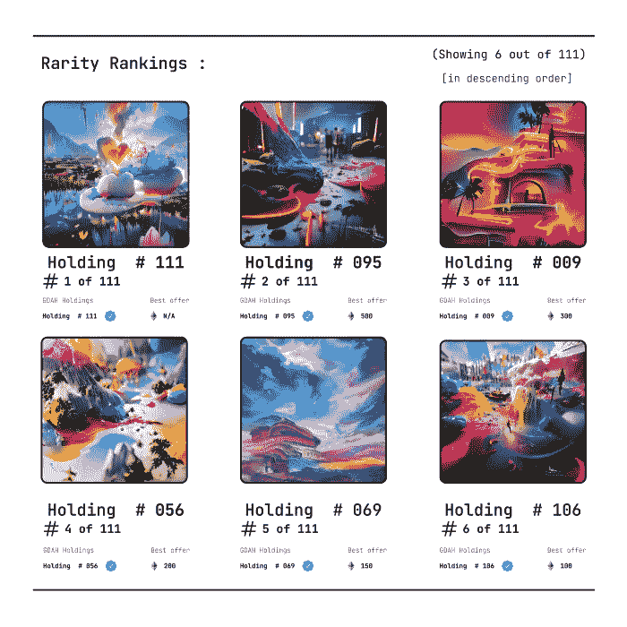
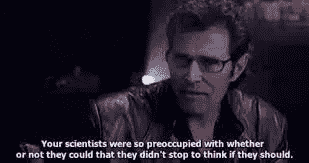
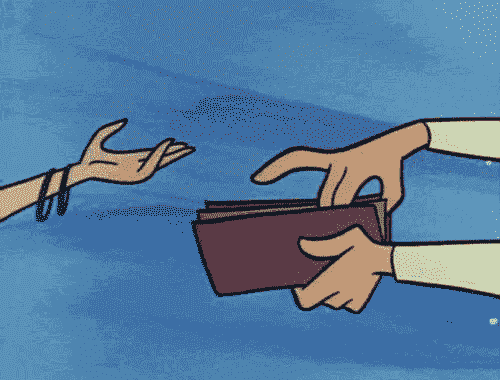

# NFT 指数基金的可行性

> 原文：<https://medium.com/coinmonks/feasibility-of-an-nft-index-fund-a62cdec56e37?source=collection_archive---------10----------------------->

## 在本文中，我们将讨论 NFT 指数的可行性，并判断它们是否是一个好主意。

[{编辑注意，请不要删除 meme gif，随它们去吧}]

嘿，读者，我已经有一段时间没有给你们写信了，这是有原因的。

我一直在不知疲倦地为我即将到来的项目工作。主要是其中的两个花费了大部分时间，即“数字资产的搜索引擎”，我称之为“NFTs 使之变得容易”,另一个是本文的主题。

(搜索引擎结果的用户界面插图的一部分)

写这篇文章的决定是非常自发的，这篇文章的目的是看看这个冒险是否可行，而不是为它提供一个论点。(假设投入了足够的精力)

清理我的头脑是一个额外的好处

> *在继续之前，有些术语你可能想习惯一下，即*

**NFT:**NFT 代表**不可替代的代币**具有独特性和不同的特征，其所有权很容易核实。

**指数基金**:指数基金是一种交易所交易基金(ETF)，其投资组合旨在匹配或跟踪金融市场指数的成分，如标准普尔 500 指数(S & P 500 ),据说它提供广泛的市场敞口、低运营费用和低投资组合周转率。

解决了这个问题后，我们会试着弄清楚这是否有意义，即“如果我们可以，我们应该吗？”

# 指数基金投资简史

从历史上看，指数基金一直被用作对冲市场风险的工具，它们一次又一次地表明，它们是最好的金融工具，只需定期平均，就能获得持续的收益，这些收益往往会逐年复合。

> *现在让我们来看看指数基金的类型，以便对它们和它们的历史回报率有一个了解。*

# 全球指数基金

(关注稳定性和多样化){也吹捧持续回报}

指数基金类型:-

*   公司规模(小型、中型)
*   位置(特定国家、外国市场、新兴市场)
*   业务类型(科技、房地产等。)
*   货币(债券、国库券等。)

全球五大指数基金

*   FXIAX(标准普尔 500)无最低[10 年平均回报率 14%，6.5% 20 年] 0.015%费用率
*   SWTSX(跟踪市场~3200 st)无最低投资[10 年平均回报率 X%，x% 20 年] 0.03%费用率
*   SWPPX(标准普尔 500)零最低[10 年平均回报率 13.9%，公司 7.7%]0.02%费用率
*   VTSAX(跟踪美国市场~3500 st){VTI 无最小值} 3000 美元最小值[10 年平均回报 y，x 20 年]0.03–0.04%费用率
*   VFIAX(先锋 500 指数基金){追踪标准普尔 500} 3000 美元最低[10 年平均回报率 14%，20 年 6.5%]0.04%费用率

一些净费用率为 0.00 %的新基金

*   FZROX(总股票市场)无最低投资[10 年平均回报率 X%，x% 20 年] 0.00%费用率[基金成立 2018]
*   FNLIX(技术上是一只标准普尔 500 基金)无最低投资[10 年平均回报率 X%，x% 20 年] 0.00 费用[2018 年基金成立]
*   FZILX(国际基金)无最低投资[10 年平均回报率 X%，x% 20 年] 0.00%费用率[2018 年基金成立]

你可能会想，我为什么要包括这个，或者它可能看起来不相关，但请耐心听我说，因为我要说到重点了。

> 为什么指数基金投资一直是长期投资者的首选？可能是通过“多样化”或这些资产的复合年增长率来对冲与投资单一实体相关的风险的能力吗？

# NFT 指数基金能提供什么效用？

一半的人在 Nft 的投资中亏损是由于几个因素，包括缺乏知识，被某些关键词吸引，如被动收入，或被不切实际的承诺，或直接被误导。

(POV:看到钱包后的我)

***可以肯定地说，挑选最佳项目的诀窍是随着时间的推移而来的，而且往往是在经历几次挫折之后***

然而，那些做得好的人往往会做得非常好，而且会提前弥补损失。

如果我们将同样的基本原则应用于此，人们可能会得出这样的结论:分散到尽可能多的不同项目中是最好的选择，但这也有一定的财务限制

(观点:政府对便便硬币的利润征收 6900%的税后)

在这种情况下，NFT 指数基金对购买力有限的人来说更有意义。这将允许一个人获得整个指数的集体利益，并通过分散风险来对冲风险。

**为了这次冒险的成功，需要做好几件事**

首先，**阿尔法团队**应该变得坚强，知道他们在做什么

第二，**社区**必须积极参与，所有重大决策都必须牢记社区

第三，也是最后一点，它必须有独特的视觉艺术来吸引潜在的买家，或者仅仅是围绕这个项目创造/扩大宣传

证据一:不是我最好的艺术

这是我通常制作的艺术类型。抽象，充满活力，并带有一点科幻的暗示来结束这一切。让我看看它在推特上的样子@[https://twitter.com/AnkurBhadauria7](https://twitter.com/AnkurBhadauria7)

我手动生成所有这些，花了我大约 2 个小时来渲染+升级这些作品。我也渲染这些作品的视频格式。

(这一块:人类作为一个星系际物种)

如果我们分散到许多不同的精选项目，并成功地利用社区钱包的集体购买力，我们将是黄金。

接下来是 Hodl-ing(坚持到底)部分，社区钱包的价值升值会导致整个项目的价值升值。

表现得像一家不支付股息的成长型股票公司，以免被归类为证券。艺术品将是不同的稀有品，每件作品都是独一无二的，但在索引中代表相同的所有权百分比。

# 与这些类型的项目相关联可能会有什么负面影响？

如果所述项目背后的团队要么过度承诺，要么只是做出古怪的声明，并试图误导首次投资者给他们血汗钱，或者如果路线图只是从另一个受欢迎的项目复制粘贴，那么这是一个危险信号。

所以我建议你们投资知名和受人尊敬的艺术家的项目，或者如果他们有一个 Doxed 团队(身份已知)。如果你这样做了，你就可以走了。

# 哪些事情对我们有利？🤔

*(我会随时更新)*

第一个是黑仔艺术。生成的艺术需要大约 2 个小时来完成{用元数据}一个单一的作品，我想附上一个这样的项目口径的艺术作品

第二，我们的透明度是无与伦比的，我们在利益相关者投票结束后做出重大决定，我们已经设置了机器人来 ping 专用 discord 渠道中与附属钱包相关的每一笔交易。

现在，我们需要做的就是构建智能合约功能(并不困难)，然后围绕项目创建一个紧密结合的社区。

然后，我们将推出 111 pc Genesis Mint，它将作为概念验证，以开发该基金的放大版本。除了现实生活中的礼物之外，创世纪系列的持有者还将获得所有即将到来的项目的免费薄荷糖，比如…🤫

加入我们的不和@【https://discord.gg/Rmz5GUcUau 

推特@【https://twitter.com/AnkurBhadauria7 

# 结论

简而言之，这个利基市场还没有被充分开发(我找不到一个做这种事情的项目),像这样的项目还没有使市场饱和{到目前为止},这表明未来有很大的增长潜力

因此，就此而言，我想完成这篇文章。我建议你们考虑一下这些东西，并在下面的评论中告诉我你们的想法(我全都读过了)

> *在我即将发表的文章中，我将讨论 Re-Fi(再生金融)的一切，这是一种利用区块链技术衡量气候行动的方式，是一项关于加密指数基金可行性的案例研究，其中最受欢迎的是“Droid Capital ”,敬请关注*

就这样，和平结束了🤣

> 加入 Coinmonks [电报频道](https://t.me/coincodecap)和 [Youtube 频道](https://www.youtube.com/c/coinmonks/videos)了解加密交易和投资

# 另外，阅读

*   [如何在 FTX 交易所交易期货](https://coincodecap.com/ftx-futures-trading) | [OKEx vs 币安](https://coincodecap.com/okex-vs-binance)
*   [CoinLoan 审查](https://coincodecap.com/coinloan-review) | [YouHodler 审查](/coinmonks/youhodler-4-easy-ways-to-make-money-98969b9689f2) | [BlockFi 审查](https://coincodecap.com/blockfi-review)
*   [XT.COM 评论](https://coincodecap.com/profittradingapp-for-binance)币安评论 |
*   [SmithBot 评论](https://coincodecap.com/smithbot-review) | [4 款最佳免费开源交易机器人](https://coincodecap.com/free-open-source-trading-bots)
*   [比特币基地僵尸程序](/coinmonks/coinbase-bots-ac6359e897f3) | [AscendEX 审查](/coinmonks/ascendex-review-53e829cf75fa) | [OKEx 交易僵尸程序](/coinmonks/okex-trading-bots-234920f61e60)
*   [如何在印度购买比特币？](/coinmonks/buy-bitcoin-in-india-feb50ddfef94) | [WazirX 评论](/coinmonks/wazirx-review-5c811b074f5b)
*   [隐料斗替代品](/coinmonks/cryptohopper-alternatives-d67287b16d27) | [HitBTC 审查](/coinmonks/hitbtc-review-c5143c5d53c2)