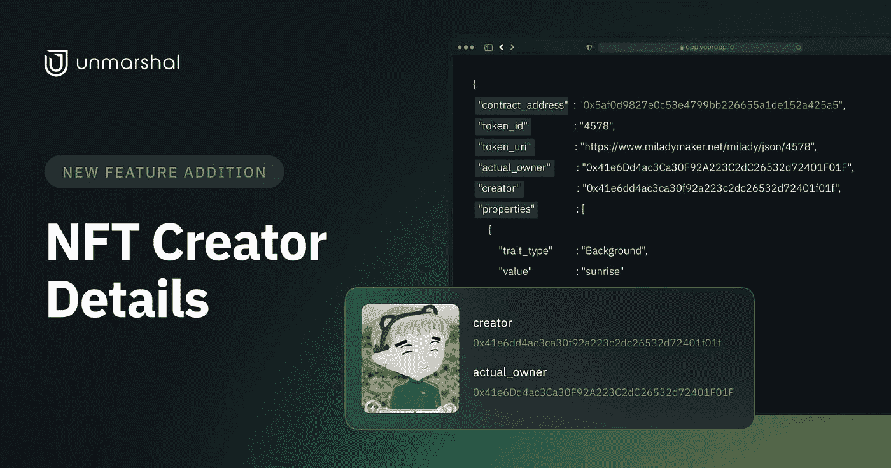

# 新增功能— NFT 创建者详细信息

> 原文：<https://medium.com/coinmonks/feature-addition-nft-creator-details-56bdbc1eb7bf?source=collection_archive---------32----------------------->

您是否正在构建一个 NFT 应用程序，并希望了解某个特定 NFT 集合的创建者？使用 Unmarshal 的 API 端点来查询 minter 细节。

## **查询制单人详细信息的意义**

这个端点最初是为了满足我们的合作伙伴的请求而创建的。它有一个非常具体的用例，但是知道 NFT 的创建者/铸造者在许多其他场景中是有帮助的。

1.  **帮助 NFT 市场验证真实性** NFT 很容易复制，市场能够验证集合和相关资产的真实性变得至关重要。因此，追踪最初的创造者变得至关重要。
2.  **验证真实性—协议** 允许用户在抵押 NFT 后借入数字货币的协议，以及 NFT 赌注、借入和借出协议，都需要验证原始创建者，该端点可以帮助他们。
3.  **追踪 NFT 资产历史** 从用户的角度来看，追踪过去的所有权一直追溯到最初的创建者有助于维护记录。过去的所有权历史以前是可用的，但创建者功能直到现在才被定义。

## **如何使用解组端点查询 Minter 细节**

1.  **NFT 资产详细信息** 除了资产详细信息(如所有者、价格和所有相关元数据)之外，该端点还将返回创建者的钱包地址。
2.  **NFT 通过令牌 ID 提供详细信息** 该端点根据其分配的令牌 ID 和智能合约地址对特定 NFT 的特征进行解码。我们现在已经将 creator 作为该端点的默认响应。因此，如果一个 NFT 集合有多个创建者，这个 API 将有助于区分他们。

## **链条支撑**

目前以太坊、BNB、多边形和雪崩链支持该功能，不久将会添加更多功能。可以使用上述端点来查询这些链上所有可用资产的 minter。

首先，在这里注册: [console.unmarshal.io](http://console.unmarshal.io)

# 关于解组

Unmarshal 是一个多链 Web 3.0 数据网络，旨在为 dApps、DeFi 协议、NFTs、元宇宙和 GameFi 解决方案提供精确、可靠和实时的数据。Unmarshal 提供了从 XDC 网络、以太坊、币安智能链、Polkadot、Near 和 Solana 查询区块链数据的最简单方法。解组网络由数据索引器和转换工具组成，为任何链上的 Web 3.0 应用程序提供动力，同时提供转换数据的潜在视图。

[**网站**](http://unmarshal.io/) **|** [**电报聊天**](https://t.me/Unmarshal_Chat) **|** [**电报安**](https://t.me/joinchat/RRUIzbuhlA8-6Kjk) **|** [**推特**](https://twitter.com/unmarshal) **|** [**中**](https://medium.com/unmarshal-io)|[**不和**](https://discord.gg/SqhYdGYtEr)

> 加入 Coinmonks [电报频道](https://t.me/coincodecap)和 [Youtube 频道](https://www.youtube.com/c/coinmonks/videos)了解加密交易和投资

# 另外，阅读

*   [CoinDCX 评论](/coinmonks/coindcx-review-8444db3621a2) | [加密保证金交易交易所](https://coincodecap.com/crypto-margin-trading-exchanges)
*   [红狗赌场评论](https://coincodecap.com/red-dog-casino-review) | [Swyftx 评论](https://coincodecap.com/swyftx-review) | [CoinGate 评论](https://coincodecap.com/coingate-review)
*   [Bookmap 评论](https://coincodecap.com/bookmap-review-2021-best-trading-software) | [美国 5 大最佳加密交易所](https://coincodecap.com/crypto-exchange-usa)
*   [如何在 FTX 交易所交易期货](https://coincodecap.com/ftx-futures-trading) | [OKEx vs 币安](https://coincodecap.com/okex-vs-binance)
*   [CoinLoan 评论](https://coincodecap.com/coinloan-review) | [YouHodler 评论](/coinmonks/youhodler-4-easy-ways-to-make-money-98969b9689f2) | [BlockFi 评论](https://coincodecap.com/blockfi-review)