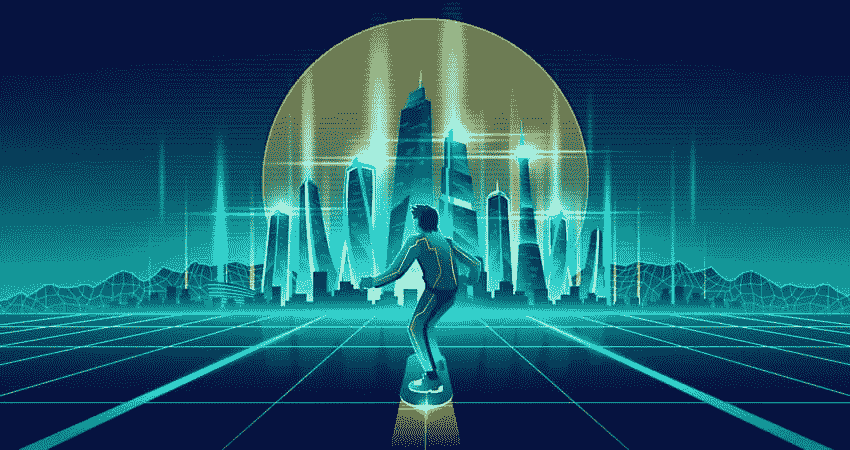
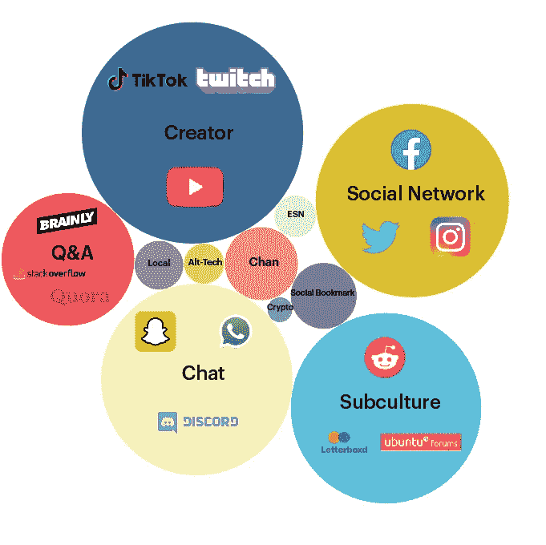
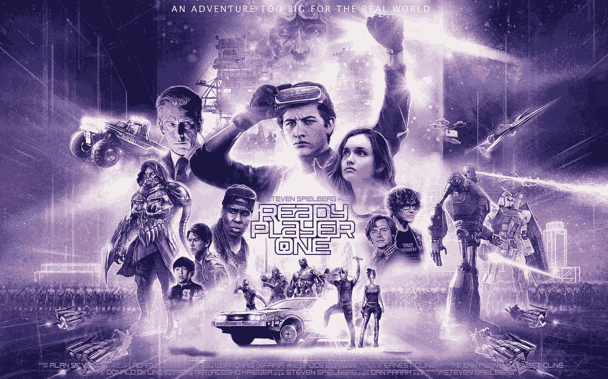
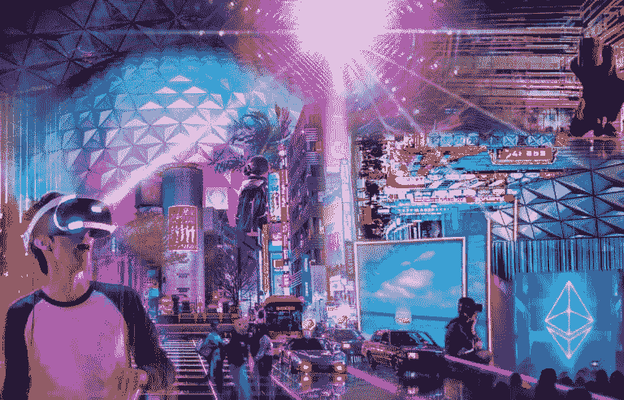
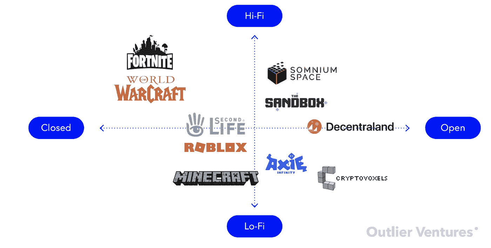

# Blockchain Blog 20:元宇宙——未来就在眼前

> 原文：<https://medium.com/coinmonks/feb-20-metaverse-the-future-is-here-a6366ee1ec40?source=collection_archive---------27----------------------->

历史记录了以以前无法想象的方式影响人类行为和文化的时代。工业革命在相对较短的时间内，通过新技术的发明和商业化，对所有人、行业、企业和政府的生活产生了重大影响。

这些创新影响了贸易、产品、社会、艺术和文化。对许多新技术、发明和工艺的开发使企业家有能力构思新的奇妙机会。

在不到 25 年的时间里，互联网影响了地球上每个人的生活，创造了前所未有的财富，使数百万人摆脱了贫困，并改变了全球每个行业和企业。

未来十年，元宇宙的出现将超越互联网带来的创造性破坏，并将赋予创造经济力量。

> “在创造性破坏的过程中出现了一些情况，其中许多公司可能不得不倒闭，但如果它们能经受住一场特定的风暴，它们将能够生机勃勃、卓有成效地生存下去。”— *约瑟夫·熊彼特*

当今世界十大最有价值的公司中有五家仅仅因为互联网的发明而存在:亚马逊、字母表、脸书、腾讯和阿里巴巴。苹果和微软的主要价值依赖于互联网接入，这两家公司的总价值为 10.2 万亿美元。这相当于前十名的 76%，相当于美国年度国内生产总值的 48%。将特斯拉列入这一名单是有道理的，因为它的全球销售业务完全依赖互联网。最重要的是，这五家公司(包括特斯拉在内的六家)在 1993 年并不存在。脸书只有 17 岁。

赋予创造者经济权力的元宇宙的出现将通过创造性破坏带来另一个划时代的变化。

元宇宙将以难以想象的方式影响我们所有人的生活，并带来行为改变。工业将在不到一代人的时间内彻底转变，社会的运作将与今天大不相同，企业将以完全不同的方式运作，我们将看到技术和发明的出现，这些技术和发明将利用元宇宙将促成的根本性行为变化。

> 我们今天不了解的公司将会出现并主导这个新的元宇宙虚拟经济，并在一代人的时间内成为世界上最有价值的公司。

从根本上来说，互联网从一开始就是一个出版平台，并且在书面语言方面非常出色(出版、存储、推广、发现、货币化和搜索)。它从来没有特别擅长视频、实时通信、游戏和社交媒体。随着 2007 年 iPhone 的发明和推出，互联网演变成了移动互联网(通常被称为互联网 2.0)。这使得互联网从只有拥有昂贵的个人电脑和直接互联网连接的用户才能访问到拥有智能手机的任何人在任何地方都可以访问。

移动互联网使网站能够利用移动设备提供的触觉视频显示界面进行全天候访问和互动。这种持续的互动，加上设备商店的创建和应用程序的发明，改变了信息和娱乐的生产和消费方式。实时交互性是互联网 2.0 的根本动力，也是创作者经济的基础。

包括 YouTube、脸书、Snapchat、Twitter、优步、网飞、Airbnb 和许多其他公司在内的公司涌现出来并占据主导地位，因为移动互联网实现了无限制的访问。我们也看到了移动游戏的普及和使用的爆炸式增长，2020 年将有 26 亿人玩移动视频游戏，移动视频游戏的下载量超过 800 亿次。

创作者经济是对电视的再创造，内容分发的控制和货币化不再由少数大型网络和媒体公司主导，而是由直接向观众分发的人才自己主导。它是内容制造和交付与通过社交媒体和移动互联网的观众管理和发现的集成。它由用户生成内容(UGC)主导，主要是由个人创作者制作的编辑视频，并上传到视频点播(SVOD)平台，如 YouTube 和脸书。

最近，制作难度更大、成本更高的用户生成直播内容(UGLC)通过 Twitch(亚马逊旗下)、YouTube Live 和脸书 Live 等平台出现了爆炸式增长。UGC 网络规模让传统媒体相形见绌；广受欢迎的 YouTuber PewDiePie 拥有 1.1 亿 YouTube 用户，他的视频被观看了超过 275 亿次。相比之下，最大的有线电视用户群康卡斯特(Comcast)拥有 2200 万用户。

# 元宇宙

元宇宙是下一代互联网——流媒体、互动和社交媒体的全面融合。内容、交流和互动在空间上表现为深刻的、令人回味的体验，这些体验驱动着消费者行为，并最终驱动品牌价值。这是一个虚拟世界，任何人都可以实时探索、体验、创造、交流和参与(想想史蒂文·斯皮尔伯格的电影《就绪玩家一号》)。最明显的是，元宇宙将扰乱经济的每个部门和我们的日常生活；零售、娱乐和休闲、设计、制造、医药、教育、交通、电信、旅游、社交媒体、用户界面和内容创作。

一些用户会像玩大型多人视频游戏一样使用它，其他人会用它来与他们的智能设备交互、购物和体验内容。对于工业，元宇宙将支持生产过程的微米级精确模拟，并消除团队之间的物理距离。

元宇宙将成为创作者经济的决定性技术，支持任何 UGLC 创作者在与观众的沉浸式、参与式、交易式社交体验中实现直播内容和体验的货币化和规模化。元宇宙将永远开启、永远运行，并像不夜城一样提供实时体验。最终，它将成为创建和观看直播内容的主导性全球平台，并具有重要的附加功能，如交互性、实时交易功能、品牌推广和集成、游戏机制和功能、集成社交、区块链和 NFT 功能以及极具价值的游戏化工具。

> “就像互联网对于信息一样，元宇宙将会为社会联系做出贡献。我不再受物理距离或所有这些限制的约束，不管是与谁互动，还是如何表现自己。所有这些东西都突然被遗忘了。这具有极大的破坏性。”— *Roblox 首席执行官克雷格·多纳托。*

元宇宙的主要入口将通过一个基于浏览器的 URL 和一个个性化的化身，人们将能够使用典型的游戏引擎机制通过移动设备来导航虚拟元宇宙环境。我们无限可定制的化身将是我们自己的虚拟版本，拥有我们的钥匙、钱包和身份。我们将为我们的头像购买数字资产，如服装和珠宝，我们将决定我们允许品牌 metaverses 访问多少数据(如果有的话),以便他们定制我们的体验。

**最终将会有数十亿元诗句，元诗句主要有两种类型:**

1.  封闭的元诗句和
2.  打开元诗句

封闭的元宇宙只能通过下载专有的源 IP 来访问，用户需要签署最终用户许可协议才能访问。像堡垒之夜、Roblox、使命召唤、《我的世界》和英雄联盟这样的视频游戏都是封闭元诗句的例子。

任何人创建一个虚拟形象，并通过浏览器和 PC 或移动设备上的 URL 输入它，就可以访问 Open metaverses。在接下来的几年里，世界上的每个品牌都需要投资一个开放的元宇宙优先战略。考虑一个全球品牌，如亚马逊。今天，任何人都可以通过浏览器访问亚马逊网站，找到数以百万计的待售商品。是以购物为主的一维体验。我不能和其他潜在的亚马逊客户谈论产品评论或卖家。我不能像在购物中心那样拿着东西。亚马逊元宇宙将为我的个性化头像实现所有这些甚至更多。

或者，如果我们甚至不需要亚马逊或脸书，而我们有一些由区块链和 Web3 驱动的开放的去中心化购物体验，那会怎么样？

元宇宙还在实时社交媒体互动的增强、发展和丰富方面表现出色。元宇宙通过添加人工智能工具，以复制我们交流的物理方式的方式实现交互。在未来，我们的化身将在元宇宙与朋友见面，探索和分享共同的经历，一起购物，拜访家人和朋友，参加虚拟音乐会和会议，参观画廊和博物馆，甚至上学。我们将在其他社交媒体平台上分享我们的虚拟体验，我们中的一些人将直播我们的元宇宙体验和互动，供 Twitch 等平台上的粉丝被动消费。元宇宙将以独特的方式为社区供电。某些规模较大的社区会创建自己的元数据并运营自己的经济。元宇宙赋予的机会是巨大的。

元宇宙已经来了。一些世界上最大的公司正在大举投资他们版本的元宇宙，同时还有一些敏捷的初创公司正在开拓元宇宙的未来。

我留个视频给你看。视频展示了元宇宙的另一面。但我相信，未来是我们努力的方向。

***阅读下一部分:*** [区块链博客 21:被元宇宙颠覆的行业](https://aaklii.medium.com/blockchain-blog-21-industries-disrupted-by-the-metaverse-b1131942419c)

***全系列:*** [28 篇关于区块链和加密货币的博客](https://aaklii.medium.com/28days-of-february-blockchain-and-cryptocurrency-research-blogs-4b73c51ce3db)

> 加入 Coinmonks [电报频道](https://t.me/coincodecap)和 [Youtube 频道](https://www.youtube.com/c/coinmonks/videos)了解加密交易和投资

## 另外，阅读

*   [Blockfi vs 比特币基地](https://coincodecap.com/blockfi-vs-coinbase) | [BitKan 点评](https://coincodecap.com/bitkan-review) | [Bexplus 点评](https://coincodecap.com/bexplus-review)
*   [南非的加密交易所](https://coincodecap.com/crypto-exchanges-in-south-africa) | [BitMEX 加密信号](https://coincodecap.com/bitmex-crypto-signals)
*   [MoonXBT 副本交易](https://coincodecap.com/moonxbt-copy-trading) | [阿联酋的加密钱包](https://coincodecap.com/crypto-wallets-in-uae)
*   [雷米塔诺评论](https://coincodecap.com/remitano-review)|[1 英寸协议指南](https://coincodecap.com/1inch)
*   [iTop VPN 审查](https://coincodecap.com/itop-vpn-review) | [曼陀罗交易所审查](https://coincodecap.com/mandala-exchange-review)
*   [40 个最佳电报频道](https://coincodecap.com/best-telegram-channels) | [喜美元评论](https://coincodecap.com/hi-dollar-review)
*   [折叠 App 审核](https://coincodecap.com/fold-app-review) | [StealthEX 审核](/coinmonks/stealthex-review-396c67309988) | [Stormgain 审核](https://coincodecap.com/stormgain-review)
*   [购买 PancakeSwap(蛋糕)](https://coincodecap.com/buy-pancakeswap) | [俱吠罗评论](/coinmonks/coinswitch-kuber-review-1a8dc5c7a739)
*   [瓦济里克斯 NFT 评论](https://coincodecap.com/wazirx-nft-review) | [比茨盖普 vs 皮奥克斯](https://coincodecap.com/bitsgap-vs-pionex) | [坦吉姆评论](https://coincodecap.com/tangem-wallet-review)
*   [如何使用 Solidity 在以太坊上创建 DApp？](https://coincodecap.com/create-a-dapp-on-ethereum-using-solidity)