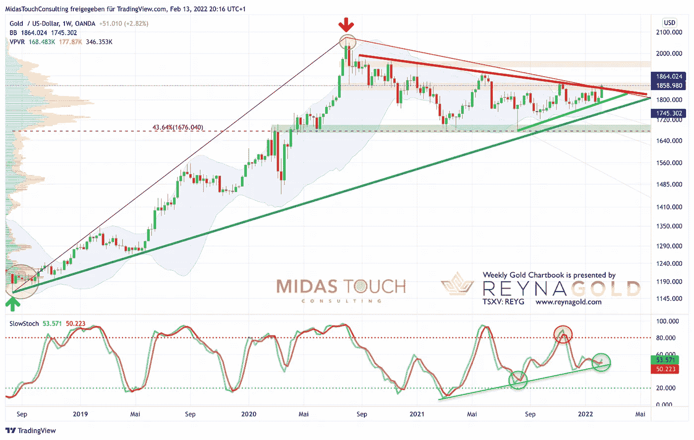
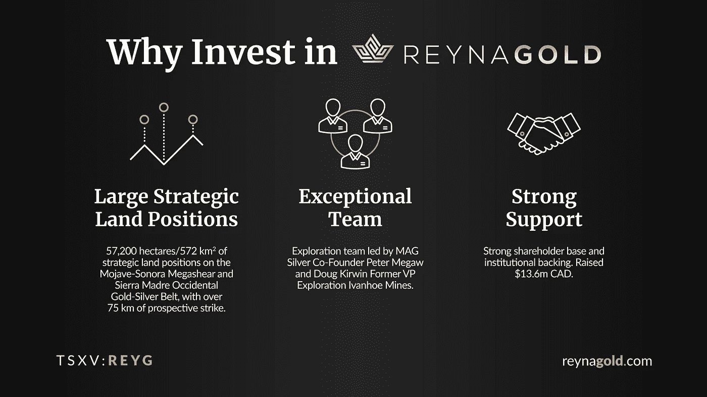
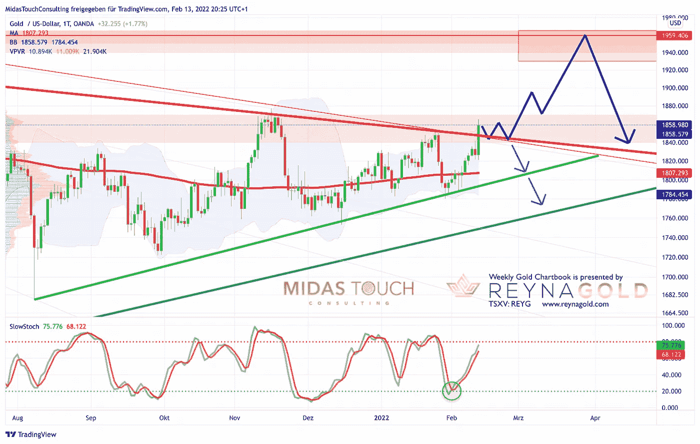
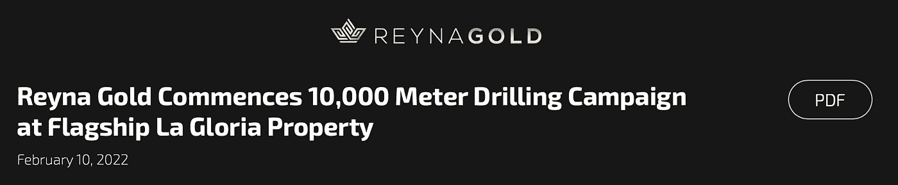

# 2022 年 2 月 13 日，黄金图表——黄金正在爆发！

> 原文：<https://medium.com/coinmonks/february-13th-2022-gold-chartbook-gold-is-breaking-out-a725efeede07?source=collection_archive---------32----------------------->

正如我们从 2022 年 2 月 3 日开始的[黄金图表中所预期的，黄金价格在过去一周不断攀升。直到周五中午，价格已经达到了 1，842 美元的高点，略低于多月三角形的上边缘(大约。1，850 美元至 1，855 美元)。在又一次猛烈的盘中回调至近 1，820 美元后，金价大幅回调并突破了该下降趋势线，价格迅速飙升至 1，865 美元的盘中高点。最后，黄金以 1858 美元的价格结束了本周的交易，这是一个非常乐观的消息。**黄金正在爆发！**](https://www.midastouch-consulting.com/gold-chartbook-03022022-seasonality-favors-another-wave-up)

鉴于上周强劲的价格走势和黄金的盘中弹性，现在很有可能黄金确实正在突破数月盘整三角形。事实上，这个巨大而对称的三角形至少已经建造了一年多。然而，黄金的调整始于 2020 年 8 月 7 日。现在看来，突破正在进行中。通常，交易者倾向于积极买入这样的突破。鉴于周五的大幅上涨，它实际上看起来就像这样。因此，随着黄金下一步走势的方向变得更加明显，预计会出现更多波动和大幅走高。

请注意，绘制和确定正确的三角形是相当具有挑战性的，因为黄金长期以来一直处于一个棘手的横盘市场，在这个混乱的时期，许多趋势线已经失效。但最迟，一周收盘超过 1，875 美元应该会确认突破。这将释放出足够的能量，推动金价在几周内迅速逼近 1900 美元，甚至 1950 美元。显然，这将非常符合黄金的季节性周期，至少在 2 月底之前是牛市，但经常看到黄金在 3 月中旬反弹。

## 消费者情绪处于 10 年低点，但美联储希望提高和缩减

从基本面来看，当消费者信心处于 10 年来的最低点时，美联储怎么能如此疯狂地加息，这让我们哑口无言。尽管人们对全球政府的信心正在崩溃，通胀正在飙升，但加息对供应短缺不会产生任何影响。相反，这只会让这些短缺变得更糟，让供应链上更多的公司破产。此外，它还会让新兴市场破产，因为强势美元已经给负债累累的美元国家和债权人带来了巨大压力。一切都是一团乱麻，我们相信没有出路。这就是为什么好战的美国工业和军事联合体不顾一切地试图推动俄罗斯攻击乌克兰！在没有任何证据的情况下，拜登政府和他们的喉舌“主流媒体”一直在推动人们关注[对俄国将很快入侵乌克兰的担忧](https://www.forbes.com/sites/sergeiklebnikov/2022/02/11/dow-plunges-500-points-oil-prices-surge-amid-fears-that-russia-will-soon-invade-ukraine/?utm_term=&utm_medium=browser_notifications&utm_source=pushly&utm_campaign=1872634&sh=684b00ee6324)。

另一个值得注意的基本观察:当[辉瑞&德国生物新技术公司在 2020 年 11 月 9 日宣布他们的疫苗](https://www.pfizer.com/news/press-release/press-release-detail/pfizer-and-biontech-announce-vaccine-candidate-against)时，黄金的修正开始了。作为第一反应，黄金在同一天立即下跌了 150 美元。在过去的 16 个月里，更多类似的大红色日线蜡烛接踵而至，摧毁了黄金投资者的信心，将数百万美元转移到卖空者手中。现在越来越多关于疫苗的严肃问题在新闻中被讨论，黄金回到 1950 美元是有道理的。这是 2020 年 11 月 9 日黄金交易的水平。

## 美元计价黄金，截至 2022 年 2 月 13 日周线图。

*Gold in US-Dollar, weekly chart as of February 13th, 2022.*

在周线图上，黄金在过去的几个月里缓慢但稳定地进入三角形的顶点。现在看来，黄金似乎正以复仇之势爆发。理论上，1，850 美元和 1，875 美元之间的阻力区仍然可以阻止牛市。周线布林线(1，864 美元)正好位于这个区域，至少应该挑战多头几天。然而，周线随机指标刚刚给出了新的买入信号。顶部，该振荡器自 2021 年 3 月以来一直在制造更高的低点。走出这个三角形的一个有分寸的移动可能会把黄金带到大约 1，950 美元到 1.975 美元，直到春天。月布林线(1975 美元)可能成为合理的目标！

总的来说，周线图变得越来越看涨，这表明黄金至少可以在 80 美元到 100 美元之间上涨。

## 美元计价黄金，截至 2022 年 2 月 13 日日线图。

*Gold in US-Dollar, daily chart as of February 13th, 2022.*

日线图上，黄金一直在 11 月和 1 月的上方三角阻力中挣扎。每一次，熊都设法反击。现在看起来公牛队终于成功了。两周半前的剧烈回调创造了一个不错的超卖格局，成为持续攻击的发射台。从那以后，慢速随机指标一直在很好地掉头。这个买入信号仍然活跃，还没有到达超买区。由于周五的绿色大蜡烛，多头现在将布林带上轨(1858 美元)向上弯曲。

**综上所述，日线图看多，黄金应该还有上行空间。如果多头继续攻击，我们可能会看到价格在 4 到 7 天内直接飙升。更有可能的是合并。只有价格低于 1835 美元，突破才会失败。在这种不太可能发生的情况下，情况可能会很快再次恶化。**

# 结论:黄金正在爆发！

**12 月中旬，黄金价格跌至 1，752 美元左右的重要低点。当时，大多数黄金投资者已经受够了，在经历了 16 个月艰难而混乱的调整后，他们放弃了。黄金、白银和矿业股票已成为最令人厌恶的资产。但实际上，黄金可能一直在做的只是建造一个史诗般的基地和发射台，以启动牛市中的下一轮上涨。**

**总体而言，我们预计黄金在短暂盘整后正在爆发！成功突破 1，850 美元和 1，875 美元之间的阻力应该会在未来几天或几周内发生。这将导致更高的价格，金价可能至少会接近 1950 美元。然而，我们还不确定这是否会冲击 2000 美元的整数关口。鉴于黄金通常在春季的某个时候开始挣扎，目前的涨势仍可能只是在更大的持续盘整/修正中的逆势移动。因此，我们短期非常看好黄金，中期保持中性，长期非常看好黄金。**

*随时加入我们的* [*我们的免费电报频道*](https://www.midastouch-consulting.com/services/newsletter-telegram) *获取每日实时数据和一个伟大的社区。如果您喜欢定期了解我们的黄金模型、贵金属和加密货币，您还可以订阅我们的* [*免费简讯*](http://bit.ly/1EUdt2K) *。*

*披露:Midas Touch Consulting 和我们团队的成员都投资于 Reyna Gold Corp .这些声明旨在披露任何利益冲突。它们不应被误解为购买任何股票的建议。本文及其内容仅供参考，不包含投资建议或推荐。每一次投资和交易都有风险，读者在做决定时应该进行自己的研究。此处表达的观点、想法、看法，均为作者个人观点。它们不一定反映或代表 Midas Touch Consulting 的观点和意见。*

> 加入 Coinmonks [电报频道](https://t.me/coincodecap)和 [Youtube 频道](https://www.youtube.com/c/coinmonks/videos)了解加密交易和投资

## 另外，阅读

*   [氹欞侊贸易评论](https://coincodecap.com/anny-trade-review) | [Paybis 评论](https://coincodecap.com/paybis-review) | [Keevo 钱包评论](https://coincodecap.com/keevo-wallet-review)
*   [印度最佳 P2P 加密交易所](https://coincodecap.com/p2p-crypto-exchanges-in-india) | [柴犬钱包](https://coincodecap.com/baby-shiba-inu-wallets)
*   [八大加密附属计划](https://coincodecap.com/crypto-affiliate-programs) | [eToro vs 比特币基地](https://coincodecap.com/etoro-vs-coinbase)
*   [最佳以太坊钱包](https://coincodecap.com/best-ethereum-wallets) | [电报上的加密货币机器人](https://coincodecap.com/telegram-crypto-bots)
*   [交易杠杆代币的最佳交易所](https://coincodecap.com/leveraged-token-exchanges) | [购买 HTZ 代币](https://coincodecap.com/how-to-buy-htz-token)
*   [5 大最佳社交交易平台](https://coincodecap.com/best-social-trading-platforms) | [瓦济克斯 NFT 印度](https://coincodecap.com/wazirx-nft-india)
*   [10 本关于加密的最佳书籍](https://coincodecap.com/best-crypto-books) | [英国 5 个最佳加密机器人](https://coincodecap.com/uk-trading-bots)
*   [ko only 点评](https://coincodecap.com/koinly-review) | [Binaryx 点评](https://coincodecap.com/binaryx-review)|[Hodlnaut vs CakeDefi](https://coincodecap.com/hodlnaut-vs-cakedefi-vs-celsius)
*   [比斯勒评论](https://coincodecap.com/bitsler-review)|[WazirX vs coin switch vs coin dcx](https://coincodecap.com/wazirx-vs-coinswitch-vs-coindcx)
*   [赢取注册奖金——10 大最佳加密平台](https://coincodecap.com/earn-sign-up-bonus)
*   [最佳加密交易信号电报](/coinmonks/best-crypto-signals-telegram-5785cdbc4b2b) | [MoonXBT 评论](/coinmonks/moonxbt-review-6e4ab26d037)
*   [Coinswitch 俱吠罗评论](/coinmonks/coinswitch-kuber-review-1a8dc5c7a739) | [电网交易机器人](https://coincodecap.com/grid-trading) | [比特币基地收费](/coinmonks/coinbase-fees-831e77d4f2c5)