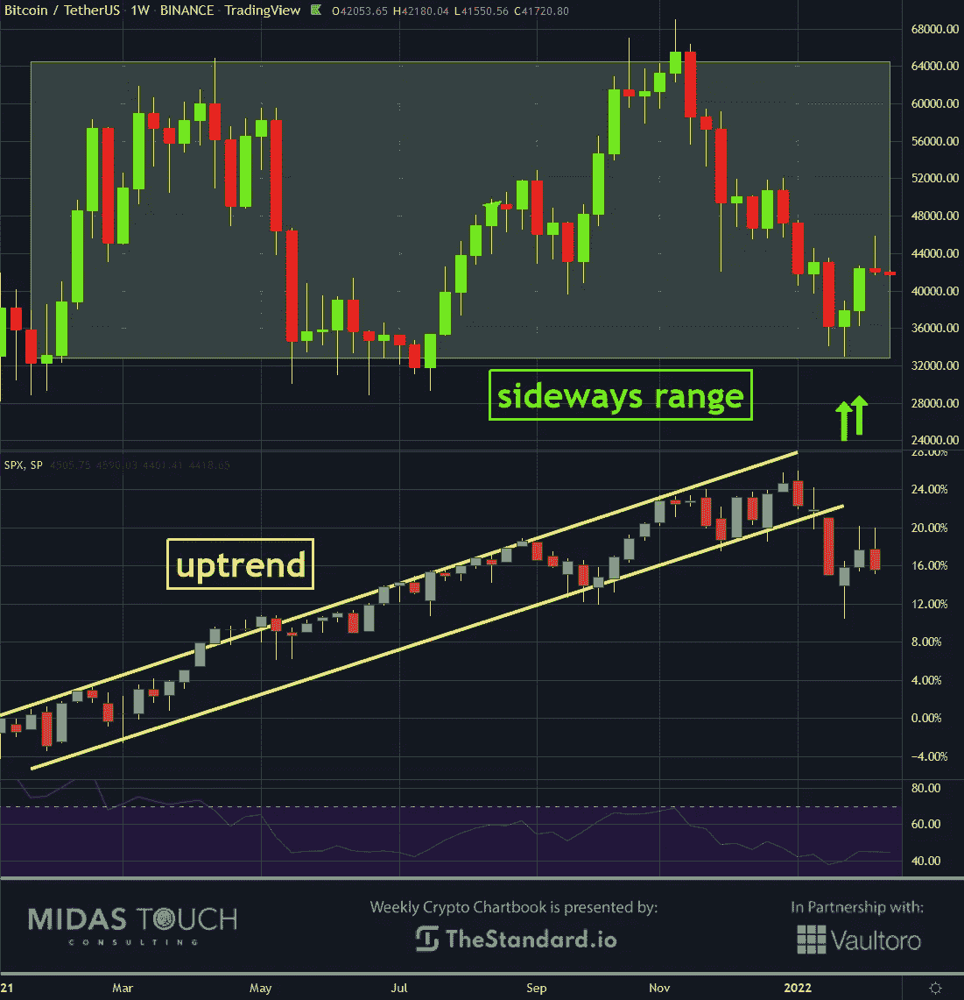
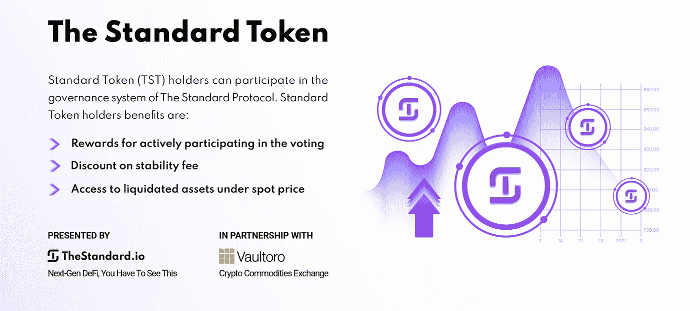
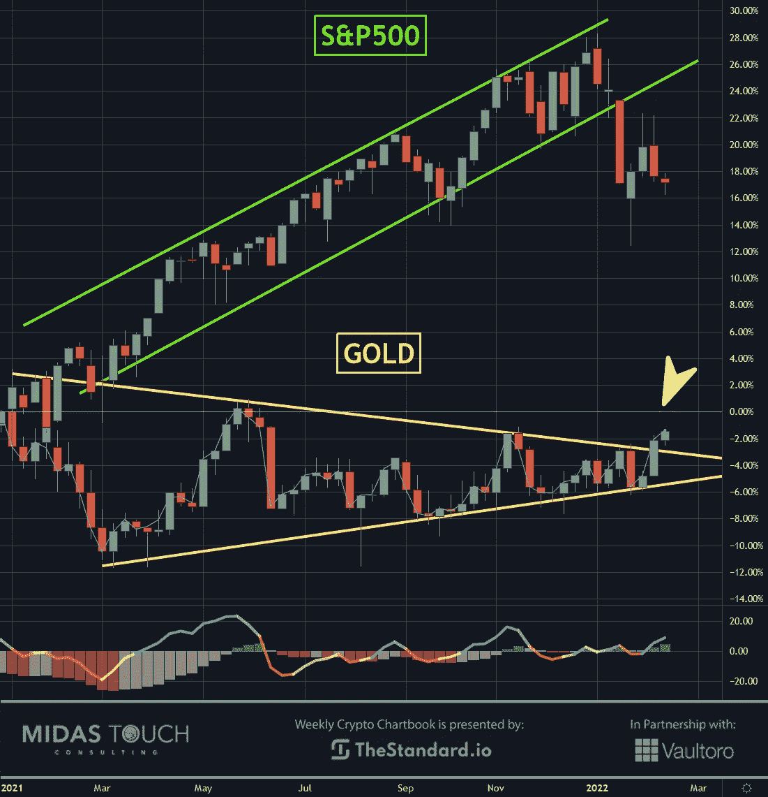
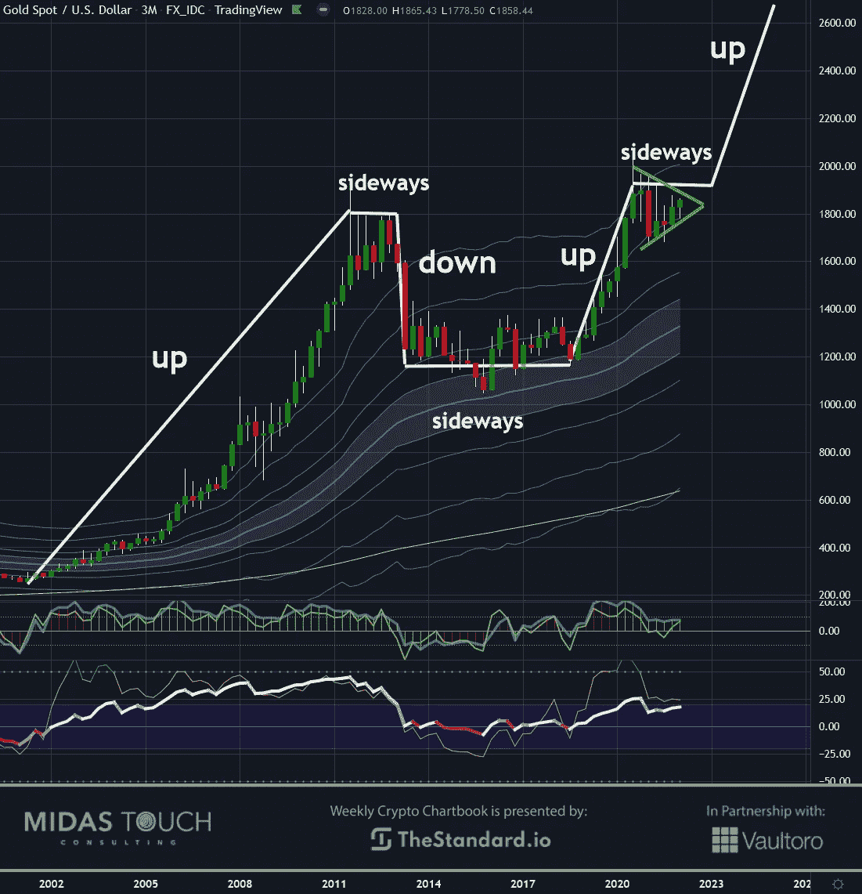
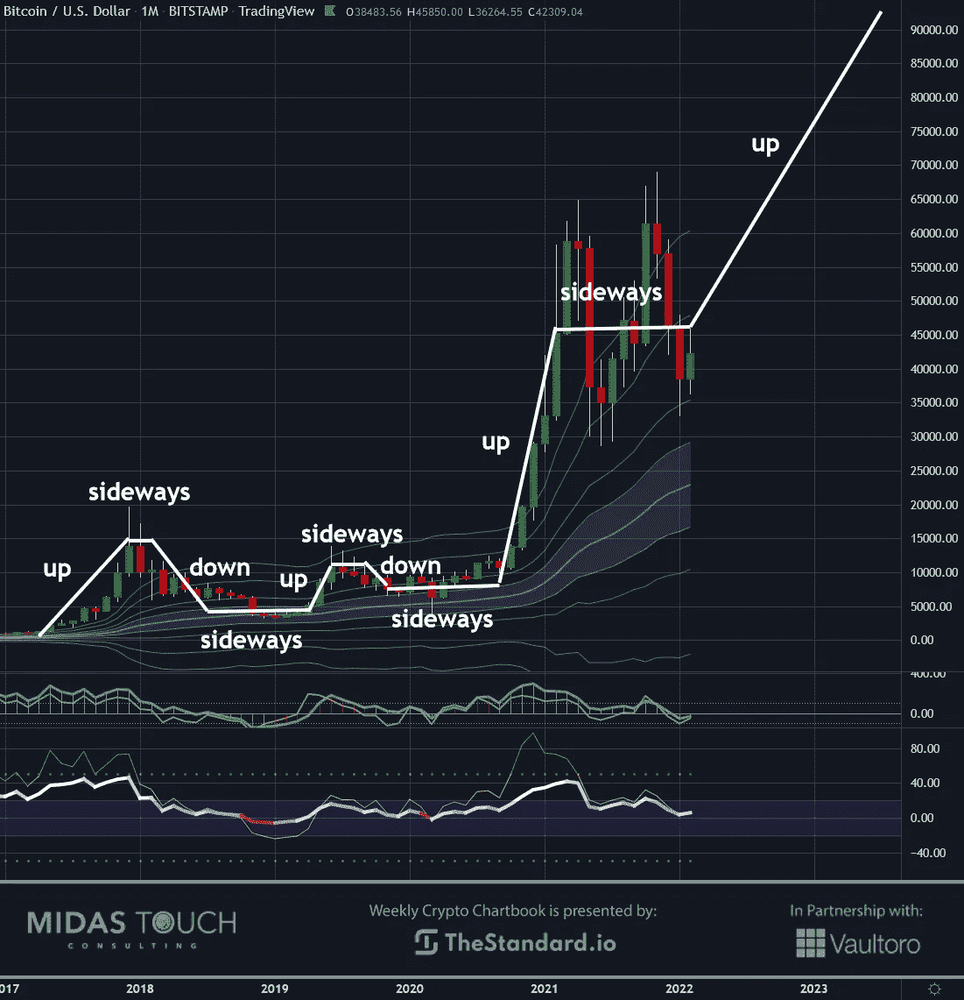

# 2022 年 2 月 15 日，加密图表——比特币从横盘到上涨

> 原文：<https://medium.com/coinmonks/february-15th-2022-crypto-chartbook-bitcoin-from-sideways-to-up-d190c0277b6f?source=collection_archive---------29----------------------->

市场价格通常以从上涨到横盘到下跌再到横盘到上涨的方式交易。随着股票经历了异常多年的上涨趋势，美联储发现自己处于困境，在大幅加息的同时没有陷入债务水平过高的困境，我们预计 2022 年将是股票波动的一年。黄金和其他财富保值股票通常会在这种不确定时期繁荣发展，并经常启动新的上涨趋势。因此，我们看到**比特币的方向从横盘变为上涨**。

非专业人士往往会问:“市场是涨还是跌？”事实上，市场大部分时间都处于横盘区间。在这些范围内进行低风险的进场交易很棘手，但对抵御波动很重要。我们的[上一本书](https://www.midastouch-consulting.com/crypto-chartbook-08022022-stacking-bitcoins-winning-edges)描述了在 2022 年新年早期进行这种定位的方法。目标是利用流动性可能开始从股票市场流向比特币和其他财富保值投资工具的统计可能性。

## 比特币对 S&P500，周线图，市场间关系:

*Bitcoin versus S&P500, weekly chart as of February 14th, 2022.*

仔细观察上面的周线图可以发现，S&P500 指数在过去的一年中有一个陡峭的上升趋势，而比特币则在横向波动。

在过去的六周里，股票市场显著打破了这一趋势，这是我们积极购买比特币的第一个信号。它在区间的低端交易，这里的风险(止损)最低。

如果我们的理论成功，我们将发现比特币从这里开始新的趋势，价格上涨，而股票将发现自己处于不确定性的一年，并因此出现波动。我们认为这是从你的股权中拿出部分利润的时候了，而不是进一步的重新分配。

## S&P500 对黄金，周线图，黄金提示:

*S & P500 对黄金，截至 2022 年 2 月 15 日的周线图。*

一旦一个重要的路线图出现在一个人最有可能的未来市场结果的堆积赔率中，技术细节就可能是进一步堆积一个人的概率的提示。

每周比较 S&P500 和黄金市场，我们可以看到，黄金一直在三角形内盘整，而股票市场则强劲看涨。

上周是第一次(现在黄金价格已经接近三角形的顶点)价格试图突破该三角形的上方阻力线。因此，我们交易的一个可能的确认信号正在形成。

支持时机和相关性的另一个因素是，黄金支持的代币市场在过去 12 个月里增长了 360%。

## 以美元计价的黄金，季度图表，趋势延续:

*Gold in US-Dollar, quarterly chart as of February 15th, 2022.*

关于比特币和黄金的争论很多。我们发现这是错误的方法，将这两种财富保值者视为对立面。我们认为，它们是相辅相成的。一方面，黄金提供了前所未有的历史稳定性，实物所有权保证了匿名性。与此同时，新出现的比特币在速度和远程交易中发挥了重要作用，并且可以很容易地分割成小得多的单位。

上面的季度黄金图表显示了它在过去 20 年的强势，价格上涨了近 10 倍。图表显示上涨-横盘-下跌-横盘-上涨的模式持续存在，与时间框架无关。目前，我们发现带有牛市标志的图表形态吸引了一个可能的长期延续形态。

## BTC 以美元计价，月线图，表现优于所有市场:

*Bitcoin in US-Dollar, monthly chart as of February 15th, 2022.*

令人振奋的是，在过去五年中，比特币以惊人的 50 倍超越了所有市场。无论是从根本上还是从技术上，都没有迹象表明这种优势应该停止。恰恰相反，我们看到大规模采用的最后一步正在进行中，这将使供需失衡更加有利于比特币价格的上涨。

比特币的月度图表显示，随着时间的推移，黄金核心的力量类似，价格波动加剧，这在高流动性交易对象中很少见。

## 比特币从横盘到上涨:

最重要的是，需要从时机的角度考虑横向波动。交易者经常假设价格从上往下变化，从下往上变化。这些价格变动相对罕见。如果不考虑市场在不确定性与贪婪和恐惧之间徘徊的较长时期，时间相关性误差是很常见的。

**此外，应该注意的是，在较长趋势结束的较大时间框架内，第一个横盘年可能会波动，人们应该相信“一切皆有可能”如果美联储继续大量印刷美元，股价可能会再次上涨。如果他们退出得太快，已经破碎的市场可能会看到价格运动的快速下降，黑天鹅已经在各个角落隐约出现。**

**尽管如此，现在是在比特币市场早期建立长期财富保值对冲的绝佳时机。**

*随时加入我们的* [*我们的免费电报频道*](https://www.midastouch-consulting.com/services/newsletter-telegram) *获取每日实时数据和一个伟大的社区。如果你喜欢获得贵金属和加密货币的定期更新，你也可以订阅我们的* [*免费简讯*](http://bit.ly/1EUdt2K) *。*

*声明:本文及其内容仅供参考，不包含投资建议或推荐。每一次投资和交易都有风险，读者在做决定时应该进行自己的研究。此处表达的观点、想法、看法，均为作者个人观点。它们不一定反映或代表 Midas Touch Consulting 的观点和意见。*

> 加入 Coinmonks [电报频道](https://t.me/coincodecap)和 [Youtube 频道](https://www.youtube.com/c/coinmonks/videos)了解加密交易和投资

## 另外，阅读

*   [Bookmap 评论](https://coincodecap.com/bookmap-review-2021-best-trading-software) | [美国 5 大最佳加密交易所](https://coincodecap.com/crypto-exchange-usa)
*   最佳加密[硬件钱包](/coinmonks/hardware-wallets-dfa1211730c6) | [Bitbns 评论](/coinmonks/bitbns-review-38256a07e161)
*   [新加坡十大最佳加密交易所](https://coincodecap.com/crypto-exchange-in-singapore) | [购买 AXS](https://coincodecap.com/buy-axs-token)
*   [Botsfolio vs nap bots vs Mudrex](/coinmonks/botsfolio-vs-napbots-vs-mudrex-c81344970c02)|[gate . io 交流回顾](/coinmonks/gate-io-exchange-review-61bf87b7078f)
*   [CoinFLEX 评论](https://coincodecap.com/coinflex-review) | [AEX 交易所评论](https://coincodecap.com/aex-exchange-review) | [UPbit 评论](https://coincodecap.com/upbit-review)
*   [AscendEx 保证金交易](https://coincodecap.com/ascendex-margin-trading) | [Bitfinex 赌注](https://coincodecap.com/bitfinex-staking) | [bitFlyer 审核](https://coincodecap.com/bitflyer-review)
*   [在美国如何使用 BitMEX？](https://coincodecap.com/use-bitmex-in-usa) | [BitMEX 评论](https://coincodecap.com/bitmex-review) | [买入索拉纳](https://coincodecap.com/buy-solana)
*   [德国最佳加密交易所](https://coincodecap.com/crypto-exchanges-in-germany) | [Arbitrum:第二层解决方案](https://coincodecap.com/arbitrum)
*   [比诺莫评论](https://coincodecap.com/binomo-review) | [斯多葛派 vs 3Commas vs TradeSanta](https://coincodecap.com/stoic-vs-3commas-vs-tradesanta)
*   [Capital.com 评论](https://coincodecap.com/capital-com-review) | [香港的加密借贷平台](https://coincodecap.com/crypto-lending-hong-kong)
*   [支持卡审核](https://coincodecap.com/uphold-card-review) | [信任钱包 vs 元掩码](https://coincodecap.com/trust-wallet-vs-metamask)
*   [赢取注册奖金——10 大最佳加密平台](https://coincodecap.com/earn-sign-up-bonus)