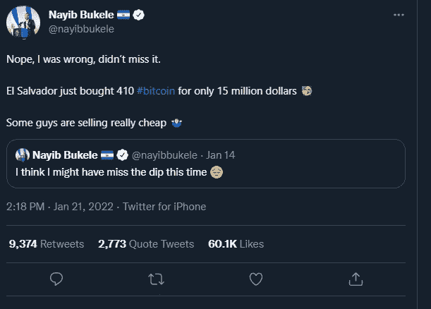

# 2022 年 2 月更新—德根加密之旅

> 原文：<https://medium.com/coinmonks/february-2022-update-degen-crypto-journey-c40dc533f735?source=collection_archive---------38----------------------->

好吧博伊斯。我想在这里快速更新一下，并讨论一些市场前景。是的，我没有死或什么的。我在圣诞节和新年的时候休息了一段时间，做了一些其他的事情。当我现在写这篇文章的时候，BTC 的美元已经回落到 42k 的水平……这似乎是一个把谨慎抛到九霄云外，讨论我对 crypto is 的计划的好时机。所以，我在放一些动漫 lofi 音乐，我在爆这个博客。让我们开始吧。

此外，我不是财务顾问，我只是一个过去一年运气好或不好的讨厌鬼。glhf！

**展望**

我最后一次发表博客是在 2021 年 11 月 16 日，当时我广泛地谈论了 Apefest。一切看起来都很乐观，看起来我们准备好再次挑战 ATH 了。众所周知，密码市场的变化比迈克尔·斯科特承诺做输精管切除术还要快。

发生了什么事？愚蠢的通货膨胀者。看，美国市场对全世界有巨大的吸引力。现实/清醒的观点是，如果美国市场经历两位数的通胀，那可能会给世界经济带来麻烦。我猜更重要的部分是它将如何影响高风险、高收益的资产，如加密市场。然而这很棘手，因为 2022 年是星条旗的选举年。我敢肯定，当共和党人经历了 4 年的牛市时，民主党人不想缩减资产价格的升值。就是一副不好看的样子。所以…虽然美联储可能会说他们可能会或可能不会加息，但这可能是两党之间的一场旷日持久的战争，更重要的是市场多头和空头之间的一场旷日持久的战争。最终，通胀问题将需要得到解决。我们不可能在牛市中持续 10 年以上而没有任何影响。

那么，这里的前景如何？嗯…在短期内，我会说，如果我们低于 39k，我们可能会陷入困境，并经历一些自由落体，这可以给投资者一个方法来重新积累更多的加密资产。如果不是，我们应该横向交易一段时间，看看 3 月会发生什么。从长期来看，我相信延长周期理论，即加密资产将慢慢升值、增长，并反击熊市。最终，公牛队总是会赢。$BTC 正在被国家、机构和像这家伙一样的终极混蛋收养、捡起、积累。off 笑翻了

我是认真的，这家伙在和他国家的财政部交易，就像推特上的我们一样。我们生活在一个什么样的世界里？太搞笑了。

**行动**

说了这么多，作为投资者/交易者/霍德尔，我们该怎么做？我的真实想法是稍微放松一下，巩固你的投资组合，保持轻松。我的意思是我拥有超过 30 枚硬币和太多的图片。虽然我的投资组合经受住了时间的考验(过去 3 个月 lmao)，但我会巩固它们。我的意思是我已经开始减少一些 alt。我们可能不得不放弃一些我们非常喜欢的另类戏剧。让我们重新组合，并采取一些损失，并将其规模回到安全的发挥，如$BTC，$瑞士法郎。我认为这种做法是将你的投资组合重新定位到你真正相信的 5-10 个品种，因为其中一些低价位可能在过去一两年里表现很好，如果我们在市场中经历一些主要的下跌趋势，大多数低价位将会流失。而且，当市场反弹时，那就是你重新进入并从$BTC 撤出资金的时候，并把它们重新分配给你最喜欢的 alt。

此外，我想谈谈 JPEGs。它们是很好的市场对冲工具……如果你选对了的话。我想这就是他们的故事。如果你有一些资本，你可以决定押注像 BAYC 这样的蓝筹股，他们在过去一个月左右的时间里表现非常好。关键是蓝筹股。很难识别和铸造像小樽这样的收藏品。所以不管你有多少资本？JPEG 铸造市场应该只为额外的可支配收入。但是，如果你有充足的资本，有很多价值游戏、长期游戏、蓝筹股游戏，你可以把钱投进去……坐下来看。

**结论**

总之，以后走路要轻快。看看你的投资组合，重新审视你是否真的想长期持有某些另类硬币和 jpegs 可能会对你有好处。

GLHF 你们好。我回来就回来。

> 加入 Coinmonks [电报频道](https://t.me/coincodecap)和 [Youtube 频道](https://www.youtube.com/c/coinmonks/videos)了解加密交易和投资

# 另外，阅读

*   [BlockFi vs Celsius](/coinmonks/blockfi-vs-celsius-vs-hodlnaut-8a1cc8c26630)|[Hodlnaut 回顾](/coinmonks/hodlnaut-review-best-way-to-hodl-is-to-earn-interest-on-your-bitcoin-6658a8c19edf) | [KuCoin 回顾](https://coincodecap.com/kucoin-review)
*   [Bitsgap 审查](/coinmonks/bitsgap-review-a-crypto-trading-bot-that-makes-easy-money-a5d88a336df2) | [Quadency 审查](/coinmonks/quadency-review-a-crypto-trading-automation-platform-3068eaa374e1) | [Bitbns 审查](/coinmonks/bitbns-review-38256a07e161)
*   [密码本交易平台](/coinmonks/top-10-crypto-copy-trading-platforms-for-beginners-d0c37c7d698c) | [Coinmama 审核](/coinmonks/coinmama-review-ace5641bde6e)
*   [印度加密交易所](/coinmonks/bitcoin-exchange-in-india-7f1fe79715c9) | [比特币储蓄账户](/coinmonks/bitcoin-savings-account-e65b13f92451)
*   [OKEx vs KuCoin](https://coincodecap.com/okex-kucoin) | [摄氏替代品](https://coincodecap.com/celsius-alternatives) | [如何购买 VeChain](https://coincodecap.com/buy-vechain)
*   [币安期货交易](https://coincodecap.com/binance-futures-trading)|[3 comas vs Mudrex vs eToro](https://coincodecap.com/mudrex-3commas-etoro)