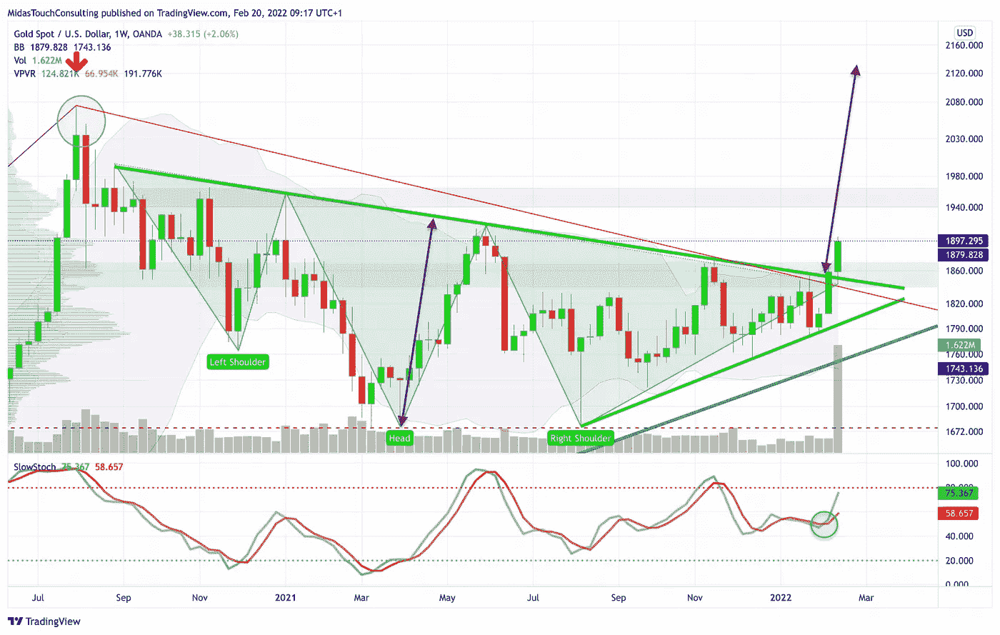
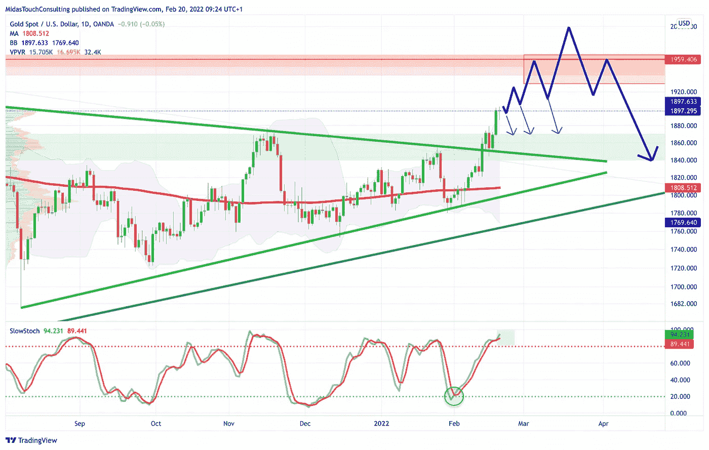
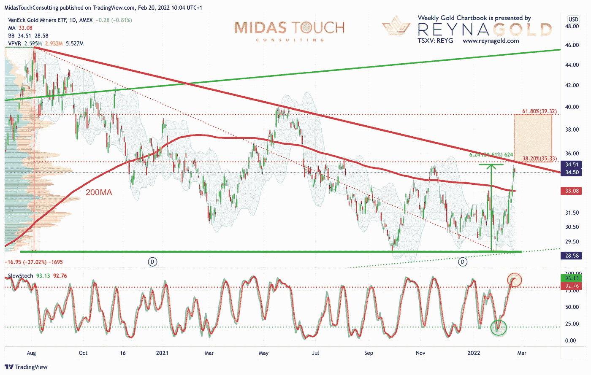

# 2022 年 2 月 20 日，黄金图表——看涨势头依然强劲

> 原文：<https://medium.com/coinmonks/february-20th-2022-gold-chartbook-bullish-momentum-remains-strong-45fa63dcf0a9?source=collection_archive---------31----------------------->

在过去的七个月里，黄金再次竭尽全力掩盖其真实意图。事后看来，8 月份 1，678 美元的闪电暴跌实际上标志着一个持续数月的上涨趋势的开始。随着周五收盘价达到 1，898 美元，黄金现在的交易价格比 1，680 美元的水平高出 220 美元，这一水平在 2021 年期间曾三次保持。一系列更高的低点，现在终于也建立了更高的高点！**看涨势头依然强劲。**

即使在 2021 年 12 月 15 日的最后一个重要低点(1，750 美元)，市场情绪仍很糟糕，因为该行业已成为最令人厌恶的资产类别。现在快进，黄金已经成功突破其多月三角，并保持冲刺更高。多头目前正在将日线和周线的布林线向上弯曲，季节性仍然非常有利。

## 美元黄金，截至 2022 年 2 月 20 日周线图。

*Gold in US-Dollar, weekly chart as of February 20th, 2022.*

看周线图，似乎黄金不仅走出了一个三角形盘整形态，还走出了一个大逆头肩底形态。这不是一本教科书的头肩，但值得注意。一个精确的移动预测理论上可以把黄金带到 2125 美元！然而，月布林线位于 1975 美元附近，可能是当前走势更现实的目标。你可能记得，1，950 美元到 1，975 美元之间的区域是非常强的阻力。不过，我们不排除短期内升至 2000 美元的可能性。

**总体而言，周线图尚未超买，看起来看涨。因此，这波涨势很有可能再持续几周。**

## 美元计价的黄金，截至 2022 年 2 月 20 日的日线图。

*Gold in US-Dollar, daily chart as of February 20th, 2022.*

正如预期的那样，突破 1，840 美元至 1，850 美元释放了足够的能量，迅速将金价推向 1，900 美元的心理数字。幸运的是，日线随机指标已经将其超买转化为罕见的“嵌入状态”，两条信号线连续三天位于 80 以上。因此，上涨趋势是锁定的，做空这个市场就是在对抗上涨趋势。

当然，鉴于地缘政治局势的不确定性和复杂性，未来几天和几周的事件可能会对黄金产生重大影响。从你的技术角度来说，任何向突破区 1，845 美元附近的回调都是买入机会。然而，低于 1875 美元的价格在短期内已经是一个惊喜。相反，未来几天，金价更有可能继续运行至至少 1，930 美元。

**综上，日图看涨。特别是看涨的嵌入式随机振荡指标可能不会出现更大的回调，而是在 1900 美元附近盘整。注意那两条信号线。只有当其中一个在每日收盘时跌破 80，牛市才可能结束！**

## 美元 GDX (VanEck 黄金矿工 ETF)，截至 2022 年 2 月 20 日的日线图。

*GDX, daily chart as of February 20th, 2022.*

黄金和黄金相关的矿业股票通常会在不确定时期稳定你的投资组合，并起到对冲的作用。虽然由于乌克兰危机和美国潜在的利率转向，股市继续跳水，但 GDX·瓦内克黄金矿工 ETF 自 12 月中旬的低点以来上涨了 21.5%以上。过去两周，黄金矿业类股创下了过去 12 个月来的最佳表现。上周，由于良好的收益、股息增加和新的股票回购计划，巴里克黄金(黄金)上涨了 7%以上。一些较小的黄金股票，如 Sabina Gold & Silver(SGSVF)的涨幅甚至更大(11 日周五上涨了 15%)。

现在黄金正在上涨，是时候让被打压和低估的矿业股迎头赶上了。通常，它从大型高级生产商开始，如巴里克黄金公司、阿格尼科鹰矿业公司(AEM)和纽蒙特公司(NEM)，然后是低级生产商，如维多利亚黄金公司(VITFF)，最后是勘探商和开发商。

**然而，GDX 已经接近其下降趋势线，以及自 2020 年 8 月以来整个修正波的 38.2%回撤。因此，大型矿商正遭遇阻力，可能需要尽快整合。**

同时，请注意，白银价格一直在下跌。白银在大多数时候总是落后，但在整个行业反弹的最后阶段，它突然超过所有其他金属，几乎垂直上涨。这通常也是该行业涨势即将结束的迹象。显然，我们还没有看到任何强劲的白银日。所以白银实际上确认了板块有更大的空间和时间去跑高！

## 结论:看涨势头依然强劲

**总体而言，由于看涨势头仍然强劲，黄金在这里继续看好。因此，黄金可能会接近 1，950 美元和 1，975 美元，有轻微机会超过 2，000 美元。但是当然，考虑到日线图的超买，风险/回报不再那么好了。然而，白银和许多较小的矿业股票仍有机会参与未来几周的持续上涨。**

一旦黄金价格在春季见顶，就会出现大幅回调。甚至可能在仲夏的某个时候回到更高的趋势 200 天移动平均线(目前为 1808 美元)。但那都是未来的事了。目前，看涨势头依然强劲。

*随时加入我们的* [*我们的免费电报频道*](https://www.midastouch-consulting.com/services/newsletter-telegram) *获取每日实时数据和一个伟大的社区。如果您喜欢定期了解我们的黄金模型、贵金属和加密货币，您还可以订阅我们的* [*免费简讯*](http://bit.ly/1EUdt2K) *。*

*披露:Midas Touch Consulting 和我们团队的成员都投资于 Reyna Gold Corp .这些声明旨在披露任何利益冲突。它们不应被误解为购买任何股票的建议。本文及其内容仅供参考，不包含投资建议或推荐。每一次投资和交易都有风险，读者在做决定时应该进行自己的研究。此处表达的观点、想法、看法，均为作者个人观点。它们不一定反映或代表 Midas Touch Consulting 的观点和意见。*

> *加入 Coinmonks* [*电报频道*](https://t.me/coincodecap) *和* [*Youtube 频道*](https://www.youtube.com/c/coinmonks/videos) *了解加密交易和投资*

# 另外，阅读

*   [3 商业评论](/coinmonks/3commas-review-an-excellent-crypto-trading-bot-2020-1313a58bec92) | [Pionex 评论](https://coincodecap.com/pionex-review-exchange-with-crypto-trading-bot) | [Coinrule 评论](/coinmonks/coinrule-review-2021-a-beginner-friendly-crypto-trading-bot-daf0504848ba)
*   [莱杰 vs n rave](/coinmonks/ledger-vs-ngrave-zero-7e40f0c1d694)|[莱杰 nano s vs x](/coinmonks/ledger-nano-s-vs-x-battery-hardware-price-storage-59a6663fe3b0) | [币安评论](/coinmonks/binance-review-ee10d3bf3b6e)
*   [Bybit Exchange 评论](/coinmonks/bybit-exchange-review-dbd570019b71) | [Bityard 评论](https://coincodecap.com/bityard-reivew) | [Jet-Bot 评论](https://coincodecap.com/jet-bot-review)
*   [3 commas vs Cryptohopper](/coinmonks/3commas-vs-pionex-vs-cryptohopper-best-crypto-bot-6a98d2baa203)|[赚取加密利息](/coinmonks/earn-crypto-interest-b10b810fdda3)
*   最好的比特币[硬件钱包](/coinmonks/hardware-wallets-dfa1211730c6) | [BitBox02 回顾](/coinmonks/bitbox02-review-your-swiss-bitcoin-hardware-wallet-c36c88fff29)
*   [block fi vs Celsius](/coinmonks/blockfi-vs-celsius-vs-hodlnaut-8a1cc8c26630)|[Hodlnaut 审核](/coinmonks/hodlnaut-review-best-way-to-hodl-is-to-earn-interest-on-your-bitcoin-6658a8c19edf) | [KuCoin 审核](https://coincodecap.com/kucoin-review)
*   [Bitsgap 审查](/coinmonks/bitsgap-review-a-crypto-trading-bot-that-makes-easy-money-a5d88a336df2) | [Quadency 审查](/coinmonks/quadency-review-a-crypto-trading-automation-platform-3068eaa374e1) | [Bitbns 审查](/coinmonks/bitbns-review-38256a07e161)
*   [加密复制交易平台](/coinmonks/top-10-crypto-copy-trading-platforms-for-beginners-d0c37c7d698c) | [Coinmama 评论](/coinmonks/coinmama-review-ace5641bde6e)