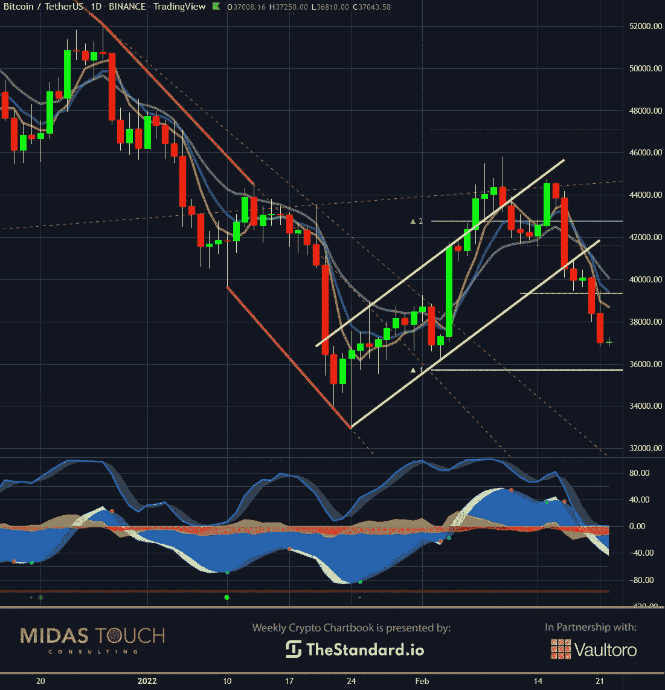
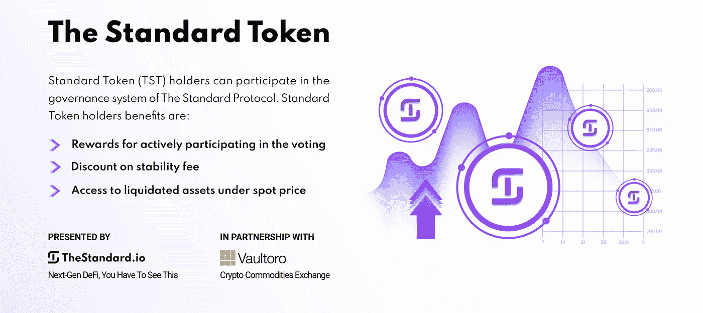
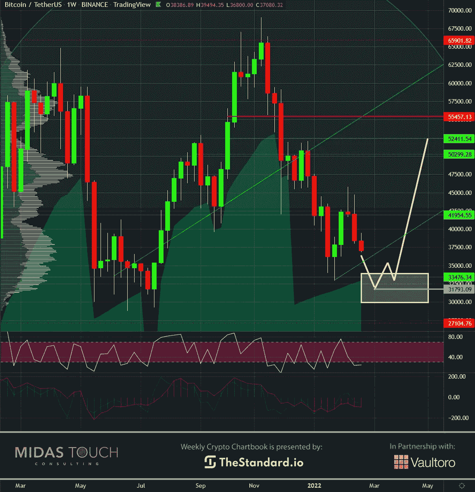
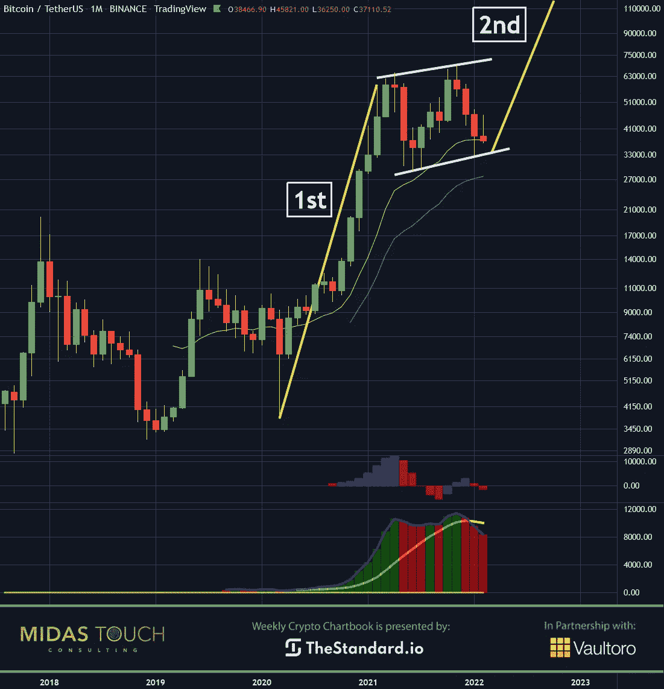

# 2022 年 2 月 22 日，密码本——比特币，最好的玩法

> 原文：<https://medium.com/coinmonks/february-22nd-2022-crypto-chartbook-bitcoin-best-in-play-6eb7f544e0e4?source=collection_archive---------34----------------------->

“有风险”的市场情绪通常对比特币投资有利。比特币最显著的价格上涨发生在 2011 年、2013 年、2017 年和 2020 年，表现在经济加速时期。当股票抛售时，黄金通常表现很好，投资者在“规避风险”的环境中寻求债券的庇护。这一次我们发现不同的是，我们看到了如此多可能的六西格玛事件情景，以至于保证金通知将很快吸收债券和黄金持有量。虽然这对比特币也是一种威胁，但有充分的理由说明比特币可能是第一个从这种黑天鹅事件中反弹的。我们发现最大的风险是，一系列事件可能会显著降低对领导层和金融体系的信任。此时，人们可能最愿意接受相对较新的比特币，远离传统银行业，特别是如果购买实物黄金是因为监管或不可能获得。**比特币，最好玩。**

Covid 环境带来了一个额外的可变风险因素，尤其是在投资者心理方面。

我们的[上周图表书](https://www.midastouch-consulting.com/crypto-chartbook-15022022-bitcoin-from-sideways-to-up)出版物为今年的风险对冲交易提供了一个案例，当时股市很可能在一个波动的横盘区间内交易。我们还谈到了适当的财富保值策略，在对冲风险降低方法中同时持有比特币和黄金。随着我们对风险的主要关注，下一个问题是比特币和黄金之间的配置规模。正如在介绍中提到的，从周期历史来看，对黄金方面有显著的暴露是很自然的。然而，保险在这个时候似乎是必不可少的，因此，我们倾向于更积极地配置比特币。

## 比特币，日线图，还没:

*Bitcoin, daily chart as of February 22nd, 2022.*

日线图反映了比特币交易以及 PMI 数据和整个市场的普遍概念。随着最近从 33，500 美元水平上升段(黄色上升通道)的适度反弹的打破，似乎没有长期风险敞口的即时低风险进场。

## 比特币，周线图，伟大的设置，比特币，最好的玩法:

*Bitcoin, weekly chart as of February 22nd, 2022.*

然而，我们发现现在缩小到每周时间框架，在 30，000 美元到 34，000 美元之间的水平是一个非常有趣的入口区域(白盒)。我们通过叠加多个边缘确定，接近 31，800 美元的进入将提供最低风险的进入配置文件。然而，这将取决于价格如何到达这些水平。因此，我们鼓励您查看我们的免费电报频道 [*。*](https://www.midastouch-consulting.com/services/newsletter-telegram) 在那里我们为了教育目的实时张贴参赛和退场。

## 比特币，月图，潜力惊人:

*Bitcoin, monthly chart as of February 22nd, 2022.*

事情变得越来越透明，我们的头条新闻是在每月图表的看法。第一次上涨不亚于 1600%的涨幅。现在我们已经在一个看涨向上倾斜的横盘通道中交易了一年。有可能在这个通道的低点进入，长期投资提供了一个稳定的风险/回报比。第二条腿通常比第一条腿长！但这还不是全部；比特币相对于三条腿移动，四条腿移动的概率更高。因此，一段时间后，这种交易可能会变得非常有利可图。

风险的一个方面是价格潜在下行幅度和可能上行幅度之间的关系。我们发现比特币的上涨潜力比黄金更重要，因为它的基本特征和百分比方面的出色表现。

# 比特币，最好的玩法:

**综上所述，比特币可能尚未处于最低回撤水平。尽管如此，它在风险/回报比方面的强大潜力，以及作为一种整体风险对冲手段，使它最有价值。我们在** [**我们的免费电报频道**](https://www.midastouch-consulting.com/services/newsletter-telegram) **分享一个低风险成本平均化的策略。我们发现，资金配置应该更倾向于比特币。此外，在货币贬值的同时持有一些现金仍然是一个不错的策略。现金是购买想要的商品和车辆的王道，尤其是在那些更加萧条的时候。**

*随时加入我们的* [*我们的免费电报频道*](https://www.midastouch-consulting.com/services/newsletter-telegram) *获取每日实时数据和一个伟大的社区。如果你喜欢获得贵金属和加密货币的定期更新，你也可以订阅我们的* [*免费简讯*](http://bit.ly/1EUdt2K) *。*

*声明:本文及其内容仅供参考，不包含投资建议或推荐。每一次投资和交易都有风险，读者在做决定时应该进行自己的研究。此处表达的观点、想法、看法，均为作者个人观点。它们不一定反映或代表 Midas Touch Consulting 的观点和意见。*

> 加入 Coinmonks [电报频道](https://t.me/coincodecap)和 [Youtube 频道](https://www.youtube.com/c/coinmonks/videos)了解加密交易和投资

## 另外，阅读

*   [3 商业评论](/coinmonks/3commas-review-an-excellent-crypto-trading-bot-2020-1313a58bec92) | [Pionex 评论](https://coincodecap.com/pionex-review-exchange-with-crypto-trading-bot) | [Coinrule 评论](/coinmonks/coinrule-review-2021-a-beginner-friendly-crypto-trading-bot-daf0504848ba)
*   [莱杰 vs n rave](/coinmonks/ledger-vs-ngrave-zero-7e40f0c1d694)|[莱杰 nano s vs x](/coinmonks/ledger-nano-s-vs-x-battery-hardware-price-storage-59a6663fe3b0) | [币安评论](/coinmonks/binance-review-ee10d3bf3b6e)
*   [Bybit Exchange 审查](/coinmonks/bybit-exchange-review-dbd570019b71) | [Bityard 审查](https://coincodecap.com/bityard-reivew) | [Jet-Bot 审查](https://coincodecap.com/jet-bot-review)
*   [3 commas vs crypto hopper](/coinmonks/3commas-vs-pionex-vs-cryptohopper-best-crypto-bot-6a98d2baa203)|[赚取秘密利息](/coinmonks/earn-crypto-interest-b10b810fdda3)
*   最好的比特币[硬件钱包](/coinmonks/hardware-wallets-dfa1211730c6) | [BitBox02 回顾](/coinmonks/bitbox02-review-your-swiss-bitcoin-hardware-wallet-c36c88fff29)
*   [block fi vs Celsius](/coinmonks/blockfi-vs-celsius-vs-hodlnaut-8a1cc8c26630)|[Hodlnaut 审核](/coinmonks/hodlnaut-review-best-way-to-hodl-is-to-earn-interest-on-your-bitcoin-6658a8c19edf) | [KuCoin 审核](https://coincodecap.com/kucoin-review)
*   [Bitsgap 评审](/coinmonks/bitsgap-review-a-crypto-trading-bot-that-makes-easy-money-a5d88a336df2) | [Quadency 评审](/coinmonks/quadency-review-a-crypto-trading-automation-platform-3068eaa374e1) | [Bitbns 评审](/coinmonks/bitbns-review-38256a07e161)
*   [加密复制交易平台](/coinmonks/top-10-crypto-copy-trading-platforms-for-beginners-d0c37c7d698c) | [Coinmama 审核](/coinmonks/coinmama-review-ace5641bde6e)
*   [印度的加密交易所](/coinmonks/bitcoin-exchange-in-india-7f1fe79715c9) | [比特币储蓄账户](/coinmonks/bitcoin-savings-account-e65b13f92451)
*   [OKEx vs KuCoin](https://coincodecap.com/okex-kucoin) | [摄氏替代品](https://coincodecap.com/celsius-alternatives) | [如何购买 VeChain](https://coincodecap.com/buy-vechain)
*   [币安期货交易](https://coincodecap.com/binance-futures-trading)|[3 comas vs Mudrex vs eToro](https://coincodecap.com/mudrex-3commas-etoro)
*   [如何购买 Monero](https://coincodecap.com/buy-monero) | [IDEX 评论](https://coincodecap.com/idex-review) | [BitKan 交易机器人](https://coincodecap.com/bitkan-trading-bot)
*   [CoinDCX 评论](/coinmonks/coindcx-review-8444db3621a2) | [加密保证金交易交易所](https://coincodecap.com/crypto-margin-trading-exchanges)