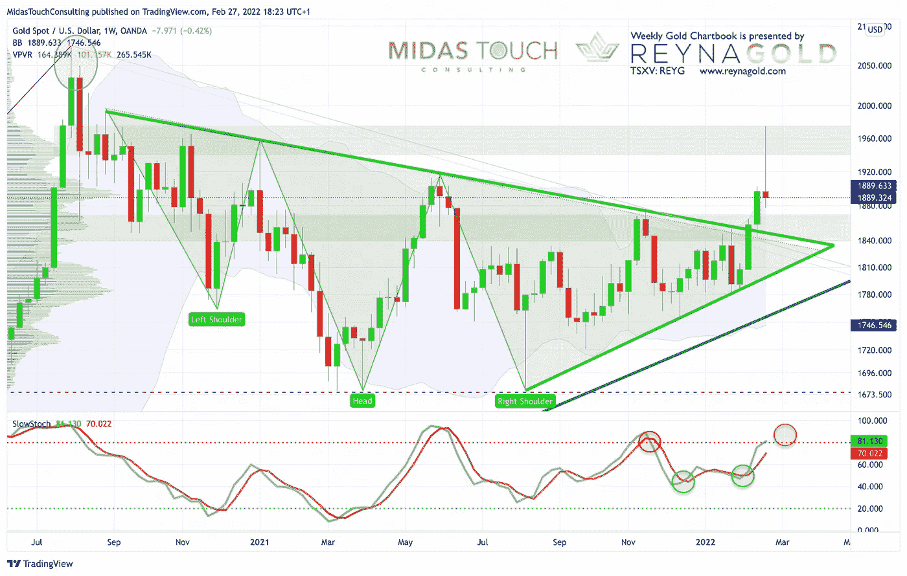
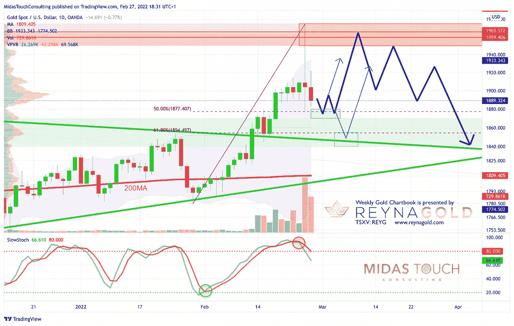

# 2022 年 2 月 27 日，黄金图表——强劲的反转应该会导致另一轮上涨

> 原文：<https://medium.com/coinmonks/february-27th-2022-gold-chartbook-strong-reversal-should-lead-to-another-leg-up-996cd3dbbc09?source=collection_archive---------37----------------------->

自 12 月中旬以来，我们一直看好黄金。当时主要是超卖格局，加上低迷的人气和积极的季节性模式，这让我们预计未来两个月将出现复苏。然而，与此同时，许多不同方面的事情都到了紧要关头。在哈萨克斯坦的动荡、通胀数字飙升至 40 年高点、美联储越来越鹰派以及加拿大在没有法院命令的情况下没收资产之后，过去几天的主要话题是俄罗斯入侵乌克兰。袭击当天，黄金价格大幅上涨，但最终下跌。周五金价进一步下跌。**黄金——强劲的反转应该会导致另一轮上涨。**

回顾过去，黄金自 2021 年 12 月 15 日以来上涨了近 225 美元，自 2022 年 1 月 28 日以来上涨了 195 美元。尤其是过去四周的强劲反弹出乎许多人的意料。但我们的目标价 1975 美元正好在上周四达到，当时所有其他市场都因预期对俄罗斯的严厉制裁而暴跌。随后，市场在周五强劲反弹，原因是对制裁力度较弱以及美联储可能推迟加息的预期。然而，上周末，北约及其合作伙伴宣布迅速对俄罗斯实施制裁。因此，周一可能会是市场又一个疯狂和动荡的一天。但“恐惧峰值”可能在上周四已经达到(至少目前如此)。

## 给和平一个机会，🕊️🇷🇺🕊️🇺🇦🕊️

从根本上说，禁止俄罗斯银行使用 SWIFT 支付将导致俄罗斯停止出售石油和天然气。俄罗斯石油产量约占全球产量的 9%,而且已经出现了能源短缺。结果将是全球性的萧条和更多的通货膨胀。这将是最好的情况，因为随着事情的发展，WWIII 不再是一个不可想象的恐怖场景。**我们只能希望尽快举行成功的和平谈判。**

在这个不确定的时期，黄金应该继续得到支撑。随着地缘政治事件的展开，再次大幅上涨总是有可能的。不太可能直接回到 2020 年 8 月开始的回调。在黄金可能回落到明显更低的水平之前，我们宁愿需要更多的时间(至少几个月)。对于 2023 年或 2024 年到期的潜在 8 年周期低点，我们的最大下行空间仍为 1625 美元。

## 美元计价黄金，截至 2022 年 2 月 27 日周线图。

*Gold in US-Dollar, weekly chart as of February 27th, 2022.*

在其周线图上，黄金继续处于上升趋势。下降趋势线上方的突破导致了过去两周的大幅上涨。随机振荡指标仍然有买入信号。随着自达到 1，975 美元以来的急剧逆转/回调，黄金本周确实收于布林带上轨(1，889 美元)。由于布林带上轨已经向上弯曲，黄金现在将有更多的空间在未来两到四周内继续上涨。

然而，随机振荡指标即将到达超买区。对比过去 16 个月的表现，我们不得不假设黄金将很难长时间停留在超买区。因此，纠正价格行为即将出现。

总的来说，周线图仍然看涨，并指向对 1，950 美元至 1，975 美元的另一次攻击。

## 美元计价的黄金，截至 2022 年 2 月 27 日的日线图。

*Gold in US-Dollar, daily chart as of February 27th, 2022.*

日线图捕捉了过去两天黄金市场的大幅反弹以及反转和大屠杀。自 1 月 28 日以来，到目前为止，黄金已经回吐了近 50%的涨幅(从 1，780 美元上涨到 1，975 美元，然后又下跌到 1，878 美元)。随机振荡器已经失去了它的地位，动量现在是熊市。

如果黄金想进一步向 61.8%的回撤位(1，854 美元)修正，它还可能测试 1，840 美元至 1，845 美元附近的前阻力和突破水平。这种对 1，840 美元至 1，855 美元的回调有一定的可能性，但也将再次提供一个非常有趣的长期进入。

由于像 1 小时和 4 小时图表这样的短期时间框架正在超卖，黄金在未来几天可能会在 1，870 美元和 1，880 美元之间找到支撑。

**总而言之，日线图目前是看跌的，需要耐心。但我认为黄金受到支撑，应该会在 1，840 美元至 1，855 美元或 1，870 美元至 1，880 美元之间找到支撑。之后，它应该会开始另一轮上涨。**

## 结论:强劲的反转应该会导致另一轮上涨

**上周的价格走势肯定不适合胆小的人。在黄金市场上，日涨幅超过 4%是极其罕见的，在 COMEX 开盘后立即被取消。大幅反转看起来不太好，但这并不意味着反弹的结束。预计会有更多的下跌，或者至少是横向盘整。通常，如此剧烈的反弹不会立即崩溃。因此，一旦多头整理好自己，我们预计价格将再次升至 1900 美元以上，最低目标价格为 1950 美元。朝 2000 美元过度仍有可能，但现在可能性有所降低。一旦下一次攻击失败，我们假设在春天的某个地方开始一波回调，这可能会持续到初夏到仲夏。**

> 加入 Coinmonks [电报频道](https://t.me/coincodecap)和 [Youtube 频道](https://www.youtube.com/c/coinmonks/videos)了解加密交易和投资

# 另外，阅读

*   [用信用卡购买密码的 10 个最佳地点](https://coincodecap.com/buy-crypto-with-credit-card)
*   [最好的卡达诺钱包](https://coincodecap.com/best-cardano-wallets) | [Bingbon 副本交易](https://coincodecap.com/bingbon-copy-trading)
*   [印度最佳 P2P 加密交易所](https://coincodecap.com/p2p-crypto-exchanges-in-india) | [柴犬钱包](https://coincodecap.com/baby-shiba-inu-wallets)
*   [8 大加密附属计划](https://coincodecap.com/crypto-affiliate-programs) | [eToro vs 比特币基地](https://coincodecap.com/etoro-vs-coinbase)
*   [最佳以太坊钱包](https://coincodecap.com/best-ethereum-wallets) | [电报上的加密货币机器人](https://coincodecap.com/telegram-crypto-bots)
*   [交易杠杆代币的最佳交易所](https://coincodecap.com/leveraged-token-exchanges) | [购买 Floki](https://coincodecap.com/buy-floki-inu-token)
*   [3Commas 对 Pionex 对 Cryptohopper](https://coincodecap.com/3commas-vs-pionex-vs-cryptohopper) | [Bingbon 评论](https://coincodecap.com/bingbon-review)