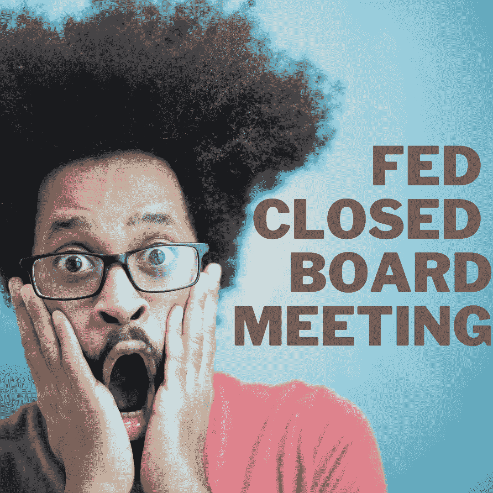

# 美联储加急会议？

> 原文：<https://medium.com/coinmonks/fed-expedited-meeting-2fa3943b85fe?source=collection_archive---------17----------------------->

密码市场会再次下跌吗？

Designed by [Author](https://www.quora.com/)

自从 COVID 席卷全球，美联储的打印机坏了，经济学家就知道通货膨胀是不可避免的。

但是加密市场上没有人能听到这些警告信号，因为他们听到的都是风笛声。

难道不是 B 计划，所有人都装扮成吹笛者，用他的“比特币兑换 10 万美元”烟斗引诱所有的加密者