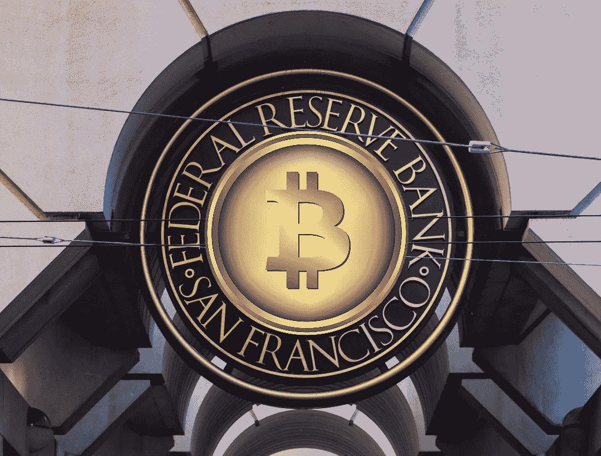
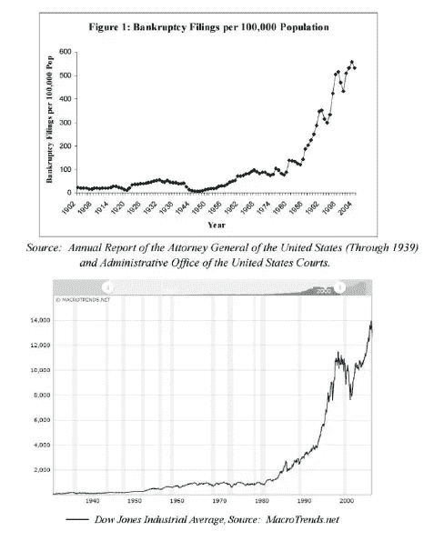
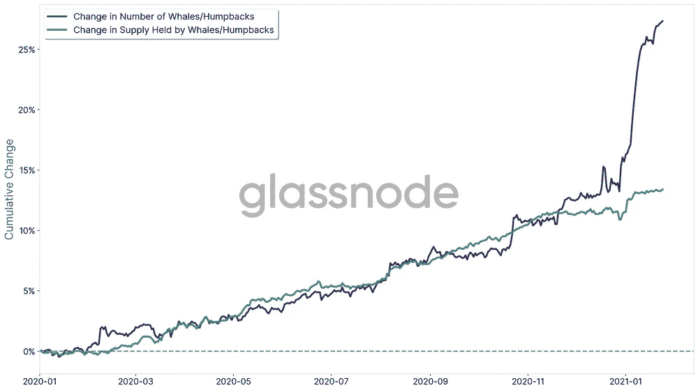

# Crypto vs 美联储 FUD:是时候买，卖，还是 Hodl？

> 原文：<https://medium.com/coinmonks/fed-fud-vs-crypto-time-to-buy-sell-or-hodl-60a8c4162288?source=collection_archive---------17----------------------->

美联储的利率剑拔弩张正把散户赶出市场。美联储是在虚张声势吗？我打赌他们是。

Image: PixTeller

> 通货膨胀夺走了无知的人，给了见多识广的人——维尼塔·范·卡斯帕尔

# 底线在前面(又名 TL；博士)

1.  连续的高通货膨胀率引起了恐慌。
2.  美联储在加息问题上的姿态将继续把散户投资者吓出市场。
3.  激进的加息担忧忽视了 40 年来相反的证据。
4.  美联储几乎肯定会继续印钞。
5.  加密市场有能力吸收通货膨胀的美元。
6.  比特币交易所交易基金的批准将推动大规模采用。
7.  精明的投资者会在前面。

## 万物泡沫

过去两个月的总体 CPI 通胀率超过了 8%。对此，美联储表示将采取积极的加息时间表。

不出所料，加密和股票市场受此消息影响暴跌。在写这篇文章的时候，“恐惧和贪婪指数”处于极度恐惧的水平。

我会尽可能多地购买密码，尽可能频繁地购买(当然是在我的预算范围内！).

如果市场继续下跌怎么办？我真诚地希望他们这样做。我也要买那个蘸酱。说我逆势，说我疯子，说我妄想。见鬼，叫我苏吧。我不在乎。

我买单。

我会吃这些话吗？也许吧。但我不这么认为。为什么？因为如果美联储真的关心“抗击”通胀，利率现在应该在 8-10%之间。

这是上一次通货膨胀达到这么高这么快的时候[保罗·沃克尔](https://www.stlouisfed.org/publications/regional-economist/january-2005/volckers-handling-of-the-great-inflation-taught-us-much)对抗通货膨胀所做的*一半*。如今，即使是 10%的利率也是荒谬的。没关系，在沃尔克的时代，利率达到了 18%。

感谢 40 年来不受控制的通货膨胀支出，我们可能再也不会看到这样的利率了。记住，都是债。这是一张我喜欢的图表:

这是同期美国破产率与道琼斯工业平均指数的比较。奇怪的是他们几乎完美地跟踪，不是吗？这也恰好与赤字支出的大幅增加相吻合。

自 1980 年以来，美国道琼斯工业平均指数上涨了 4，107%。房价中值上涨了 701%。学生贷款债务增加了 909%。医疗费用上涨了 983%。

同期的总体 CPI 上涨了 214%。

这些都是巨大的泡沫。我认为美联储不会让它们破裂。原因是:他们不能。

## 自 1986 年以来，美联储从未失败过拯救股票市场

你应该仔细留意股市 4，107%的涨幅。这很重要。美国的通胀美元主要流入了股市。反过来，股票现在已经深深扎根于美国经济中。

是什么让它们如此重要？每一个 401k，保险基金，养老基金，市，县，州政府基金，*所有的*主要金融公司，40%的美国人，以及*数以千计的*其他实体都依靠股票市场来支付未来的债务或回报。

美联储不能让股市崩盘。这将意味着我们所知的美国的终结。“美联储看跌期权”对全球金融体系的生存至关重要。当他们谈论“激进加息”时，美联储是在卖“狼票”。

当美联储缩减规模时，市场不会“冷却”。他们坦克。两年来，美国金融部门每月从美联储回购市场获得 1200 亿美元的直接支持。

我购买 crypto 是因为我相信一旦这种支持解除，回购市场就会锁定。我还认为，市场将在不久后陷入低谷，然后美联储将被迫继续向股市投入资金。

他们可能会四处活动，寻找借口恢复印钞机。他们已经开始指责俄罗斯了。也许一场严重的飓风会破坏墨西哥湾的石油供应？或者，也许一些中国妖怪会来，谁知道呢？

关键是，美联储会以某种方式继续印钞。或者，全球经济崩溃。这不是一个很难解决的问题。

一旦印钞机开足马力，我们都可以回去思考下一个“牛市”何时会冲击加密市场。

## 美联储还不知道，但 crypto 可能是他们的救星

如前所述，大部分通胀资金都流入了股市。但现在，股票正在被掏空。你只能给 FAANGMs 和 Tesla 注入这么多钱。

房地产投资信托基金和一般的房地产也是如此。据《华尔街日报》报道，对冲基金正在购买 T21 的房产。为什么？因为他们没有其他值得买的东西。

或者，他们有吗？[灰度投资](https://beincrypto.com/grayscale-mulls-lawsuit-sec-bitcoin-spot-etf-rejected/)一直在推动美国证券交易委员会(SEC)采纳他们提议的比特币现货 ETF。如果他们获得通过(我认为他们会)，这将为机构投资者打开加密的大门。

不要介意机构投资者已经开始涌入。看起来是这样的:

Image: Glassnode Insights

为了清楚起见，“鲸鱼/座头鲸”是能装 1000 多 BTC 的钱包。有了这样的资金流入，价格只有一个上涨的方向。

如果你认为 FOMO 零售业看起来很疯狂，你认为当高盛或花旗银行开始进入时会是什么样子？这甚至还没提到当他们释放拥有博士学位的定量分析师大军时会发生什么。

换句话说，当他们可以将通胀资金投入到加密领域以获得 40%(或更高)的回报时，为什么他们要继续将所有通胀资金投入到股票和房地产领域以获得 15%的回报？别忘了，零售业将紧随其后，这是毫无疑问的。

一旦发生这种情况，我认为这将产生推动 GDP 的连锁效应。反过来，这将为美联储继续印钞提供更多借口。他们已经尽可能地远离股市。密码市场可能会给他们更多的工作机会。

加密已经是一个价值 2 万亿美元的空间。一旦通胀资金达到机构投资总额，没有什么能阻止它轻松获得 10 倍的回报。我觉得不是“如果”，我觉得是“什么时候。”

## 骑着座头鲸

当那些鲸鱼开始狼吞虎咽地吃掉眼前的一切时，你最好远远地走在前面，因为它们不会留下任何东西。我只是大计划中的一只小虾。

我游得很快。我把我的小虾米手上能找到的东西都挖了出来。我想这是板上钉钉的事。对我来说，市场是明天还是下周变得糟糕并不重要。

我有工作。我去找 DCA。我在堆 alt。我在堆积 BTC。我在堆积我喜欢的、认为会做得很好的项目。见鬼，我甚至可以堆砌一个迷因。我只知道我需要大、中、小盘的非垃圾密码。

然后我只需要游到旁边，让鲸鱼经过，卖给后面的零售商。就像我说的，叫我疯子，叫我笨蛋，叫我苏。我不在乎。

我买单。

我买了 T2 的密码，因为美联储 FUD 的 T3。我认为这是我们见过的最乐观的宏观信号。自 1980 年以来，他们一直在将自己拖入一个充满道德风险的债务陷阱。唯一能让这场游戏继续下去的是美联储继续吹大泡沫。

我打赌加密将会是下一个美联储泡沫。黄金女郎再现珍妮特·耶伦(Janet Yellen)在电视上兜售加密和比特币。有这样的朋友，比特币大到不能倒只是时间问题。

文兰博兄弟？4 现实。

当然，这些只是我 ***的观点*。**我不是财务顾问，这不是财务建议，而且总是 [DYOR](/coinmonks/crypto-investing-how-to-dyor-1e6dabdb1de9) 。遵循这些想法中的任何一个都可能会让你失去所有的钱。我对此 100%认真。我喜欢摆弄这些东西，但我公开表现得像个彻头彻尾的狒狒。相应投资。

直到下一次，安全，聪明，一定要[绑骆驼](https://www.oxfordreference.com/view/10.1093/acref/9780199539536.001.0001/acref-9780199539536-e-2318)。

> 加入 Coinmonks [电报频道](https://t.me/coincodecap)和 [Youtube 频道](https://www.youtube.com/c/coinmonks/videos)了解加密交易和投资

# 另外，阅读

*   [AscendEx 保证金交易](https://coincodecap.com/ascendex-margin-trading) | [Bitfinex 赌注](https://coincodecap.com/bitfinex-staking) | [bitFlyer 审核](https://coincodecap.com/bitflyer-review)
*   [Bitget 评论](https://coincodecap.com/bitget-review) | [双子星 vs BlockFi](https://coincodecap.com/gemini-vs-blockfi) cmd| [OKEx 期货交易](https://coincodecap.com/okex-futures-trading)
*   [AscendEx Staking](https://coincodecap.com/ascendex-staking)|[Bot Ocean Review](https://coincodecap.com/bot-ocean-review)|[最佳比特币钱包](https://coincodecap.com/bitcoin-wallets-india)
*   [霍比审核](https://coincodecap.com/huobi-review) | [OKEx 保证金交易](https://coincodecap.com/okex-margin-trading) | [期货交易](https://coincodecap.com/futures-trading)
*   [电网交易机器人](https://coincodecap.com/grid-trading) | [Cryptohopper 审核](/coinmonks/cryptohopper-review-a388ff5bae88) | [Bexplus 审核](https://coincodecap.com/bexplus-review)