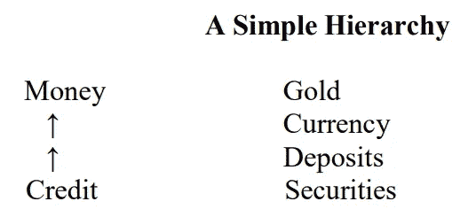

# 美联储的数字美元与实物货币:相同还是不同？直观的解释。

> 原文：<https://medium.com/coinmonks/feds-digital-dollar-vs-physical-currency-same-or-different-an-intuitive-explanation-c9551f1f88b7?source=collection_archive---------25----------------------->

因为迟早我们都会用到它。

Source: It’s a Wonderful Life

## 从某种意义上说，央行数字货币或数字美元(这两个术语我在这里可以互换使用)并不新鲜。

我们每个人都在自己的*钱包里带着*实体*美元纸币。这些都是央行发行的，是他们的直接负债。坦率地说，这些纸币不是商业银行的债务，也不是由富国银行、美国银行或花旗银行发行的。对他们和经济的其他部分来说，他们只是由中央银行发行的法定货币，拥有者是那些把他们放在钱包里的人。*

从中央银行的角度来看，他们将发行这些*实物*纸币的事实记录为资产负债表上的“负债”，这是他们拥有和维护的中央分类账*。顺便说一下，这个账本是数字的。*

我们把每张纸币当作一张单独的纸放在钱包里，也就是说，当我们放入一张 10 美元和 5 美元的纸币时，它们仍然是两张单独的纸，不会自动变成一张 15 美元的纸币。这一看似微不足道的事实，在操作上类似于美联储提出的 CBDC 可能的工作方式，这是基于 Project Hamilton (波士顿联邦储备银行和麻省理工学院的联合合作)最近发布的[报告。只不过，在数字领域，这些纸币被称为 UTXOs——未用交易产出。一个借鉴比特币技术运作方式的想法。(旁注——以太坊的运作理念不同。)](/@uditg/central-bank-digital-currency-febd806a437e)

此外，类似于我们如何用 10 美元的钞票支付 3 美元的咖啡，并获得 7 美元的回报，使用 UTXOs 的这种交易的数字等价物将以类似的方式操作。

最后，就像两张 5 美元钞票的唯一区别是印在钞票上的序列号一样，两张数字美元的唯一区别是钞票上的数字序列号。在所有其他方面，它们都是同样的可替代美元。

## 那么，如果一切都一样(差不多)，有什么不同呢？

首先，**技术**——支持*数字*美元的*数字*美元、*数字*分类账和*数字*钱包背后的底层技术。但那感觉还是挺像的。

第二，**隐私**——与*实体*美元不同，中央银行不知道我钱包里有多少钞票，与*数字*美元不同。*数字*美元无法提供与*实体*美元相同的匿名级别。然而，为了更公平的比较，我们应该将数字美元与我们今天使用的网上银行、信用卡、借记卡进行比较。在每一笔支付中，银行(在另一家中介机构)都确切知道你持有或花费了多少钱。*数字*美元会更类似于那个，那么*实物*美元在那个方面。美联储非常清楚客户隐私，并将其列为需要精心设计的 4 个关键特征之一。

这是美联储邀请公众评论的问题之一:

> CBDC 如何在不提供完全匿名和便利非法金融活动的情况下为消费者提供隐私？

第三，**层次性和灵活性** —今天我们的大部分存款都存在各商业银行的存款账户中，只有一小部分是我们以纸币形式持有的。我们在银行的存款是该银行的责任，而不是中央银行的责任。这是一个微妙的点，在大多数用例中并不重要。我的意思是，我们中有多少人去自动取款机前想，让我把银行的负债转换成中央银行的负债。

不过，从技术上来说，你可以将二级“货币”(银行存款/银行负债)转换为一级“货币”(中央银行负债)。

Source: [Perry Mehrling](https://d396qusza40orc.cloudfront.net/money/lecture_notes/Lecture%20notes%20V3265%2C%202016.pdf)

在我们的日常生活中，这种区别并不重要，我们含蓄地把在街角银行的存款视为和持有实物货币一样好。那是因为有一种隐含的信任。部分原因是，FDIC 为高达 25 万美元的存款提供保险。

> FDIC，即联邦存款保险公司，是一家成立于 1933 年大萧条时期的机构，旨在保护银行储户，确保人们对美国银行系统的信任度。

然而，如果你在当地银行持有大量存款，隐含的信任可能会有点捉襟见肘，你可能希望从银行获得一些担保，或者寻找其他选择来持有你的钱。

其中一个选择是提取你的存款，并以实物钞票的形式持有。这样你就从二级货币跳到了一级货币。然而，现在你不得不担心持有和保护所有这些实物钞票。

这就是数字美元的灵活性变得明显的地方。这是一种一级货币，没有必须存放在床底下的后勤噩梦。(当然，它也有自己的安全问题，比如保护你的数字钱包。)

更重要的是，这种灵活性是有代价的。银行和客户的成本。这是因为银行利用这些存款发放各种贷款——汽车贷款、消费贷款、抵押贷款等。(提示乔治·贝利在《美好生活》中的演讲。)

没有这些存款，银行就没有足够的资金发放贷款，借贷价格就会上涨。美联储也敏锐地意识到这一点，并正在探索限制这种灵活性的可能性。美联储正在征求公众意见的另一个问题是:

> 单个最终用户持有的 CBDC 数量是否应该受到数量限制？

这就是为什么美联储也明确表示，任何由中央银行发行的数字美元都需要由常规商业银行和其他服务提供商持有和中介。（

> **中介**:美联储法案并未授权个人直接开立美联储账户，而这种账户将代表着美联储在金融体系和经济中的作用的显著扩大。在中介模式下，私营部门将提供账户或数字钱包，以促进 CBDC 控股公司的管理和支付。潜在的中介机构可能包括商业银行和受监管的非银行金融服务提供商，并将在 CBDC 服务的开放市场中运作。

除了**隐私保护的**和**中介的**，美联储认为*数字*美元需要具备的另外两个关键特征是:

**可转让性:**数字美元应可在使用不同服务提供商的客户之间随时转让(与银行存款在银行账户、经纪账户等之间无缝流动的方式相同。)

**身份-验证:**与银行存款类似，存取*数字*美元的人的身份需要由金融中介机构确定，以应对洗钱和恐怖融资的威胁。

(如果你想了解更多，我建议在这里阅读美联储的完整报告

尽管听起来像是显而易见的船长，我还是想指出中央银行的数字美元与公共货币(如比特币、以太坊等)之间的一个关键区别。

与支撑对公共加密货币信任的分布式账本系统不同，*数字*美元的账本将*集中*由美联储所有(或许还会选择其他中介机构)。

## 故事并没有在数字美元上结束；这只是开始

虽然这些品质将*数字*美元与我们今天所知的任何东西区分开来，并且肯定会影响我们对金钱的使用和行为，但更具结构性影响的将是围绕这一点建立的新技术基础设施和支付轨道，以使*数字*美元在我们的经济中无缝流动。从我的*数码*钱包到你的！

如果您有任何问题或意见，请随时留言。

如果你喜欢这篇文章，请点击👏按钮。想知道如果你敲两下会发生什么吗！

## 对于好奇的人，请参考:

*   《货币和银行业经济学》——佩里·梅尔林著
*   [联邦存款保险公司—历史](https://www.history.com/topics/great-depression/history-of-the-fdic#:~:text=The%20FDIC%2C%20or%20Federal%20Deposit,in%20the%20American%20banking%20system.)
*   [https://www . federal reserve . gov/publications/files/money-and-payments-2022 01 20 . pdf](https://www.federalreserve.gov/publications/files/money-and-payments-20220120.pdf)

> 加入 Coinmonks [电报频道](https://t.me/coincodecap)和 [Youtube 频道](https://www.youtube.com/c/coinmonks/videos)了解加密交易和投资

# 另外，阅读

*   [BlockFi 信用卡](https://coincodecap.com/blockfi-credit-card) | [如何在币安购买比特币](https://coincodecap.com/buy-bitcoin-binance)
*   [火币交易机器人](https://coincodecap.com/huobi-trading-bot) | [如何收购 ADA](https://coincodecap.com/buy-ada-cardano) | [Geco。一次审查](https://coincodecap.com/geco-one-review)
*   [密码副本交易平台](/coinmonks/top-10-crypto-copy-trading-platforms-for-beginners-d0c37c7d698c) | [五大区块链替代方案](https://coincodecap.com/blockfi-alternatives)
*   [信用贷款审核](https://coincodecap.com/coinloan-review)|[Crypto.com 审核](/coinmonks/crypto-com-review-f143dca1f74c) | [货币融资融券交易](/coinmonks/huobi-margin-trading-b3b06cdc1519)
*   [拜比特 vs 币安](https://coincodecap.com/bybit-binance-moonxbt)|[stealthexreview](/coinmonks/stealthex-review-396c67309988)|[Probit Review](https://coincodecap.com/probit-review)