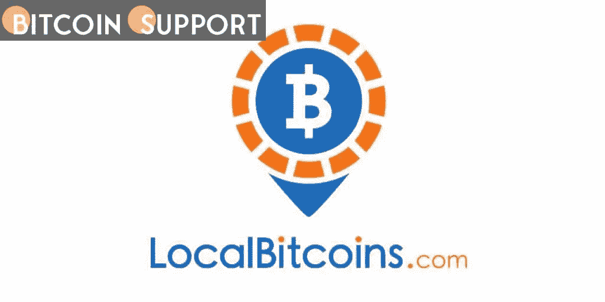

# 本地比特币免除了乌克兰国内外用户的费用

> 原文：<https://medium.com/coinmonks/fees-for-ukrainian-users-at-home-and-abroad-are-eliminated-with-localbitcoins-f916a2c28bf1?source=collection_archive---------51----------------------->

**Visit our website:-** [**https://bitcoinsupports.com/**](https://bitcoinsupports.com/)

全球最大的点对点比特币交易所 LocalBitcoins 表示，在另行通知之前，将免除其乌克兰用户的所有费用，无论是在乌克兰国内还是国外。3 月 1 日，这份声明是通过 Twitter 发布的，同时还对该市场的乌克兰用户做了全面的解释。

乌克兰用户无论身在何处，都将获得一个免费的比特币钱包，以及在乌克兰即时免费从世界任何地方接收比特币(BTC)的机会，以及将捐献的 BTC 快速兑换成乌克兰格里夫纳的能力。

据 LocalBitcoins 的首席营销官 Jukka Blomberg:

**“local bitcoins 的本质价值是自由。我们认识到乌克兰目前正在经历一段困难时期。因此，LocalBitcoins 乌克兰用户的所有费用都被取消了。"**

由于这一声明(以及其他良好的发展)，乌克兰本币(乌克兰格里夫纳)的交易量在加密市场创下新高。令人印象深刻的结果不仅出现在本地比特币和币安上，也出现在乌克兰一家受欢迎的交易所 Kuna 上。乌克兰人民正在努力应对俄罗斯对该国的持续入侵，交易所的决定只是最近一个向他们表达同情的例子。

战斗加剧的挑战之一是，乌克兰人不再能够使用传统的银行系统，迫使他们更加依赖加密货币。自 2 月 24 日凌晨入侵开始以来，加密货币捐赠从全球各个角落涌入。他们主要是针对乌克兰政府，AidForUkraine，UkraineDAO，Unchain。基金和非政府组织:活着回来的账户。

**访问我们的网站:-**[**https://bitcoinsupports.com/**](https://bitcoinsupports.com/)

**免责声明:以上为作者观点，不应视为投资建议。读者应该自己做研究。**

> 加入 Coinmonks [电报频道](https://t.me/coincodecap)和 [Youtube 频道](https://www.youtube.com/c/coinmonks/videos)了解加密交易和投资

# 另外，阅读

*   [如何在印度购买比特币？](/coinmonks/buy-bitcoin-in-india-feb50ddfef94) | [瓦济克斯审查](/coinmonks/wazirx-review-5c811b074f5b)
*   [隐翅虫替代品](/coinmonks/cryptohopper-alternatives-d67287b16d27) | [HitBTC 审查](/coinmonks/hitbtc-review-c5143c5d53c2)
*   [CBET 点评](https://coincodecap.com/cbet-casino-review) | [库币 vs 比特币基地](https://coincodecap.com/kucoin-vs-coinbase)
*   [折叠 App 审核](https://coincodecap.com/fold-app-review) | [Kucoin 交易机器人](/coinmonks/kucoin-trading-bot-automate-your-trades-8cf0ca2138e0) | [Probit 审核](https://coincodecap.com/probit-review)
*   [如何匿名购买比特币](https://coincodecap.com/buy-bitcoin-anonymously) | [比特币现金钱包](https://coincodecap.com/bitcoin-cash-wallets)
*   [币安 vs FTX](https://coincodecap.com/binance-vs-ftx) | [最佳(索尔)索拉纳钱包](https://coincodecap.com/solana-wallets)
*   [比诺莫评论](https://coincodecap.com/binomo-review) | [斯多葛派 vs 3Commas vs TradeSanta](https://coincodecap.com/stoic-vs-3commas-vs-tradesanta)
*   [Capital.com 评论](https://coincodecap.com/capital-com-review) | [香港的加密借贷平台](https://coincodecap.com/crypto-lending-hong-kong)
*   [如何在 Uniswap 上交换加密？](https://coincodecap.com/swap-crypto-on-uniswap) | [A-Ads 评论](https://coincodecap.com/a-ads-review)
*   [WazirX vs CoinDCX vs bit bns](/coinmonks/wazirx-vs-coindcx-vs-bitbns-149f4f19a2f1)|[block fi vs coin loan vs Nexo](/coinmonks/blockfi-vs-coinloan-vs-nexo-cb624635230d)