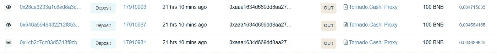

# 女权主义者元宇宙攻击分析

> 原文：<https://medium.com/coinmonks/feminist-metaverse-attack-analysis-e97b20ddbea8?source=collection_archive---------12----------------------->

**0x01 事件背景**

5 月 18 日，**币安**链条上的女权主义者元宇宙智能合约遭到了**智能合约**的攻击。损失了价值超过 55 万美元的资金。

**0x02 攻击者信息**

**攻击者钱包**:0x AAA 1634d 669 DD 8 aa 275 bad 6 FD f19 c 7 E3 B2 f1 ef 50

**攻击者契约**:0x 0b 8d 752252694623766 DFB 161 e 1944 f 233 BC a10 f

**攻击者转移**:0x ecde 3c 3742615852 Abd BD 6 EC 5d 75 AE 982 b5 c 29 f 810 e 140 e5cd 822667 d6f 7 b 848

**FmToken 合同**:0x 843528746 f 073638 c9e 18253 ee 6078613 c0df 0 f 1

**0x03 攻击分析**

通过分析攻击者在 BNB 链上的交易，攻击者的主要交易过程如下:

1.  攻击者部署攻击契约；

2.攻击钱包向攻击契约发送 10 个 FM，为后续调用做准备；

3.攻击者将他钱包中的最大 FM 资金授权给 **PancakeSwap。路由器 v2** 约定方便后续令牌交换；

4.攻击者正式开始调用攻击契约进行攻击。攻击契约调用 Fmtoken.transfer 将资金转入攻击者的钱包，然后从 SakeSwapPair.skim 中提取大量 FM 令牌；

5.将获得的 FM 令牌转换为美元和 BNB。

**攻击交易主要是第四步**

上图为交易流程图，下图为交易明细。

上面的交易明细只有两个操作:**第一个**是攻击者契约调用 **Fmtoken** 契约中的 transfer 方法将 FM 令牌转移到攻击者的钱包中，每次传输 0.0000000000001FM，共 500 次转移；**第二个**是攻击者的钱包地址调用 **SakeSwapPair** 契约中的**skim 方法**将 7593 万 FM 转给自己。

通过分析所有交易，攻击者共进行了 16 次成功的攻击交易，8000 次调用 Fmtoken 契约中的转账方法进行资金转账，从 **skim 方法**转出超过 11 亿 FM。

**0x04 漏洞详情**

通过以上过程分析可以发现，攻击者成功获利的主要操作是攻击者契约调用 Fmtoken 契约中的转账方法将 FM token 转入攻击者的钱包，进而获得大量资金。

为了查看数据，关键数据将显示在这里

从上图可以清楚地看到，攻击者最终通过 **_transfer** 方法转移资金。

由于**numTokensSellToAddToLiquidity**和**swapandliquityenabled**变量已经确定，在**的三个条件中，如果 **_transfer** 方法的条件**、**swapandliquityenabled**已经满足。既然攻击者调用了 **from！= uniswapV2Pair** 条件下，合同地址资金不小于**变量 numTokensSellToAddToLiquidity**的值。，可以满足条件，所以攻击者可以进行更新 **uniswapV2Pair** 地址余额和**地址(this)** 的操作。

由于这里的资金加入到 **uniswapV2Pair** 中，所以资金不是通过增加流动性进行转移，而是直接加入到 **uniswapV2Pair** 中。当攻击者进行多次转账时，即攻击者将契约的资金多次转账给 **uniswapV2Pair** 。

使用 **skim 方法**，任何人都可以调用该方法来转移合同中的附加资产。

攻击者调用**SakeSwapPair contract**t 中的 **skim 方法**转移资金并获利。

**0x05 资金来源和去向**

攻击者的资金来源全部来自**龙卷风。现金**平台，金额为 1 BNB。目前攻击者的利润已经全部兑换成 1838.3 BNB，转移到**龙卷风。现金**平台。

**0x06 汇总**

根据这次攻击， **Fmtoken。_transfer** 方法没有正确操作添加到 **SakeSwapPair** 合同中的资金，使得攻击者可以在一次交易中通过多次转账将合同中的原始资金转移到 SakeSwapPair 合同中。从而通过**撇帐方式**提取资金。

**0x07 安全建议**

*   应对合同资金转账逻辑进行严格检查；
*   智能合约上线前，要进行完整详细的测试，确保合约逻辑正确。
*   智能合同生效前，应进行全面的安全审计

> 加入 Coinmonks [电报频道](https://t.me/coincodecap)和 [Youtube 频道](https://www.youtube.com/c/coinmonks/videos)了解加密交易和投资

# 另外，阅读

*   [3 商业评论](/coinmonks/3commas-review-an-excellent-crypto-trading-bot-2020-1313a58bec92) | [Pionex 评论](https://coincodecap.com/pionex-review-exchange-with-crypto-trading-bot) | [Coinrule 评论](/coinmonks/coinrule-review-2021-a-beginner-friendly-crypto-trading-bot-daf0504848ba)
*   [莱杰 vs n rave](/coinmonks/ledger-vs-ngrave-zero-7e40f0c1d694)|[莱杰 nano s vs x](/coinmonks/ledger-nano-s-vs-x-battery-hardware-price-storage-59a6663fe3b0) | [币安评论](/coinmonks/binance-review-ee10d3bf3b6e)
*   [Bybit Exchange 审查](/coinmonks/bybit-exchange-review-dbd570019b71) | [Bityard 审查](https://coincodecap.com/bityard-reivew) | [Jet-Bot 审查](https://coincodecap.com/jet-bot-review)
*   [3 commas vs crypto hopper](/coinmonks/3commas-vs-pionex-vs-cryptohopper-best-crypto-bot-6a98d2baa203)|[赚取加密利息](/coinmonks/earn-crypto-interest-b10b810fdda3)
*   最好的比特币[硬件钱包](/coinmonks/hardware-wallets-dfa1211730c6) | [BitBox02 回顾](/coinmonks/bitbox02-review-your-swiss-bitcoin-hardware-wallet-c36c88fff29)
*   [BlockFi vs 摄氏度](/coinmonks/blockfi-vs-celsius-vs-hodlnaut-8a1cc8c26630) | [Hodlnaut 审核](/coinmonks/hodlnaut-review-best-way-to-hodl-is-to-earn-interest-on-your-bitcoin-6658a8c19edf) | [KuCoin 审核](https://coincodecap.com/kucoin-review)