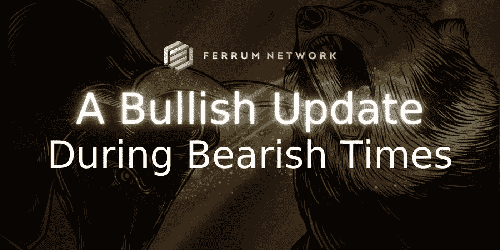

# 铁网:熊市中的牛市升级

> 原文：<https://medium.com/coinmonks/ferrum-network-a-bullish-update-during-bearish-times-966a90cc9a6c?source=collection_archive---------24----------------------->

## 提供关于为什么铁比以往任何时候都更好，并且无论市场条件如何都将继续建设的见解。

嗯，过去几天这个市场很难熬。我真心希望每个人都过得好。如果这个领域有一家公司能够应对逆境，走出熊市，那就是铁网络。在这篇文章中，我将详细描述为什么不管市场情况如何，铁公司都能取得成功的原因。

# 生于熊

铁姆诞生于熊市。该项目于 2018 年推出后不久，市场就崩溃了。作为一个仍在构建平台的低成本项目，他们需要变得非常有创意，以至于他们如何度过加密的冬天，并为 FRM 令牌带来效用。因此，在 DeFi 这个词出现之前，铁公司就创建了一个赌注合同，允许社区成员以他们的 FRM 为赌注，赚取 APR。这不仅最终锁定了一批 FRM 的流通供应，而且最终导致了一项业务的创建，使该公司获得了成功。

# 创造可持续的收入

他们自己的 staking 契约的创建激起了其他早期项目的兴趣，这些项目需要帮助将实用程序添加到他们的本地令牌中。铁姆开始收到来自项目的询问，询问他们是否会为他们部署类似的智能合同。这让铁公司有了给产品贴上白色标签的想法，并最终导致了现在市场上一些最广泛使用的 Staking as a Service 解决方案。

这些项目中的许多成为了铁的合作伙伴，因为他们开始打造一个生态系统，后来被称为铁联盟。因此，许多项目敏锐地观察到他们构建技术解决方案、建立关系和导航空间的先天能力，他们开始向团队寻求建议。铁姆公司再次抓住了这个机会，不久之后，铁姆咨询服务公司诞生了。

# 经久耐用

铁姆公司的 B2B 业务为他们的长期成功奠定了基础。这为他们提供了足够的收入从公开市场上回购数百万 FRM…但更重要的是，这让他们能够建立足够的稳定硬币储备(不是算法的！)来维持公司两年以上的管理费用。这意味着，即使在接下来的两年里，铁姆没有赚到一分钱，他们仍然可以在接下来的两年多里支付我们的 50 多名员工、我们的供应商、税收和其他辅助费用，而无需出售一台 FRM 或 FRMx！

# 铁 2.0

铁姆诞生于熊市，不仅幸存下来，而且建立了一个令人难以置信的企业、社区和一套 DeFi 产品。他们已经开始吸取让他们走到这一步的相同教训，并在这些熊市中应用它们，不管它们持续多久。他们的 DeFi 2.0 产品 *Crucible* ，本质上是他们在 2018 年部署的第一个桩合同的演变。他们即将推出的智能路由多链聚合器 *InfinitySwap* ，是铁跨链令牌桥的发展，为互操作性 2.0 和铁无限层 mainnet 铺平了道路！

四年后，他们仍在应用让他们度过 2018 年至 2019 年秘密冬天的同样的创新和努力原则……他们决心通过下一个冬天建立自己的方式，不管这是否取决于我们。

# “世界上最大的空间就是改进的空间”

不管 2 年的跑道，熊市迫使你以全新的眼光看待事物。尽管铁姆的团队由 50 多名不可思议的成员组成，但他们实际上通过调整工资、取消每月订阅以及与主要供应商重新谈判协议降低了烧钱率。

他们还计划通过增加销售团队的规模来增加收入，因为他们开始销售其他产品，如即将到来的归属门户网站——T4 铁释放，以及坩埚的白色标签版本— *等离子打桩*。

> “虽然加密领域在熊市期间往往会退缩，但 iron 正在为加速增长而优化。主要是为了我们的 mainnet 发布，我们正在减少脂肪，扩大我们的投资和重点，无论市场周期如何，都要推出铁 mainnet。”
> 
> —铁网络公司首席社会干事 Taha Abbasi

# 产品市场适合度

此外，铁姆的产品线非常适合熊市。 *Crucible* 赌注允许参与者灵活地对其持有的股份进行赌注，并通过铁代币经济中产生的交易量获得可持续的被动奖励。 *Infinity Swap* 将为 FRM 提供一个重要的新令牌资源，同时也将带来可观的收入。铁 X 网络和铁网络的主网最终将为参与者提供运行节点的机会，并从网络产生的交易费用中获得被动收入。

为了给社区和生态系统带来尽可能多的价值，铁姆的工程团队正在不知疲倦地开发这些产品和其他产品。业务开发团队继续从整个空间的网络中获得对所有这些产品的极大兴趣和支持。铁姆公司目前已经获得了超过 150 万美元的资助(还在增加),因为他们的目标是让所有网络在通往互操作性 2.0 的道路上更加紧密地联系在一起！

# 最后

从心理学的角度来看，熊市是艰难的，但铁之前也经历过。他们受到这个市场所带来的挑战的鼓舞，事实上他们比以往任何时候都更加努力地工作，YouTube 上不断增加的营销工作，Crucible Alpha 的及时交付，以及开发团队为构建他们计划在 2022 年交付的革命性 mainnet 所做的大量工作都证明了这一点。因此，尽管市场上普遍存在恐惧，我坚信 2022 年将是铁姆最好的一年！

> “铁姆诞生于熊市。我们知道如何在不利的市场条件下茁壮成长。面对这一挑战，我们团队的感觉是冷静、沉着和镇定。我们继续前进。”
> 
> 伊恩·弗兰德，铁姆网络公司的联合创始人兼首席运营官

敬请期待

非常真诚地属于你，

*铁队*

# 关于铁

铁是开创互操作性 2.0 时代的先锋。由 Quantum Portal 提供支持，铁网络的 mainnet 节点和相关基础设施将为行业中的每个链带来价值、数据和功能互操作性。利用铁网络，任何人都可以在一个网络上构建和部署解决方案，并立即启用多链功能，而没有为其 dApps 和项目管理多链基础设施带来的负担或技术债务。

铁姆还专门从事多链区块链即服务 DeFi 公司，为整个加密领域的项目添加紧缩机制、令牌实用程序和咨询服务。

本着打破大规模采用障碍的使命，铁通过减少摩擦，使初创公司和已建立的网络更加紧密，从而为行业提供动力。

# 铁重要环节

[网站](https://ferrum.network/) | [电报](http://telegram.ferrum.network/) | [推特](http://twitter.ferrum.network/) | [YouTube](https://www.youtube.com/channel/UCN658dMRTaH4C4dP32VHi6Q) | [不和](https://discord.gg/HEfKq57asd)

> 加入 Coinmonks [电报频道](https://t.me/coincodecap)和 [Youtube 频道](https://www.youtube.com/c/coinmonks/videos)了解加密交易和投资

# 另外，阅读

*   [南非的加密交易所](https://coincodecap.com/crypto-exchanges-in-south-africa) | [BitMEX 加密信号](https://coincodecap.com/bitmex-crypto-signals)
*   [MoonXBT 副本交易](https://coincodecap.com/moonxbt-copy-trading) | [阿联酋的加密钱包](https://coincodecap.com/crypto-wallets-in-uae)
*   [雷米塔诺评论](https://coincodecap.com/remitano-review)|[1 英寸协议指南](https://coincodecap.com/1inch)
*   [iTop VPN 审查](https://coincodecap.com/itop-vpn-review) | [曼陀罗交易所审查](https://coincodecap.com/mandala-exchange-review)
*   [40 个最佳电报频道](https://coincodecap.com/best-telegram-channels) | [喜美元评论](https://coincodecap.com/hi-dollar-review)
*   [折叠 App 审核](https://coincodecap.com/fold-app-review) | [StealthEX 审核](/coinmonks/stealthex-review-396c67309988) | [Stormgain 审核](https://coincodecap.com/stormgain-review)