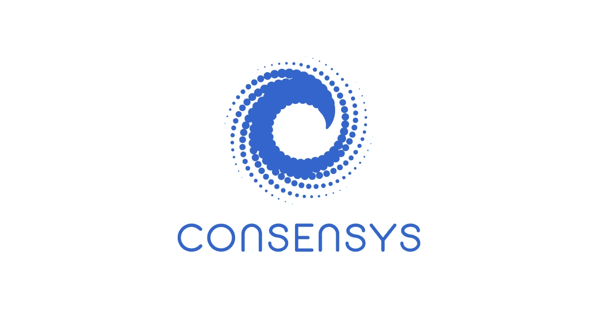

# 很少有人意识到 Web3 正变得多么集中

> 原文：<https://medium.com/coinmonks/few-realize-how-centralized-web3-is-becoming-cb10fbb4b4c8?source=collection_archive---------71----------------------->

Web3 公司只是科技公司，从富人那里筹集资金，由少数人管理，并利用其他科技公司(infura，alchemy 等)。)在最好的情况下与分散的区块链连接。

在最坏的情况下，他们使用 L2 链(多边形，索拉纳，avax 等。)，它们是科技公司，从富人那里筹集资金，由少数人管理。

在这两种情况下，后端是分散的，但前端是集中的。用户或产品连接到区块链的媒介只是一家科技公司。

科技公司，即。例如，ConsenSys 可以决定阻止用户使用元掩码。用户将仍然拥有分散的钱包，但是将没有前端来访问它。用户可以使用不同的前端软件(rainbow、coinbase wallet 等。)，但访问权限仍将由科技公司决定。

Infura 也一样。ConsenSys 拥有 Infura。微软、摩根大通、瑞银、万事达和许多风投公司都有自己的顾问团。99%的 EVM 交易都是通过 ConsenSys 进行的。你可以看到这是怎么回事。

这个行业的全部目的是允许去中心化，允许每个人利用和贡献。我们正朝着完全不同的方向前进。

这并不是说 Web3 将不复存在，而是说它正在偏离它的初衷。

在我看来，这个行业将会在制度化的密码公司和真正的分散化之间分裂，就像 BTC 和纯粹的 ETH 一样。为什么？看看 BTC 和瑞士联邦理工学院的发展模式。

[https://bitcoindevlist.com/](https://bitcoindevlist.com/)这就是比特币开发者赚钱的方式。https://ethereum.org/en/foundation/[这就是以太坊开发者赚钱的方式。受激情、创造社区驱动技术的意愿以及开源和去中心化的未来的驱动。不是靠炒作或者 VC 美元。](https://ethereum.org/en/foundation/)

去中心化前端是未来吗？它能解决这个问题吗？

> 加入 Coinmonks [电报频道](https://t.me/coincodecap)和 [Youtube 频道](https://www.youtube.com/c/coinmonks/videos)了解加密交易和投资

# 另外，阅读

*   [Bitget 回顾](https://coincodecap.com/bitget-review)|[Gemini vs block fi](https://coincodecap.com/gemini-vs-blockfi)cmd |[OKEx 期货交易](https://coincodecap.com/okex-futures-trading)
*   [AscendEx Staking](https://coincodecap.com/ascendex-staking)|[Bot Ocean Review](https://coincodecap.com/bot-ocean-review)|[最佳比特币钱包](https://coincodecap.com/bitcoin-wallets-india)
*   [霍比审核](https://coincodecap.com/huobi-review) | [OKEx 保证金交易](https://coincodecap.com/okex-margin-trading) | [期货交易](https://coincodecap.com/futures-trading)
*   [网格交易机器人](https://coincodecap.com/grid-trading) | [Cryptohopper 审查](/coinmonks/cryptohopper-review-a388ff5bae88) | [Bexplus 审查](https://coincodecap.com/bexplus-review)
*   [7 个最佳零费用加密交易平台](https://coincodecap.com/zero-fee-crypto-exchanges)