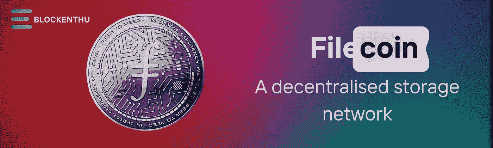
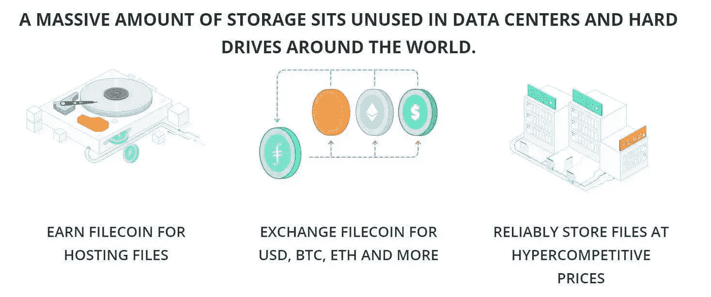
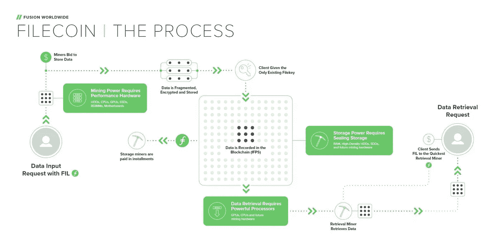
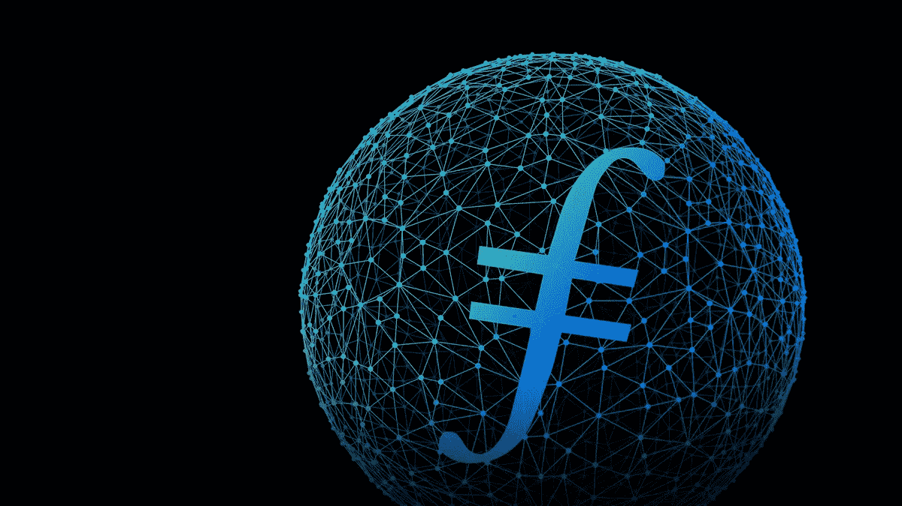
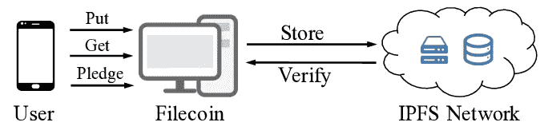

# Filecoin:一个去中心化的存储网络

> 原文：<https://medium.com/coinmonks/filecoin-a-decentralised-storage-network-955848a9e94f?source=collection_archive---------48----------------------->

# FileCoin 到底是什么？

Filecoin 是一个使用区块链技术的分散式点对点数字存储市场。它建立在星际文件系统(IPFS)之上，允许用户租用未使用的硬盘空间，并获得 FIL 令牌作为回报。

Filecoin 是一个分散的存储网络，任何人都可以出租存储空间。同样，任何人都可以在网络上购买存储。重要数据不必只信任一家公司，而是可以分散存储在世界各地的不同计算机上。

Filecoin 于 2014 年首次推出，当时 Juan Benet 发布了白皮书:Filecoin:一种加密货币操作的文件存储网络。该提案是一个类似于比特币的区块链网络，但网络中的节点可以存储数据，由可检索性证明组件保证。Filecoin 由 Protocol Labs 开发。

Filecoin 有时被称为 IPFS 之上的激励层。这仅仅意味着用户通过 FIL 代币获得报酬而被激励出租他们的存储空间。那么，可以用 Filecoin 把圣诞照片发到火星或者金星吗？还没有。IPFS 是一种点对点的数据存储和检索协议，它是使用一种更加分散的方法构建的。与 HTTP 或 HTTPS 不同，它不依赖于中央服务器来存储数据。

Filecoin 在 2017 年的 ICO 中筹集了超过 2.5 亿美元，这在当时是一项纪录。Filecoin mainnet 随后于 2020 年 10 月推出。

# **Filecoin(FIL)如何工作**

Filecoin 基础设施是一个分布式的点对点网络，其主要目的是为组织和个人提供一种新的方式来存储世界各地的数据。当人们有免费存储可用时，他们可以成为存储矿工，他们本质上负责存储 Filecoin 网络上的数据。客户支付 FIL 令牌来存储和检索数据。

> **复制证明**

网络验证存储挖掘者是否已经实际存储了他们声称持有的数据副本的数量。

> **时空的证明**

有了时空的证明，filecoin 可以确保矿工们在约定的时间内存储了所有的数据。

检索矿工是另一类参与者。正如您所料，他们促进了客户端和存储挖掘者之间的数据检索过程，并为他们的服务收取少量的 FIL。Filecoin 使用端到端加密，存储提供商无法访问解密密钥。由于这是一个分布式系统，文件在多个存储位置保持安全。

那么，是什么让 Filecoin 比它的集中式竞争对手更有潜力呢？嗯，它为企业和消费者提供了一个点对点的云存储解决方案。因为相同的物品(存储)由不同的卖家以不同的价格出售，消费者最终可能会受益。虽然有时您可能没有足够的存储空间来存储所有数据，但有时您会有多余的存储空间，并且可以出售。这是 Filecoin 的承诺。

# 主要问题

令人震惊的是，83%的公司工作负载存储在云上，普通员工在日常工作中使用 36 种基于云的服务。随着企业努力控制支出，这种增长的成本令人震惊，但这不仅仅是由几家大型云存储提供商主导市场的相关成本。另一个问题是黑客攻击的永久风险。

这里有一个替代购买亚马逊 S3 存储桶，Dropbox 空间在这个分散的世界？在分散的空间中存储数据。

# 为什么 Filecoin (FIL)很重要

在过去的几十年里，我们存储和访问数据的方式发生了变化。在商业中，这已经从公司拥有巨大服务器机房的现场存储转变为远程数据存储仓库和遍布全球的更加多样化的云存储。目前，大多数企业使用所有这些的组合。同样，消费者数据存储也随着对云存储依赖的增加而发生了变化。

这造就了云存储市场的超级大国，如 AWS、HPE 和戴尔。企业客户通常会选择一家供应商，并与它合作多年，这阻碍了竞争。Filecoin 允许想要购买存储的客户即时浏览最佳交易，无论存储提供商是谁。这可能会创造一个竞争更加激烈的云存储市场。

## **Filecoin (FIL)用例**

Filecoin 允许消费者选择最佳存储选项，而不是必须遵循固定的供应商合同或按需存储的高费率。拥有未使用存储空间的组织和个人可以在网络上提供存储空间。通过分享他们的资源，他们在 FIL 中得到了回报。这可能一开始并不明显，但是您也可以为存储构建 DApps！其中包括消费者存储应用、DeFi 应用、分散式视频应用等。

## **如何存储 Filecoin (FIL)**

无论你是通过存储活动在 Filecoin 网络上消费或制作 FIL，还是只是交易代币，你都需要一个地方来存储它们。

Filecoin 为 FIL 推荐三款钱包。可以用来运行 Filecoin 节点的 Lotus 可以连接到 Ledger。Glif wallet 是一个基于网络的界面，如果你不想运行 Lotus，它也可以连接到你的账本。Filfox 钱包是一个基于网络的钱包，你可以用它来存放代币。

# 结论

Filecoin 为全球范围内的文件存储和检索效率低下提供了一个很好的解决方案。这也将权力交到了客户手中，他们不太可能受到大企业合同的约束。

有了一个活跃的 mainnet 和一套完善的工具，Filecoin 已经可以自由使用了。Filecoin 生态系统的成功将取决于它在加密货币社区中的使用情况，也取决于它是否能吸引新人进入 Web 3.0 的世界。

# **加入我们，轻松进入 WEB 3.0**

# 我们的社区

## WHATSAPP

 [## ⚡BLOCKENTHU⚡

### WhatsApp 群邀请

chat.whatsapp.com](https://chat.whatsapp.com/FTKme4XzkOU73ZDv99Oatj) 

## 电报

 [## ⚡·布洛克登胡·⚡

### 可以马上查看并加入@blockenthu。

t.me](https://t.me/blockenthu) 

## INSTAGRAM

【https://www.instagram.com/blockenthu/ 号

## 商务化人际关系网

 [## Blockenthu | LinkedIn

### blockenthu | LinkedIn 上有 245 名粉丝。“面向大众的 Web 3.0 福利”加密和区块链| BlockEnthu 是社区…

www.linkedin.com](https://www.linkedin.com/company/blockenthu/) 

使用印度最安全的外汇货币

 [## CoinDCX -加密交易所|购买、出售和交易比特币和顶级替代币

### CoinDCX 是印度最大、最安全的加密货币交易所，在这里你可以买卖比特币和其他…

coindcx.com](https://coindcx.com/) 

# blockenthu # ETH # BTC # coincxpathbreaker # FILECOIN #比特币#以太坊#索拉纳

> 加入 Coinmonks [电报频道](https://t.me/coincodecap)和 [Youtube 频道](https://www.youtube.com/c/coinmonks/videos)了解加密交易和投资

# 另外，阅读

*   [BigONE 交易所评论](/coinmonks/bigone-exchange-review-64705d85a1d4) | [电网交易机器人](https://coincodecap.com/grid-trading)
*   [氹欞侊贸易评论](https://coincodecap.com/anny-trade-review) | [CoinSpot 评论](https://coincodecap.com/coinspot-review)
*   [新加坡十大最佳加密交易所](https://coincodecap.com/crypto-exchange-in-singapore) | [购买 AXS](https://coincodecap.com/buy-axs-token)
*   [投资印度的最佳加密软件](https://coincodecap.com/best-crypto-to-invest-in-india-in-2021) | [WazirX P2P](https://coincodecap.com/wazirx-p2p)
*   [西班牙 5 大最佳文案交易平台](https://coincodecap.com/copy-trading-spain)
*   [Pionex 双投](https://coincodecap.com/pionex-dual-investment) | [AdvCash 审核](https://coincodecap.com/advcash-review) | [秉持审核](https://coincodecap.com/uphold-review)