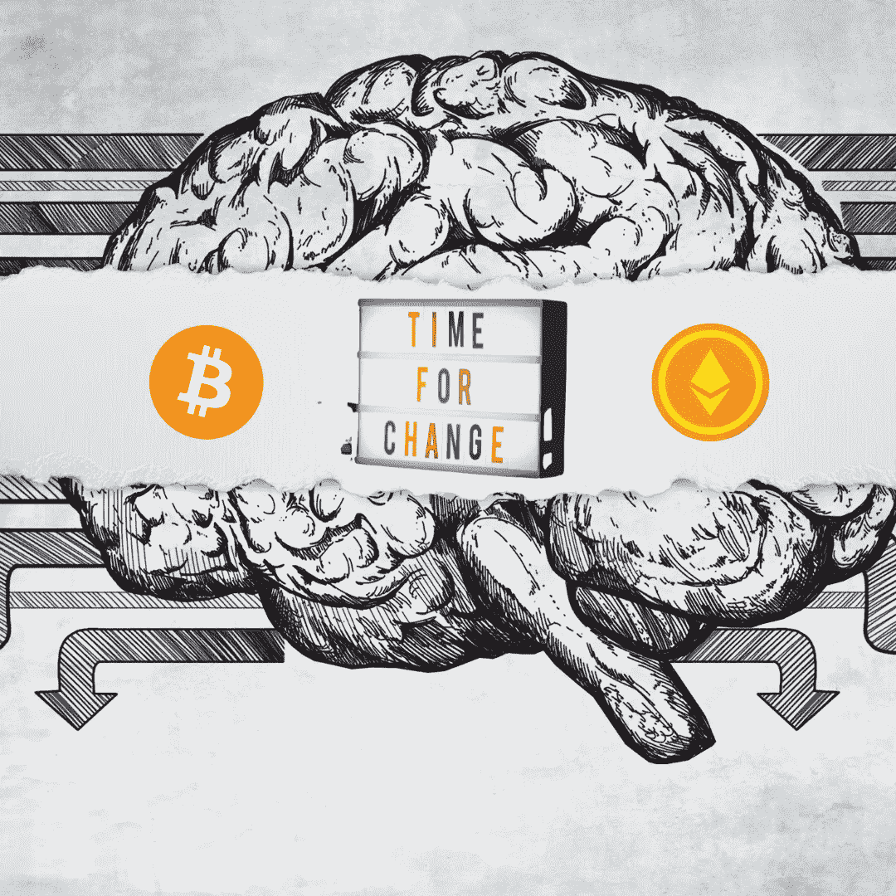

# 最终，美国通过《负责任金融创新法案》接受了比特币

> 原文：<https://medium.com/coinmonks/finally-us-has-embraced-bitcoin-through-the-responsible-financial-innovation-act-6ca677d9ad68?source=collection_archive---------3----------------------->

## 比特币被称为骗局和失败。现在比特币成功了，它不是一个骗局。谁说的。两名美国参议员如是说。

Source: Self Created Image with [Canva](http://www.canva.com).

**结束所有争论的法案**