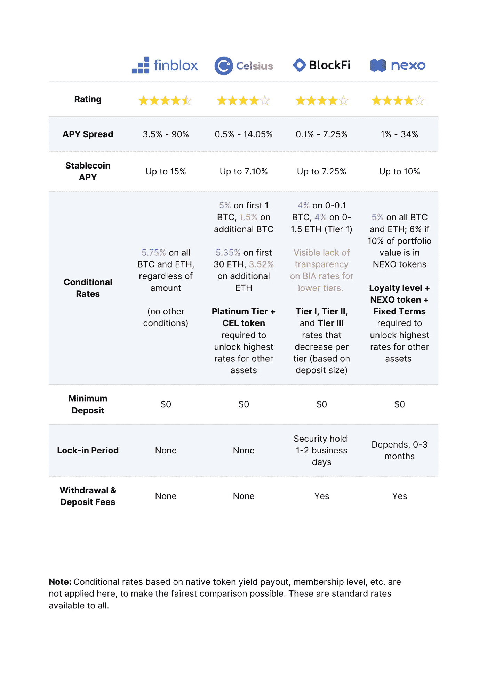
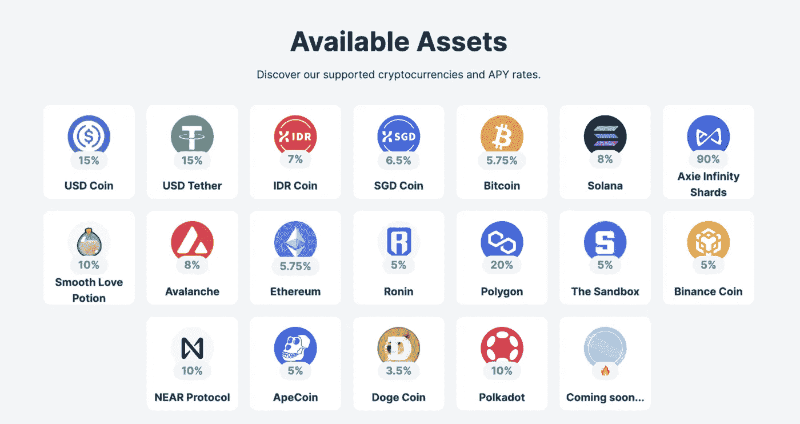
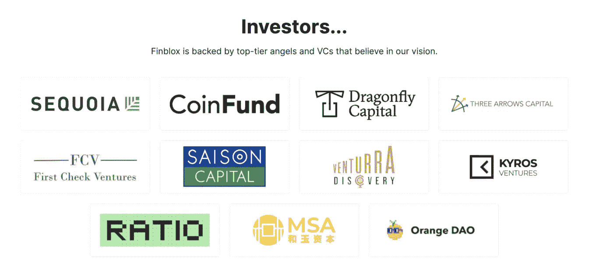
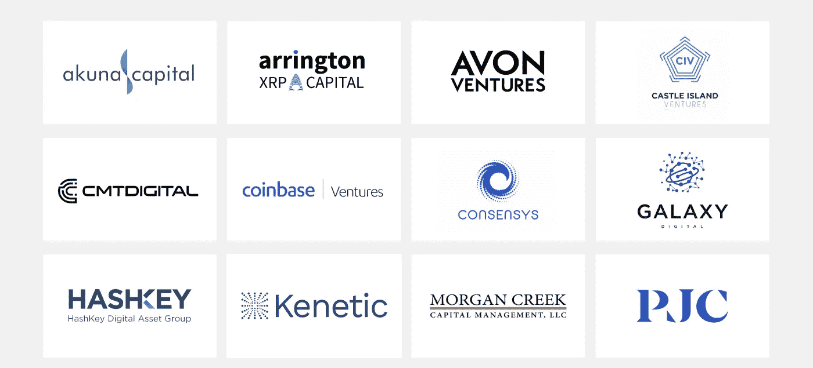
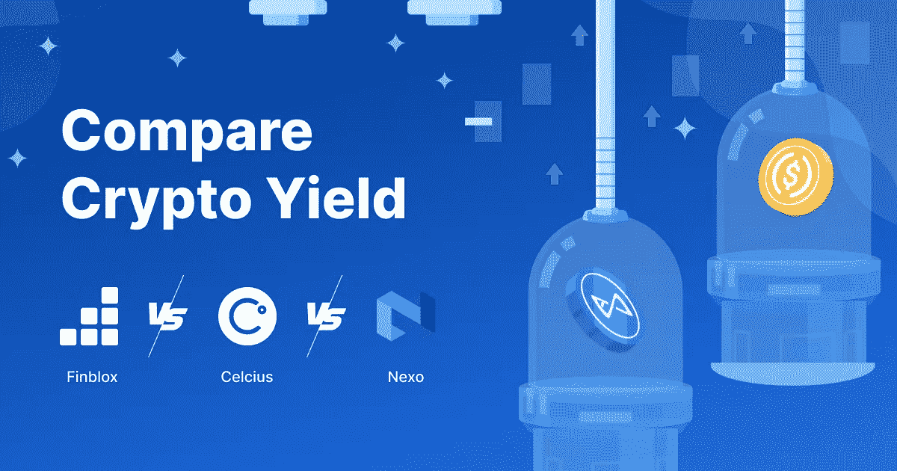

# finblox vs Nexo vs Celsius vs block fi:比较加密产出平台

> 原文：<https://medium.com/coinmonks/finblox-vs-nexo-vs-celsius-vs-blockfi-comparing-the-crypto-yield-platforms-1bdae51cb172?source=collection_archive---------6----------------------->

鉴于我们的加密资产可以赚取的期权数量，我正在深入比较流行的加密利息收益率平台 [Finblox](https://finblox.com/) 、Nexo、Celsius 和 BlockFi 的利率。哪一个能提供最好的收益，是增加你的秘密财富的更可靠的途径？

下面是一个快速对照表:

# 产量比较

我个人更喜欢从基础货币中获得收益(例如，从 BTC 存款中获得 BTC 利息，从 USDC 存款中获得 USDC 利息，也称为实物收益)。我假设你们中的大多数人会有类似的偏好，因此基于本地代币支付的条件利率(如 CEL 或 NEXO 代币)在这里不适用，以尽可能进行最公平的比较。

**Stablecoins:**

[Finblox](https://finblox.com/) 在这里大幅领先，为 USDC 和 USDT 提供 15%的回报，同时为其他稳定货币如 XSGD(与新加坡元挂钩的稳定货币)和 XIDR(与印尼盾挂钩的稳定货币)提供 8%的收益率。

相比之下，Blockfi 和 Celsius 在 Stablecoins 上的平均 APY 为 7.10%，Nexo 为 10%左右，具体取决于存款金额、忠诚度水平和其他条件。

**加密货币:**

大盘股:Celsius 和 Nexo 为 BTC 和 ETH 提供了大约 5%的相对收益率。然而，如果你打算存入超过 1 个 BTC 或 30 个瑞士法郎，BTC 和瑞士法郎的利率会大幅下降到 1.5%和 3.52%。在 Finblox 上，BTC 和瑞士联邦理工学院的统一费率为 5.75%，不考虑金额。

**其他 cryptos:** 费率因资产而异，但所有平台都有大约 20+个受支持的流行协议和项目，如 Solana、Polygon、Avalanche 和 Axie Infinity。Blockfi 支持的资产不到 20 个，是该平台上可用的加密货币数量最少的。

其中一个值得注意的收益率是 AXS 的 90% APY 和 Finblox 上 Polygon 的 20% APY:

**我们对稳定货币收益率的选择:** [Finblox](https://finblox.com/)

**我们挑选的其他加密货币:** Finblox 和 Nexo

我们选择的资产:Nexo、Finblox 和 Celsius 之间的关系。

# 取款和存款费用

Finblox 和 Celsius 不收取任何存放和提取平台密码的费用。在 Nexo 和 Blockfi 上，每种资产都有不同的提现费用。

**我们的选择:** Finblox 和 Celsius

# 可信度/机构支持者

Nexo 由专注于支付服务和在线消费贷款的金融科技集团 Credissimo 孵化。

Finblox 得到了红杉资本(一家最大和最著名的风险投资公司，投资了谷歌、贝宝和 Stripe，管理着超过 800 亿美元的资产)、Saison Capital(一家在东京上市的价值 300 亿美元的消费金融公司，也是日本最大的信用卡发行商之一)以及三箭资本、蜻蜓资本、居鲁士风险投资和 Coinfund 等大型区块链基金的支持。

**Celsius** 已经吸引了来自 WestCap(一家成长型股权公司)和 Caisse de dépét et placement du québec(一家全球投资集团)的投资。

Blockfi 由比特币基地创投(比特币基地平台的投资部门)、银河数码、梵拉创投和 Jump Capital 支持。

我们的选择: Blockfi 和 Finblox 拥有声誉卓著的老牌基金的最强支持。

# 最终结论

加密平台是增加你的加密财富的重要解决方案。所有以上都是大而受欢迎的场所，可以让你的加密资产获得不错的 APY 回报。当选择哪一个最适合你时，最重要的因素可能是哪个平台对你感兴趣的资产提供最高的兴趣。如果你有兴趣增加 USDC/USDT 等稳定货币或 AXS 等加密货币的被动收益率，Finblox 的优势最大，APY 和 APY 分别为 15%和 90%。

**免责声明:**本文是作者的观点，而非投资建议。你应该自己做研究！

*   **本恩·史密斯**

喜欢这篇文章吗？注册我的邀请链接，我们都将获得高达 250 USDC 的推荐奖励:[https://join.finbloxapp.com/ref/a9b154a0fd](https://join.finbloxapp.com/ref/a9b154a0fd)

> 加入 Coinmonks [电报频道](https://t.me/coincodecap)和 [Youtube 频道](https://www.youtube.com/c/coinmonks/videos)了解加密交易和投资

# 另外，阅读

*   [有哪些交易信号？](https://coincodecap.com/trading-signal) | [Bitstamp vs 比特币基地](https://coincodecap.com/bitstamp-coinbase) | [买索拉纳](https://coincodecap.com/buy-solana)
*   [ProfitFarmers 回顾](https://coincodecap.com/profitfarmers-review) | [如何使用 Cornix 交易机器人](https://coincodecap.com/cornix-trading-bot)
*   [区块链 vs 摄氏](/coinmonks/blockfi-vs-celsius-vs-hodlnaut-8a1cc8c26630) | [区块链回顾](/coinmonks/blockfi-review-53096053c097) | [区块链 vs 比特币基地](https://coincodecap.com/blockfi-vs-coinbase)
*   [block fi vs coin loan vs Nexo](/coinmonks/blockfi-vs-coinloan-vs-nexo-cb624635230d)|[双子座 vs BlockFi](https://coincodecap.com/gemini-vs-blockfi)
*   [十大最佳加密货币博客](https://coincodecap.com/best-cryptocurrency-blogs) | [YouHodler 评论](https://coincodecap.com/youhodler-review)
*   [my constant Review](https://coincodecap.com/myconstant-review)|[8 款最佳摇摆交易机器人](https://coincodecap.com/best-swing-trading-bots)
*   [MXC 交易所评论](/coinmonks/mxc-exchange-review-3af0ec1cba8c) | [Pionex vs 币安](https://coincodecap.com/pionex-vs-binance) | [Pionex 套利机器人](https://coincodecap.com/pionex-arbitrage-bot)