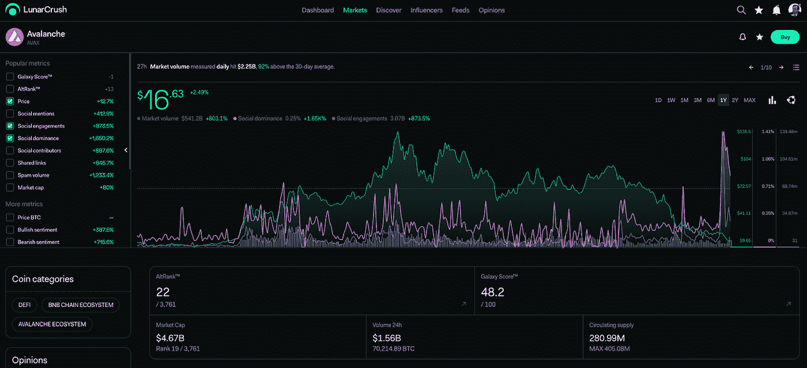
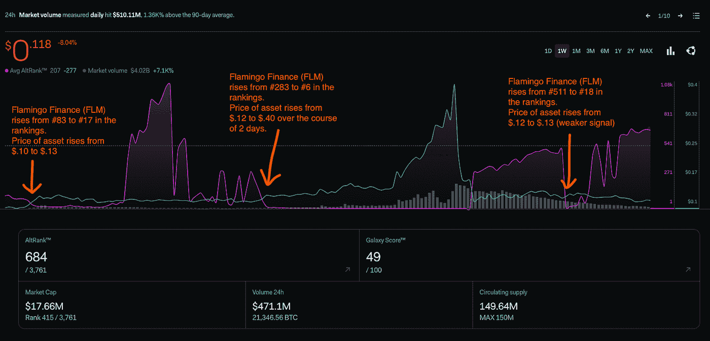
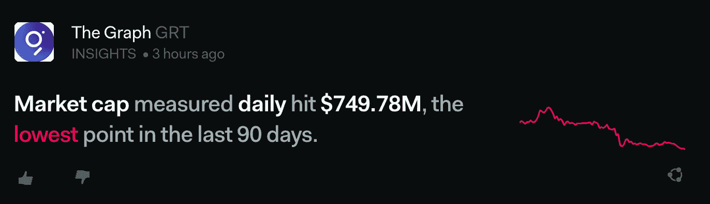
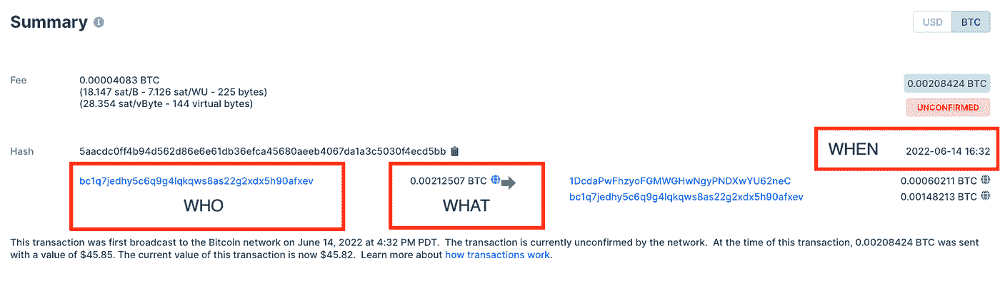
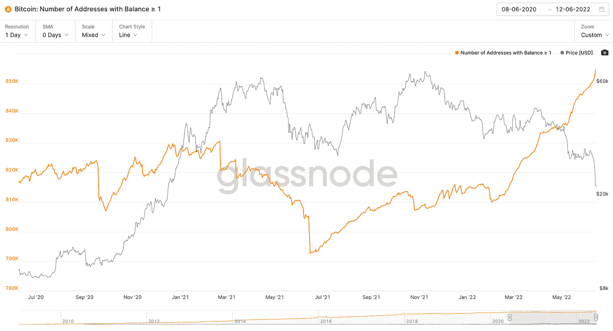
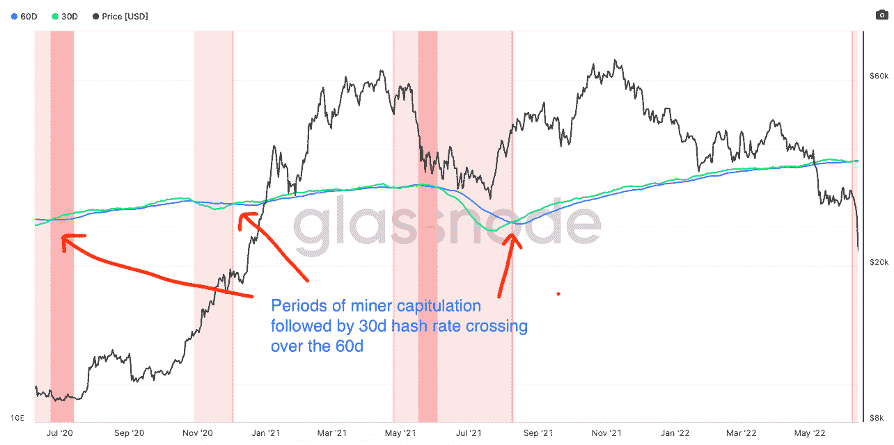

# 利用社交和链上数据寻找阿尔法机会

> 原文：<https://medium.com/coinmonks/finding-alpha-opportunities-with-social-and-on-chain-data-3984102d661e?source=collection_archive---------9----------------------->

*看看 metric 网站如何帮助交易者做出更明智的决策，看看 LunarCrush 的社交网站和 Glassnode 的链上分析*

过去几周对 crypto 来说很难熬。无论你是经验丰富的德根还是初出茅庐的猿猴，大规模的下降和“秘密的冬天”从来都不容易驾驭。即使有传统技术分析的敏锐眼光和评估项目基本面的良好框架，市场修正也很难发现，甚至更难找到阿尔法。

然而，有一些方法可以让你的密码交易之旅更加顺利，并且最大限度地增加你自信地做出合理交易决定的机会。其中许多方式都围绕着智能利用替代数据，即链上数据和社交数据。

交易者可以使用 GlassNode (on-chain)和 LunarCrush (social)等应用程序获取实时信息或专有指标，如 GlassNode 上的比特币哈希功能区和 LunarCrush 上的 AltRank。

# **社会指标**

实时社交指标在过滤和聚合时可以提供优势。真实的、可行的见解是存在的，但通常很难找到，也很乏味。LunarCrush 将来自网络和众多社交媒体渠道的数据汇集到一个[直观悦目的用户界面](https://lunarcrush.com/markets)。

LunarCrush’s Coin Detail page

LunarCrush 为每个用户提供了个性化的体验，允许您定制不同资产的跟踪，同时从您提供的关于显示内容和观点问题的反馈中学习从市场状况到模因的一切。然而，他们提供的核心是实时跟踪社交网站和自动打包这些数据，以及分析情绪和过滤垃圾邮件和低质量内容的机器学习引擎。他们以实时延迟主动跟踪超过 4000 项资产，并计算 Galaxy Score 和 AltRank 等专有指标。作为一家土生土长的 web3 公司，毫不奇怪他们有自己的令牌$LUNR，它为生态系统提供动力，并激励用户参与，提供更丰富的第一方数据，如前面提到的意见调查。钱包中存放的更多$LUNR 令牌允许您在更宽的时间范围内访问更多数据和更好的指标(https://lunarcrush.com/lunr)。

LunarCrush 上的 AltRank 指标被广泛用作领先指标和信号确认。根据 LunarCrush.com 的说法，Alt-Rank 是一种资产的价格变化、交易量、社交量和相对于加密资产领域其余部分的社交得分的组合。作为一个纯粹的相对衡量标准，这一指标对所有硬币进行排名(1 为最佳)，并允许您在所有其他资产中找出表现最佳的资产，这意味着即使市场其他资产都在亏损，您也有可能找到赢家。

以下是上周 Flamingo Finance (FLM)的 price vs. AltRank 的快照:

AltRank vs. Price for Flamingo Finance

LunarCrush 还提供定制洞察，如果某个指标发现异常活动或与正常情况有较大偏差，就会提醒交易员，有助于确定新事件何时会影响资产价格或交易量。

LunarCrush Insights

总而言之，这是一个通过社交媒体和在线内容来跟踪流行加密项目的伟大工具，这通常是交易阿尔法的第一个花絮，也是传统价格行为分析经常滞后的地方。

# **链上指标**

使用链上指标，用户可以查看实际交易的“何人、何事、何时”:

Tx From Blockchain.com (BTC Explorer)

聚集了数百万个地址:

GlassNode: Number of Addresses with Balance > 1 BTC

Glassnode 为您完成了繁琐(坦率地说也很复杂)的聚合工作，并将数据打包成数百个关于 [100 多项资产](https://docs.glassnode.com)的指标。这让你作为交易者可以利用区块链数据的权威来源进行追溯分析和领先指标。

以“[比特币:散列带](/capriole/hash-ribbons-bitcoin-bottoms-60da13095836)为例，它绘制了 BTC 散列率的 30d 和 60d 简单移动平均线。该指标用于寻找杂凑比率的 30d 简单移动平均线穿过 60d 的周期，这意味着 BTC 价格的局部底部和买入机会。该指标基于以下假设:当矿商投降时，BTC 往往会触底(历史表明，矿商通常是继投资者/投机者之后最后投降的)。

GlassNode: BTC Hash Ribbon vs Price

随着 BTC 价格下跌，采矿业务的利润率受到挤压，直到维持运营不再有利可图。当超过这些盈利阈值时，采矿运营商关闭钻机，哈希费率下降。矿工们最近赚到的一些比特币很可能被出售到市场上，以收回运营成本，并在他们的收入来源(采矿)被搁置时保留下来。我们称这一时期为“矿工投降时期”。

当散列率回升时，可能是由于两个主要因素——比特币难度和价格，比特币难度是衡量开采一个区块的难度的指标。

比特币难度大约每两周调整一次，以确保平均阻断时间保持在 10 分钟左右。当散列率突然下降时，难度降低，因此块被散列得更快，这意味着挖掘变得更有利可图(同样的回报，更少的计算，即电力)。这使得更多活跃的矿工回到了生态系统中，从而增加了散列率。当价格上涨时，杂凑率通常也会跟着上涨。随着比特币的美元价格上涨，采矿再次变得有利可图，采矿运营商重新打开钻机。

这从高层次上告诉我们，价格和杂碎率都下降是矿工投降的好指标，可能是买入的好时机。一个好的买入机会的确认信号是当 30d 的散列值穿过 60d 时，意味着情况再次好转，矿商正在重返市场。

# **结论**

虽然保持盈利几乎从来都不是一件容易的事情，但是有一些工具和指标可以让你超越其他交易者和投机者。社交媒体通常是一条可操作的信息最先登陆的地方，诀窍在于首先找到它。汇总这些数据以查看所有资产的社会前景也非常有用，LunarCrush 以直观、简单的方式做到了这两点(这不是一件容易的事情)。链上数据提供了一个纯粹的、不加修饰的视图，显示实际上正在进行什么交易以及何时进行交易。虽然这些数据是未经过滤的原始数据，但通常需要像 GlassNode 这样的工具来聚合数据并将其转换为有用的信息。

如果你正在寻找交易优势或积极保护你的投资组合，而你还没有，考虑把这两种工具都包括在你的投资组合中。通过在你的模型中加入比下一个交易者更多的信息，你就在市场上占了上风，增加了你成功的表面积，不管是多头还是空头掌权。

> 加入 Coinmonks [电报频道](https://t.me/coincodecap)和 [Youtube 频道](https://www.youtube.com/c/coinmonks/videos)了解加密交易和投资

# 另外，阅读

*   [Coldcard 评论](https://coincodecap.com/coldcard-review) | [BOXtradEX 评论](https://coincodecap.com/boxtradex-review)|[uni swap 指南](https://coincodecap.com/uniswap)
*   [比特币基地评论](/coinmonks/coinbase-review-6ef4e0f56064) | [德里比特评论](/coinmonks/deribit-review-options-fees-apis-and-testnet-2ca16c4bbdb2) | [FTX 评论](/coinmonks/ftx-crypto-exchange-review-53664ac1198f)
*   [Coinmetro 评论](https://coincodecap.com/coinmetro-review) | [VirgoCX 评论](https://coincodecap.com/virgocx-review)
*   [法国 4 大最佳加密副本交易平台](https://coincodecap.com/copy-trading-platforms-france)
*   [从 WazirX 切换到 CoinDCX 的 5 个理由](https://coincodecap.com/reasons-to-switch-from-wazirx-to-coindcx)
*   [联合国硬币评论](https://coincodecap.com/unocoin-review) | [最佳加密赌注硬币](https://coincodecap.com/best-crypto-staking-coins)
*   [如何使用 MetaMask Wallet 获取 KCC 地址？](https://coincodecap.com/kcc-address-metamask)