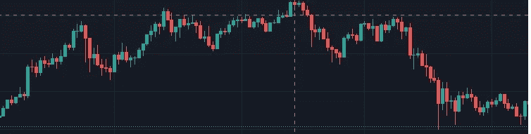
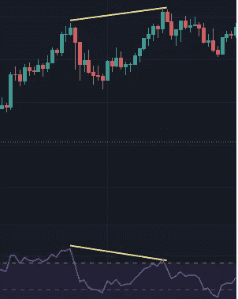
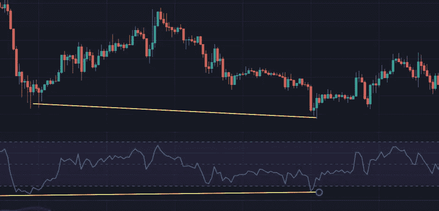
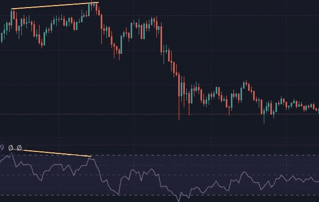

# 寻找市场顶部和底部第 1 部分

> 原文：<https://medium.com/coinmonks/finding-market-tops-and-bottoms-part-1-ae39986d6de0?source=collection_archive---------37----------------------->

这是如何寻找市场顶部和底部系列的第一部分，特别关注比特币。

我开发了这个策略，因为我痴迷于寻找波动高点和波动低点。我有其他有利可图的策略，但正是高峰和低谷的挑战把我带到了这里。此外，由于有一份全职工作和 3 个孩子，我根本没有时间在警报响起时不停地查看图表。这种策略是一个长期的游戏，可能进展缓慢，这适合我的生活方式。

该战略有许多部分，但第一部分没有什么革命性；它以分歧为中心。请参阅后面的文章，了解我如何使用背离和其他指标来预测波动的高点和低点，以及在什么时间范围内。

# **什么是背离？**

对于那些不知道的人来说:背离是指价格朝一个方向移动，而某个特定的指标(有很多)却朝另一个方向移动。你通常关注价格和指标的波峰或波谷。

例如:

你可以看到价格在上涨，而相对强弱指数在下降。我不用 RSI 来衡量背离，这纯粹是为了说明。

# 分歧的类型

有两种类型的分歧:

1.  常规背离，可以是看涨或看跌，通常是反转的迹象。
2.  隐藏的背离，可以是看涨或看跌，通常是趋势延续的标志。

因为我们关注的是波动的高点和低点，所以我们坚持认为趋势是反转，因此是常规背离。

# 正则散度

对于看涨的常规背离，我们正在看波谷，价格运动的底部和你选择的指标。看涨的常规背离是指价格下跌，指标上涨。趋势朝着看涨的方向逆转

Price decreases, RSI increases(slightly). A bullish regular divergence which then sees an increase in price, a reversal of the trend.

对于一个看跌的常规背离，我们正在看峰值，价格运动的顶部和你选择的指标。看跌的常规背离是指价格上涨，指标下跌。这一趋势随后转向熊市。

Price Increases, RSI increases. A bearish regular divergence which then sees a decrease in price, a reversal of the trend

# 结论

与任何指标一样，你不能孤立地单独使用它。

你必须学会注意哪些实例，忽略哪些实例，这就是我即将发布的帖子的内容。

同时查看交易视图**上的[**lone sometheblue**](https://www.tradingview.com/u/LonesomeTheBlue/)[**WIZARD**](https://www.tradingview.com/pine-wizards/)**免费的“多指标背离 v3”。**它允许您选择任何指标，并在您显示的任何图表上突出显示背离。**

> **加入 Coinmonks [电报频道](https://t.me/coincodecap)和 [Youtube 频道](https://www.youtube.com/c/coinmonks/videos)了解加密交易和投资**

# **另外，阅读**

*   **[BigONE 交易所点评](/coinmonks/bigone-exchange-review-64705d85a1d4) | [电网交易 Bot](https://coincodecap.com/grid-trading)**
*   **[氹欞侊贸易评论](https://coincodecap.com/anny-trade-review) | [CoinSpot 评论](https://coincodecap.com/coinspot-review)**
*   **[新加坡十大最佳加密交易所](https://coincodecap.com/crypto-exchange-in-singapore) | [购买 AXS](https://coincodecap.com/buy-axs-token)**
*   **[投资印度的最佳加密软件](https://coincodecap.com/best-crypto-to-invest-in-india-in-2021) | [WazirX P2P](https://coincodecap.com/wazirx-p2p)**
*   **[西班牙 5 大最佳文案交易平台](https://coincodecap.com/copy-trading-spain)**
*   **[Pionex 双重投资](https://coincodecap.com/pionex-dual-investment) | [AdvCash 审查](https://coincodecap.com/advcash-review) | [支持审查](https://coincodecap.com/uphold-review)**